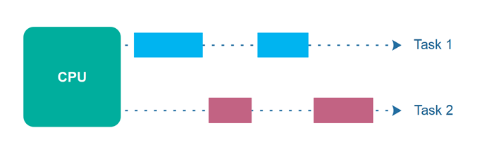

## 10주차 과제
> 자바의 멀티스레드 프로그래밍에 대해 학습

## 목차
- [Thread 클래스와 Runnable 인터페이스](#thread-클래스와-runnable-인터페이스)
- [스레드의 상태](#스레드의-상태)
- [스레드의 우선순위](#스레드의-우선순위)
- [Main 스레드](#main-스레드)
- [동기화](#동기화)
- [데드락](#데드락)

## Thread 클래스와 Runnable 인터페이스
### Thread
스레드란, 프로그램의 실행 단위이며 한 프로세스 내에서 일부 자원을 공유하며 작업을 수행하는 것 (자세한 내용은 [링크](https://github.com/WeareSoft/tech-interview/blob/master/contents/os.md) 내 '프로세스와 스레드의 차이' 참고)<br /> 자바는 여러 스레드의 동시 실행이 가능한 멀티 스레딩 지원<br/> 모든 스레드는 우선순위가 존재하며 우선순위가 높은 스레드를 먼저 수행<br />

### java.lang.Thread
JVM이 제공해주는 기본 main 스레드 외에 개발자가 직접 작업 스레드를 생성하기 위해 사용하는 클래스
```JAVA
public class Thread implements Runnable {
  // 주요 필드
  private long tid;               // 스레드 아이디
  private volatile String name;   // 스레드 이름
  private int priority;           // 스레드 우선순위
  private Runnable target;        // 스레드가 수행할 작업이 구현된 Runnable 객체 (Thread 생성 시 인자로 전달)

  // Thread의 우선순위 상수
  public final static int MIN_PRIORITY = 1;
  public final static int NORM_PRIORITY = 5;
  public final static int MAX_PRIORITY = 10;

  // 주요 네이티브 메소드
  public static native Thread currentThread();  // 현재 스레드 정보 확인 가능
  public static native void yield();            // 우선순위가 같거나 더 높은 다른 스레드에게 실행 양보하는 메소드 (호출한 스레드는 대기 상태로)
  public static native void sleep(long millis) throws InterruptedException;                         // 인자로 전달한 시간만큼 스레드 일시정지

  // 주요 생성자
  public Thread() {
    init(null, null, "Thread-" + nextThreadNum(), 0);
  }

  public Thread(Runnable target) {
    init(null, target, "Thread-" + nextThreadNum(), 0);
  }

  public Thread(ThreadGroup group, Runnable target, String name, long stackSize) {
    init(group, target, name, stackSize);
  }

  // 주요 메소드
  @Override
  public void run() { // 생성한 작업 스레드에서 수행할 내용 작성
    if (target != null) {
      target.run();
    }
  }

  public synchronized void start() {  // 생성한 스레드를 실행 대기 상태로 전환
    if (threadStatus != 0)
      throw new IllegalThreadStateException();

    group.add(this);

    boolean started = false;
    try {
      start0();
      started = true;
    } finally {
      try {
        if (!started) {
          group.threadStartFailed(this);
        }
      } catch (Throwable ignore) {
          /* do nothing. If start0 threw a Throwable then
            it will be passed up the call stack */
      }
    }
  }

  public void interrupt() { // 스레드가 일시정지 상태일 때 InterruptedException을 발생시켜 run() 메소드를 정상 종료 처리
    if (this != Thread.currentThread())
      checkAccess();

    synchronized (blockerLock) {
      Interruptible b = blocker;
      if (b != null) {
        interrupt0();      // Just to set the interrupt flag
        b.interrupt(this);
        return;
      }
    }
    interrupt0();
  }

  // 스레드 상태
  public enum State {
    NEW,            // 객체 생성
    RUNNABLE,       // 실행 대기
    BLOCKED,        // 일시정지
    WAITING,        // 일시정지
    TIMED_WAITING,  // 일시정지
    TERMINATED;     // 종료
  }

}
```

<br />

### java.lang.Runnable
인터페이스 타입이므로 구현 객체를 만들어 사용해야 하며, ```Runnable```의 구현 클래스는 ```run()```을 재정의해서 새로 생성한 스레드에서 실행할 코드 작성
```JAVA
@FunctionalInterface
public interface Runnable {
    public abstract void run();
}
```

.```Runnable```은 작업 내용을 가지고 있는 객체일 뿐 실제 스레드는 아니기 때문에 ```Runnable``` 구현 객체를 생성 후 ```Thread```의 생성자를 호출해야 스레드가 생성
```JAVA
class Task implements Runnable {
  @Override
  public void run() {
    // 스레드 실행 코드
    System.out.println("Task 클래스 스레드 작업 실행");
  }
}
```
```JAVA
public class Ex {
  public static void main(String[] args) {
    // Runnable을 구현한 Task를 생성해서 Thread의 생성자로 전달하는 방법
    Runnable task = new Task();
    Thread thread1 = new Thread(task);

    // 익명 클래스로 Runnable을 구현하고 Thread 생성하는 방법
    Thread thread2 = new Thread(new Runnable() {
      @Override
      public void run() {
        System.out.println("익명 클래스 스레드 작업 실행");
        . . .
      }
    });

    // 람다로 Runnable을 구현하고 Thread 생성하는 방법
    Thread thread3 = new Thread(() -> {
      System.out.println("람다 스레드 작업 실행");
      . . .
    });
  }
}
```

#### Callable
.```Runnable```과 비슷한 역할이지만 ```Callable```은 반환타입이 있고, Exception을 던지는 메소드를 정의
```JAVA
@FunctionalInterface
public interface Callable<V> {
    V call() throws Exception;
}
```

<br />

### 스레드 생성 방법
#### 1. Thread 클래스로부터 직접 생성
직접 생성하려면 ```Runnable```을 매개값으로 갖는 생성자 호출
```JAVA
class Task implements Runnable { // Runnable을 구현
  @Override
  public void run() {
    // 스레드 실행 코드
    System.out.println("Task 클래스 스레드 작업 실행");
  }
}
```
```JAVA
public void method() {
  Thread thread = new Thread(new Task());
  thread.start();
}
```
- ```Runnable```을 구현하는 클래스를 ```Thread``` 생성자 인자로 넘겨주고 ```start()``` 호출하여 스레드 생성


**실행 흐름**
  


#### 2. Thread 하위 클래스로부터 생성
.```Thread```를 상속 받은 하위 클래스를 작업 스레드로 정의하여 스레드를 생성하는 방법
```JAVA
public class MyThread extends Thread { // Thread를 상속
  private int data;

  public MyThread(int data) {
    this.data = data;
  }
  @Override
  public void run() {
    System.out.println("MyThread data is " + data);
  }
}
```
```JAVA
public class Ex {
  public static void main(String[] args) {
    // Thread를 상속받은 MyThread 생성하는 방법
    Thread thread1 = new MyThread(10);

    // 익명으로 생성하는 방법
    Thread thread2 = new Thread() {
      @Override
      public void run() {
        System.out.println("AnonymousThread");
      }
    };

    thread1.start();
    thread2.start();
  }
}
```
- 마찬가지로 ```start()``` 메소드를 호출하여 스레드 실행 대기 상태로 전환

### Runnable vs Thread
자바는 다중 상속이 불가능하기 때문에 ```Thread```를 상속 받으면 다른 클래스를 상속 받을 수 없으므로 인터페이스인 ```Runnable```을 구현하는 것이 확장성 향상에 도움

:arrow_double_up:[Top](#10주차-과제)

## 스레드의 상태

###### 출처 : https://blog.naver.com/qbxlvnf11/220921178603

- **실행 대기** : 아직 스케줄링되지 않아 실행 대기 중인 상태
  - 스레드 객체를 생성하고 ```start()``` 메소드 호출 시 스레드는 곧바로 실행되지 않고 실행 대기 상태
- **실행** : CPU를 점유하고 ```run()``` 메소드를 실행하는 상태
  - 실행 대기 상태에 있는 스레드들 중 스케줄링에 의해 선택된 스레드가 실행 상태로 전환
  - 실행 중인 스레드는 ```run()``` 메소드를 모두 수행하기 전에 다시 실행 대기 상태로 전환 가능(```yield()```)
- **일시정지** : 스레드가 작업을 수행할 수 없는 상태
  -  WAITING : ```wait()``` ```join()``` ```sleep()``` 메소드 호출로 대기 중인 상태
  - TIMED_WAITING : WAITING과 유사하지만 차이점은 최대 대기 시간이 지정된 채로 대기 중인 상태
  - BLOCKED : 한 스레드가 동기화 영역에 들어가있을 때 해당 영역에 접근하기 위해 스레드 수행 종료를 대기 중인 상태
- **종료** : ```run()``` 메소드가 종료되어 더 이상 실행할 내용이 없어 스레드 멈춤

<br />

### 스레드 상태 제어 메소드
#### interrupt()
**일시 정지 상태인 스레드**의 ```interrupt()``` 메소드를 호출하면 InterruptedException 예외를 발생시켜, 예외 처리 코드에서 대기 상태나 종료 상태로 전환(run() 메소드 정상 종료 가능)
```JAVA
class InterruptEx {
  public static void main(String[] args) {
    MyThread thread = new MyThread();
    thread.start();

    try {
      Thread.sleep(1000);
    } catch (InterruptedException e) {}

    thread.interrupt(); // MyThread의 interrupt() 호출
  }
}
```
```JAVA
class MyThread extends Thread {
  @Override
  public void run() {
    try {
      while(true) {
        System.out.println("실행 중");
        Thread.sleep(1);  // 일시정지 상태가 되고, 메인 스레드가 호출한 interrupt에 의해 예외 발생
      }
    } catch (InterruptedException e) { }

    System.out.println("실행 종료");
  }
}
```
- 일반적으로 호출된 스레드(MyThread)가 실행/실행 대기 상태일 땐 interrupt가 미작동. 일시정지 상태로 전환되어서야 InterruptedException 예외가 발생하므로 강제로 ```sleep()```

강제로 일시정지 상태로 만드는 방법 대신 ```interrupt()``` 호출 여부를 알 수 있는 메소드를 활용해 스레드 종료 처리 가능
```JAVA
class MyThread extends Thread {
  @Override
  public void run() {
    while(true) {
      System.out.println("실행 중");
      if (Thread.interrupted()) {
        break;
      }
    }
  }
}
```
- ```Thread.interrupted()```
- ```objThread.isInterrupted()```

<br />

#### notify() / notifyAll()
여러 스레드를 교대로 번갈아가며 실행해야 하는 경우 사용하는 메소드. **공유 객체**를 사용해 스레드들이 작업할 내용을 각각 동기화 블록으로 구분해두고, 한 스레드가 작업을 완료하면 ```notify()```로 다른 스레드를 깨우고(일시정지 -> 대기) 본인은 ```wait()```을 호출해 일시정지 상태로 전환
```JAVA
// 생산자 스레드, 소비자 스레드가 있을 때, 생산자가 공유 객체(DataBox)에 데이터를 넣었을 때만 소비자 스레드가 데이터를 가져다 쓸 수 있는 작업
class DataBox {
  private String data;

  // 소비자가 사용할 동기화 메소드
  public synchronized String getData() {
    if (this.data == null) {
      try {
        wait(); // 생산자가 넣은 데이터가 없으므로 소비자 일시정지 상태로 전환
      } catch (InterruptedException ignored) { }
    }

    String returnValue = data;
    System.out.println("꺼낸 데이터 : " + returnValue);

    data = null; // 소비자가 꺼내갔으므로 기존 데이터 null
    notify();    // 생산자 스레드 깨우기

    return returnValue;
  }

  // 생산자가 사용할 동기화 메소드
  public synchronized void setData(String data) {
    if (this.data != null) {
      try {
        wait(); // 소비자가 아직 데이터를 꺼내지 않았으므로 생산자 일시정지 상태로 전환
      } catch (InterruptedException ignored) { }
    }

    this.data = data;
    System.out.println("생산한 데이터 : " + data);
    notify();   // 데이터 생산했으므로 소비자 스레드 깨우기
  }
}
```
```JAVA
class Producer extends Thread {
  private DataBox box;

  public Producer(DataBox box) {
    this.box = box; // 공유객체를 필드로 사용
  }

  @Override
  public void run() {
    for (int i = 0; i <= 3; i++) {
      String data = "Data-" + i;
      box.setData(Data);
    }
  }
}
```
```JAVA
class Consumer extends Thread {
  private DataBox box;

  public Consumer(DataBox box) {
    this.box = box; // 공유객체를 필드로 사용
  }

  @Override
  public void run() {
    for (int i = 0; i <= 3; i++) {
      String data = box.getData();
    }
  }
}
```
```JAVA
class NotifyWaitEx {
  public static void main(String[] args) {
    DataBox dataBox = new DataBox();

    Producer producer = new Producer(dataBox);
    Consumer consumer = new Consumer(dataBox);

    producer.start();
    consumer.start();
  }
}
```
실행 결과
```
생산한 데이터 : Data-0
꺼낸 데이터 : Data-0
생산한 데이터 : Data-1
꺼낸 데이터 : Data-1
생산한 데이터 : Data-2
꺼낸 데이터 : Data-2
생산한 데이터 : Data-3
꺼낸 데이터 : Data-3
```
- ```notify()```는 ```wait()```에 의해 일시정지 중인 한 개의 스레드만 깨우고, ```notifyAll()```은 ```wait()```에 의해 일시정지된 모든 스레드를 깨움
- 동기화 블록(synchronized) 내에서 ```wait()``` 메소드에 의해 일시정지된 스레드를 대기 상태로 전환

<br />

#### wait()
- 동기화 블록(synchronized) 내에서 스레드를 대기 -> 일시정지 상태로 전환
- 매개값으로 주어진 시간이 지나면 대기 상태로 전환되며 시간이 주어지지 않으면 ```notify()``` ```notifyAll()```에 의해 대기 상태로 전환

<br />

#### sleep()
```JAVA
try {
  Thread.sleep(1000);
} catch (InterruptedException e) {
  // interrupt() 메소드 호출 시 실행
}
```
- 호출 시 주어진 시간 동안 스레드를 일시정지 상태로 전환
- 매개값으로 주어진 시간 지나면 자동으로 대기 상태로 전환
- 매개값으로 일시정지할 시간을 밀리세컨드(1/1000) 단위로 입력
- 스레드가 깨어나기 전에 ```interrupt()``` 메소드가 호출되면 예외 발생

<br />

#### join()
스레드는 기본적으로 다른 스레드와 독립적으로 실행되어야 하지만 경우에 따라 다른 스레드가 종료된 후 실행되어야 할 때, 다른 스레드의 종료를 기다리는 용도로 사용하는 메소드
```JAVA
class JoinEx {
  public static void main(String[] args) {
    MyThread thread = new MyThread();
    thread.start();

    try {
      thread.join();    // 다른 스레드의 join()을 호출한 메인 스레드는 MyThread 작업 종료 시까지 일시정지
    } catch (InterruptedExceptione e) { }

    System.out.println("1 ~ 100 합 : " + thread.getSum());
  }
}

class MyThread extends Thread {
  private long sum;

  public long getSum() {
    return sum;
  }

  public void setSum(long sum) {
    this.sum = sum;
  }

  @Override
  public void run() {
    for (int i = 1; i <= 100; i++) {
      sum += i;
    }
  }
}
```
- 다른 스레드의 ```join()``` 호출 시 호출한 현재 스레드는 일시정지 상태로 전환
- ```join()``` 메소드를 멤버로 가지는 스레드가 종료되거나 매개값으로 주어진 시간이 지나면 대기 상태로 전환

<br />

#### yield()
무의미한 반복을 진행하지 않고 다른 스레드에게 실행 순서를 양보할 때 사용하는 메소드
```JAVA
class YieldEx {
  public static void main(String[] args) throws InterruptedException {
    MyThread threadA = new MyThread("ThreadA");
    MyThread threadB = new MyThread("ThreadB");

    threadA.start();      // Thread A 시작
    threadB.start();      // Thread B 시작

    Thread.sleep(1000);   
    threadA.work = false; // Thread B만 실행(A가 B에게 양보)

    Thread.sleep(1000);
    threadA.work = true;  // Thread A, B 모두 실행

    Thread.sleep(1000);
    threadA.stop = true;  // Thread A 정지
    threadB.stop = true;  // Thread B 정지
  }
}


class MyThread extends Thread {
  public boolean stop = false;
  public boolean work = true;

  public MyThread(String name) {
    super(name);
  }

  @Override
  public void run() {
    while (!stop) {
      if (work) {
        System.out.println(this.getName());
      } else {
        Thread.yield();
      }
    }
  }
}
```
- 실행 중 우선순위가 동일하거나 더 높은 다른 스레드에게 실행을 양보하고 대기 상태로 전환

:arrow_double_up:[Top](#10주차-과제)

## 스레드의 우선순위
스레드에 우선순위를 부여하면 우선순위가 높은 스레드가 더 많은 실행 상태를 보유 가능<br/>우선순위를 부여하는 이유는 **멀티 스레드 환경에서 스레드를 어떤 순서로 동시 실행**할 것인지 결정하는 **스레드 스케줄링**이 필요하기 때문이며, 스레드 스케줄링에 의해 스레드들은 짧은 시간에 번갈아가며 각자의 ```run()``` 메소드를 실행하는 것이 가능

멀티스레드 환경 구성을 위해 먼저 동시성(Concurrency)과 병렬성(Parallelism) 개념 이해 필요

### 동시성(Concurrency)

###### 출처 : http://tutorials.jenkov.com/java-concurrency/concurrency-vs-parallelism.html

- 한 개의 CPU에서 둘 이상의 작업을 동시에 수행하는 것
- 동시에 둘 이상의 작업을 수행하기 위해 CPU는 작업 실행 시간 동안 작업 전환

### 병렬성(Parallelism)

###### 출처 : http://tutorials.jenkov.com/java-concurrency/concurrency-vs-parallelism.html

- 둘 이상의 CPU에서 둘 이상의 작업을 동시에 수행하는 것
- 엄밀히 말하자면 위 모델은 '병렬 실행' 모델이고 정확한 '병렬성' 모델은 출처 링크 참고

### 스레드 스케줄링
자바의 스레드 스케줄링은 **우선순위(Priority)** 방식과 **순환 할당(Round-Robin)** 방식
- 우선순위 방식
  - 우선순위가 높은 스레드가 실행 상태를 더 많이 가지도록 스케줄링
  - 스레드 객체에 우선순위 번호를 부여하여 개발자가 코드로 우선순위 제어 가능
- 순환할당 방식
  - 시간 할당량(Time Slice)을 정해서 하나의 스레드를 정해진 시간만큼만 실행하고 다시 다른 스레드를 실행하는 방식
  - JVM에 의해 정해지기 때문에 코드로 제어 불가능

#### 스레드 우선순위
```JAVA
thread.setPriority(우선순위 값);
```
우선순위 매개값으로는 1~10까지 직접 지정하거나 ```Thread```의 상수 사용
```JAVA
Thread.MAX_PRIORITY   // 10
Thread.NORM_PRIORITY  // 5
Thread.MIN_PRIORITY   // 1
```
값이 클수록 더 높은 우선순위를 가지며 우선순위 값은 스레드를 생성한 스레드로부터 상속

다음은 20억번 반복 후 자신의 이름을 출력하는 10개의 스레드를 생성하는 코드<br />thread1 ~ thread9까지는 낮은 우선순위를 부여하고 thread10에만 가장 높은 우선순위 부여
```JAVA
public class MyThread extends Thread {
  public MyThread(String name) {
    setName(name);  // 스레드 이름 변경
  }

  @Override
  public void run() {
    for (int i = 0; i < 2_000_000_000; i++) { }
    System.out.println(getName());
  }
}
```
```JAVA
public class PriorityEx {
  public static void main(String[] args) {
    for (int i = 1; i <= 10; i++) {
      Thread thread = new MyThread("thread" + i);
      if (i != 10) {
        thread.setPriority(Thread.MIN_PRIORITY);
      } else {
        thread.setPriority(Thread.MAX_PRIORITY);
      }
      thread.start();
    }
  }
}
```
그런데 실행 결과가 예상과 다름
```JAVA
thread4's priority is 1
thread2's priority is 1
thread3's priority is 1
thread1's priority is 1
thread5's priority is 1
thread6's priority is 1
thread7's priority is 1
thread8's priority is 1
thread9's priority is 1
thread10's priority is 10 // 우선순위가 가장 높기 때문에 예상대로라면 가장 먼저 끝났어야할 작업
```
- 스레드 우선순위는 실행 순서를 보장하지 않으며, 제한된 자원을 사용할 때 동작
- 우선순위는 스케줄러에게 '힌트' 정도로만 영향
- 더 자세한 내용은 [참고](https://stackoverflow.com/questions/12038592/java-thread-priority-has-no-effect)
- 예를 들어 한 코어에 한 스레드가 생성된다고 가정하면
  - 싱글 코어의 경우, 우선순위가 높은 스레드가 실행 기회를 더 많이 가지기 때문에 우선순위 방식 유효
  - 멀티 코어의 경우, 쿼드 코어라면 4개의 스레드가 병렬 수행될 수 있기 때문에 4개 이하의 스레드를 실행할 경우 우선순위 방식이 크게 영향을 미치지 못하며 최소 5개 이상의 스레드를 실행해야 우선순위 방식 유효

:arrow_double_up:[Top](#10주차-과제)

## Main 스레드
모든 프로세스는 최소 한 개 이상의 스레드가 존재해야 하며 자바 애플리케이션의 기본 스레드는 JVM이 애플리케이션을 실행하면서 생성하는 main 스레드.<br /> main 스레드가 시작하면 ```main()``` 메소드의 존재를 검증 후 클래스를 초기화<br /> main 스레드는 ```main()``` 메소드의 첫 코드부터 순차적으로 실행하고, ```main()``` 메소드의 마지막 줄을 실행하거나 ```return``` 문을 만나면 스레드 종료

```JAVA
public class Main {
  public static void main(String[] args) {
    Thread.currentThread().getContextClassLoader();

    long id             = Thread.currentThread().getId();
    String name         = Thread.currentThread().getName();
    int priority        = Thread.currentThread().getPriority();
    Thread.State state  = Thread.currentThread().getState();

    System.out.println(id);
    System.out.println(name);
    System.out.println(priority);
    System.out.println(state); // => 이후 main 스레드 종료
  }
}
```
실행결과
```
1
main
5
RUNNABLE
```

main 스레드는 필요에 따라 작업 스레드들을 만들어 병렬 작업 수행 가능. 모든 작업 스레드는 main 스레드로부터 파생되고 스레드 우선순위를 상속

:arrow_double_up:[Top](#10주차-과제)

## 동기화
동기화란, 프로세스 또는 스레드가 수행되는 시점을 조절하여 서로 알고 있는 정보가 일치하는 것을 의미

멀티 스레드 환경에서는 여러 스레드가 공유 객체를 사용하면서 데이터가 꼬이는 문제 발생할 수 있기 때문에 한 스레드가 사용 중인 객체에 다른 스레드가 접근할 수 없도록 '임계 영역'을 지정

자바에서는 임계 영역 지정을 위해 동기화(synchronized) 메소드와 블록을 제공하며 스레드가 이 영역에 들어가면 즉시 객체에 잠금을 걸어 다른 스레드는 이미 접근 중인 스레드가 빠져나갈 때 까지 임계 영역 코드에 접근 불가능

### 자바가 제공하는 동기화
- synchronized 키워드
- volatile 키워드
- java.util.concurrent 패키지

<br />

### synchronized
자바에서 임계 영역 지정을 위해 제공하는 키워드

#### 동기화 메소드
```JAVA
public synchronized void method() {
  // 임계 영역
}
```
- 메소드 전체 내용이 임계 영역이므로 스레드가 동기화 메소드를 실행하는 즉시 객체 잠금 발생
- 메소드에 잠금을 걸면 메소드가 포함된 해당 객체(this)에 잠금을 거는 것과 마찬가지
- ```synchronized``` 메소드 영역에 접근한 스레드가 있다면 나머지 스레드는 다른 모든 ```synchronized``` 영역에 접근 불가능(일반 메소드나 블록은 접근 가능)


#### 동기화 블록
```JAVA
public void method() {
  // 여러 스레드가 접근 가능한 영역
  synchronized(공유 객체) {
    // 임계 영역
  }
  // 여러 스레드가 접근 가능한 영역
}
```
- 동기화 블록을 사용해 임계 영역 축소 가능
- 공유 객체에는 ```this```도 가능
- 블록을 사용하면 같은 공유 객체를 사용하는 ```synchronized``` 영역에만 접근 불가능하기 때문에 조금 더 효율적으로 동기화 가능

자바는 ```synchronized``` 외에도 동기화를 위해 ```volatile``` 키워드나 ```Atomic``` 클래스 제공

<br />

### java.util.concurrent
자바 5부터 추가된 패키지의 API를 사용해 동기화 가능

#### 주요 패키지 및 클래스
- ```locks``` : 상호 배제를 사용할 수 있는 클래스 제공 패키지
- ```atomic``` : 동기화 된 변수 제공 패키지
- ```Executors``` : 스레드 풀 생성, 생명주기 관리, Task 등록 및 실행 처리 관련 클래스
- ```Queue``` : 스레드 세이프한 큐 관련 클래스들
- ```Synchronizers``` :  특수한 목적의 동기화를 처리하는 클래스들
  - ```Semaphore```, ```CountDownLatch```, ```CyclicBarrier```, ```Pharser```, ```Exchanger```

<br />

### java.util.concurrent.locks
내부적으로 ```synchronized```를 사용해 구현되었기 때문에 동일한 매커니즘으로 동작

#### 인터페이스
- ```Lock``` : 공유 자원에 대해 한 번에 한 스레드만 읽기/쓰기 가능
- ```ReadWriteLock``` : 공유 자원에 대해 읽기는 여러 스레드, 쓰기는 한 스레드만 가능
- ```Condition``` : Object 클래스가 제공하는 ```notify()```, ```notifyAll()```, ```wait()``` 대체할 수 있는 인터페이스
  -  wait → await / notify → signal / notifyAll → signalAll

#### 인터페이스의 구현체
- ```ReentrantLock``` : Lock의 구현체이며 임계 영역의 시작점과 종료점 직접 명시 가능
- ```ReentrantReadWriteLock``` : ReadWriteLock의 구현체

#### 주요 메소드
```JAVA
void lock();
void lockInterruptibly();
boolean tryLock();
void unlock();
Condition newCondition();
```
- ```lock()``` : Lock 인스턴스 잠금. 이미 락이 걸려있다면 락을 호출한 스레드가 ```unlock()``` 호출 전 까지 비활성화
- ```lockInterruptibly()``` : 현재 스레드가 interrupt 상태가 아니면 잠금. interrupt 상태면 InterruptedException 발생
- ```tryLock()``` : 즉시 잠금 시도하고 성공 여부 반환
- ```unlock()``` : 잠금 해제
- ```newCondition()``` : 현재 Lock 인스턴스왕 연결된 Condition 반환

:arrow_double_up:[Top](#10주차-과제)

## 데드락


###### 출처 : https://qweqwe12e0.tistory.com/33

데드락이란, 둘 이상의 스레드가 락 해제를 기다리는데 해당 락을 잡고있는 스레드가 또 다른 락 해제를 기다리고 있을 경우 서로 블록 상태에 놓이는 상황<br />
예를 들어 Thread1이 A의 락을 잡은 채로 B의 락 해제를 기다리고 있고, Thread2가 B의 락을 잡은 채로 A의 락 해제를 기다리고 있을 때 데드락 발생

### 데드락 방지 방법
1. 락 정렬
2. 락 타임아웃
3. 데드락 감지

#### 락 정렬
데드락은 본인이 가진 락을 양보하지 않고 서로 다른 락을 획득하려해서 발생하기 때문에 모든 락을 항상 같은 순서로 획득하도록 정렬하여 예방하는 방법<br />
단, 락 순서를 알고 있어야 유효한 방법

#### 락 타임아웃
스레드가 락 획득을 위해 기다리는 시간을 설정하는 방법. 주어진 시간까지 락을 획득하지 못하면 스레드는 해당 락을 포기하거나 반드시 획득해야 하는 락이라면 본인이 갖고 있는 모든 락을 해제하고 일정 시간(다른 스레드들이 해제된 락 획들할 시간) 대기 후 락 획득 재시도<br />
단, 일정 시간 틈이 있기 때문에 어디에도 락을 걸지 못하고 계속 실행되거나 다른 스레드가 락을 채가는 문제 발생 가능성

#### 데드락 감지
가장 무거운 방법이며, 락 정렬이나 타임아웃으로 해결할 수 없을 때 사용하는 방법

추가로, 스레드에 우선순위를 부여해서 데드락을 방지하거나 데드락이 발생할 때마다 스레드의 우선순위를 랜덤하게 지정하는 방법도 있음

### Reference
- 신용권, 『이것이 자바다』, 한빛미디어(2015)
- [JAVA 36. main Thread and Thread Synchronization](https://m.blog.naver.com/martinok1103/221973320349)
- [JAVA 스레드(thread) 상태(객체 생성, 실행 대기, 일시 정지, 종료)](https://blog.naver.com/qbxlvnf11/220921178603)
- [Java Concurrency and Multithreading Tutorial](http://tutorials.jenkov.com/java-concurrency/concurrency-vs-parallelism.html)
- [Java의 동기화 Synchronized 개념 정리#1](https://tourspace.tistory.com/54)
- [Java의 동기화 Synchronized 개념 정리#2](https://tourspace.tistory.com/55?category=788398)
- [Java의 concurrent 패키지 알아보기 (1) Lock을 사용한 동기화](https://zion830.tistory.com/57)
- [데드락(Deadlock)](https://parkcheolu.tistory.com/19)
- [[Java] 24. 동기화(synchronized) 그리고 교착 상태(Deadlock)](https://nowonbun.tistory.com/300)
- [데드락 방지(Deadlock Prevention)](https://parkcheolu.tistory.com/20?category=654619)
