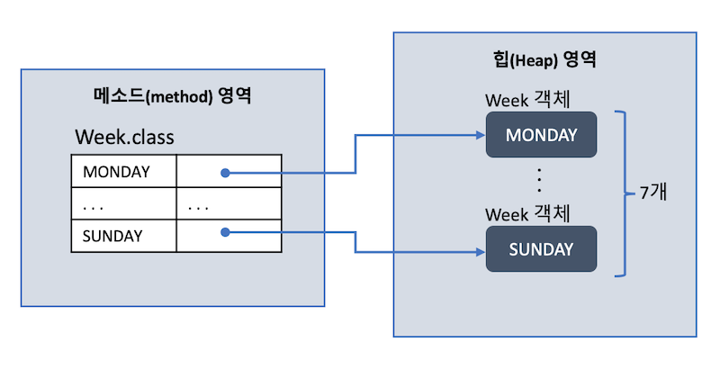
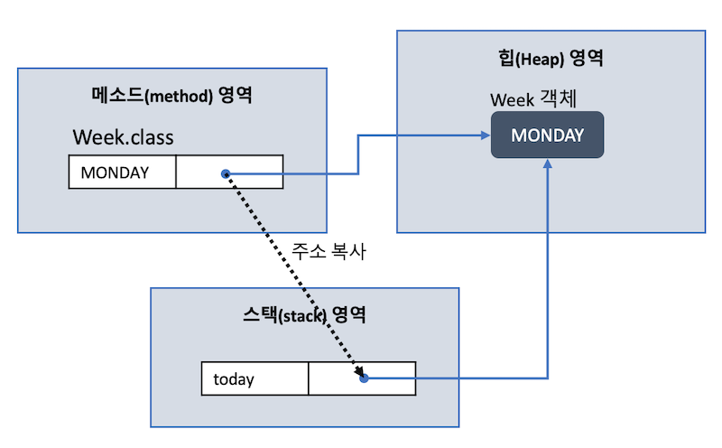

## 11주차 과제
> 자바의 열거형에 대해 학습

## 목차
- [enum](#enum)
- [enum 정의하는 방법](#enum-정의하는-방법)
- [enum이 제공하는 메소드](#enum이-제공하는-메소드)
- [java.lang.Enum](#javalangenum)
- [EnumSet](#enumset)

## enum
enum이란, 자바 데이터 타입 중 참조 타입의 한 종류

참조 타입
- 배열 타입
- **열거 타입**
- 클래스
- 인터페이스

한정된 값만 갖는 데이터 타입이며, 한정적으로 정의된 열거 상수 중 **하나의 상수를 저장하는 데이터 타입**
- 요일 : 월, 화, 수, 목, 금, 토, 일 -> 열거 상수 목록
- 계절 : 봄, 여름, 가을, 겨울 -> 열거 상수 목록

:arrow_double_up:[Top](#11주차-과제)

<br />

## enum 정의하는 방법
열거 타입 이름의 관례는 클래스와 동일하며 열거상수는 모두 대문자로 작성(여러 단어일 경우 언더바)

### 가장 기본적인 열거 타입 정의
```JAVA
public enum 열거타입이름 {
  열거상수1,
  열거상수2,
  . . .
}
```
```JAVA
public enum Week {
  MONDAY,
  TUESDAY,
  WEDNESDAY,
  THURSDAY,
  FRIDAY,
  SATURDAY,
  SUNDAY
}
```
```JAVA
public enum LoginResult { LOGIN_SUCCESS, LOGIN_FAILED }
```

### 데이터와 메소드가 있는 열거 타입 정의
```JAVA
public enum Planet {
  MERCURY (3.302e+23, 2.439e6),
  VENUS   (4.869e+24, 6.052e6),
  EARTH   (5.975e+24, 6.378e6),
  MARS    (6.419e+23, 3.393e6),
  JUPITER (1.899e+27, 7.149e7),
  SATURN  (5.685e+26, 6.027e7),
  URANUS  (8.683e+25, 2.556e7),
  NEPTUNE (1.024e+26, 2.477e7)
  ;

  private final double mass;              // 질량(단위: kg)
  private final double radius;            // 반지름(단위: m)
  private final double surfaceGravity;    // 표면중력(단위: m / s^2)

  // 중력상수(단위: m^3 / kg s^2)
  private static final double G = 6.67300E-11;

  // Constructor
  Planet(double mass, double radius) {
    this.mass = mass;
    this.radius = radius;
    surfaceGravity = G * mass / (radius * radius);
  }

  public double mass() { return mass; }
  public double radius() { return radius; }
  public double surfaceGravity() { return surfaceGravity; }
  /* 해당 행성에서의 무게를 구한다 */
  public double surfaceWeight(double mass) {
    return mass * surfaceGravity; // F = ma
  }
}
```

<br />

#### switch문 활용해 동작 정의하는 방법
```JAVA
public enum Operation {
  PLUS,
  MINUS,
  MULTIPLY,
  DIVIDE
  ;

  public double apply(double x, double y) {
    switch(this) {
      case PLUS: return x + y; break;
      case MINUS: return x - y; break;
      case MULTIPLY: return x * y; break;
      case DIVIDE: return x / y; break; // divide by zero exception 생략
      default:
        throw new IllegalArgumentException("Unknown Operation");
    }
  }
}
```
- 열거 상수 추가될 때마다 ```switch``` 코드도 수정 필요

<br />

#### 열거 상수에 상수의 동작까지 정의 하는 방법
위 방법에서 개선한 방법
```JAVA
public enum Operation {
  PLUS {
    public double apply(double x, double y) { return x + y; }
  },
  MINUS {
    public double apply(double x, double y) { return x - y; }
  },
  MULTIPLY {
    public double apply(double x, double y) { return x * y; }
  },
  DIVIDE {
    // divide by zero exception 생략
    public double apply(double x, double y) { return x / y; }
  };

  public abstract double apply(double x, double y);
}
```
- 중복 코드가 너무 많음

<br />

#### 공통 부분 자바 인터페이스로 추출한 방법
위 방법에서 개선한 방법
```JAVA
public interface Operator {
  double apply(double x, double y);
}
```
```JAVA
public enum Operation {
  PLUS ((x, y) -> x + y),
  MINUS ((x, y) -> x - y),
  MULTIPLY ((x, y) -> x * y),
  DIVIDE ((x, y) -> x / y)
  ;

  private final Operator operator;

  Operation(Operator operator) {
    this.operator = operator;
  }

  public double apply(double x, double y) {
    return operator.apply(x, y);
  }
}
```

<br />

#### 열거 타입의 데이터로 열거 타입을 꺼내는 방법
```JAVA
public enum Operation {
  PLUS ("+", (x, y) -> x + y),
  MINUS ("-", (x, y) -> x - y),
  MULTIPLY ("*", (x, y) -> x * y),
  DIVIDE ("/", (x, y) -> x / y)
  ;

  private final String symbol;
  private final Operator operator;

  Operation(String symbol, Operator operator) {
    this.symbol = symbol;
    this.operator = operator;
  }

  // 파라미터로 넘겨준 symbol로 적절한 열거 객체 찾아서 반환
  public static Operation of(String symbol) {
    return Arrays.stream(values())
            .filter(op -> op.symbol.equals(symbol))
            .findFirst()
            .orElseThrow(IllegalArgumentException::new);
  }

  public double apply(double x, double y) {
    return operator.apply(x, y);
  }
}
```

<br />

### 열거형의 데이터 구조
#### 열거 타입 선언 시 데이터 구조


**열거 상수는 열거 객체로 생성**되며 ```Week``` 타입의 경우 ```MONDAY```부터 ```SUNDAY```까지 7개의 ```Week``` 객체가 생성. **메소드 영역에 생성된 열거 상수가 해당 ```Week``` 객체를 각각 참조**

<br />

#### 열거 타입의 객체 선언 시 데이터 구조
```JAVA
Week today = Week.MONDAY;
```


열거 타입의 변수 ```today```가 stack 영역에 생성되고, 해당 변수는 열거 상수가 참조하는 객체의 번지 값 저장(같은 객체 참조)
```JAVA
today == Week.MONDAY // true
```

:arrow_double_up:[Top](#11주차-과제)

<br />

## enum이 제공하는 메소드
열거 객체는 열거 상수의 문자열을 내부 데이터로 저장

다음은 열거 객체의 데이터와 메소드 목록
- 데이터
  - 열거 상수 문자열
  - 그 외 개발자가 추가 정의한 데이터
- 메소드
  - ```String name()``` : 열거 객체의 문자열 리턴
  - ```int ordinal()``` : 열거 객체의 순번(0부터 시작) 리턴
  - ```int compareTo()``` : 열거 객체를 비교해서 순번 차이 리턴
  - ```열거타입 valueOf(String name)``` : 주어진 문자열의 열거 객체 리턴
  - ```열거배열 values()``` : 모든 열거 객체를 배열로 리턴
  - 그 외 개발자가 추가 정의한 메소드

### name()
열거 객체가 가지고 있는 문자열 리턴

열거 객체가 가지고 있는 문자열이란 **열거 타입을 정의할 때 사용한 상수 이름**
```JAVA
Week today = Week.MONDAY;
String name = today.name();
System.out.println(name);
```
실행결과
```
MONDAY
```

### ordinal()
전체 열거 객체 중 몇 번째 열거 객체인지 순번 리턴(0번부터 시작)
```JAVA
Week today = Week.MONDAY;
int ordinal = today.ordinal();
System.out.println(ordinal);
```
실행결과
```
0
```
단, 이 메소드는 ```EnumSet```과 ```EnumMap```에 쓸 목적으로 설계되었기 때문에 이 값에 의존하는 코드를 작성하는 것은 지양

### compareTo()
매개값으로 주어진 열거 객체를 기준으로 전후로 몇 번째에 위치하는지 비교
- 열거 객체 순번 < 매개값 열거 객체 순번 : 음수
- 열거 객체 순번 > 매개값 열거 객체 순번 : 양수
- ```열거 객체 순번 - 매개값 열거 객체 순번``` 결과와 동일

```JAVA
Week day1 = Week.MONDAY;  // 순번 0
Week day2 = Week.FRIDAY;  // 순번 4

int result1 = day1.compareTo(day2); // -4
int result2 = day2.compareTo(day1); // 4
```

### valueOf()
매개값으로 주어지는 문자열과 동일한 문자열을 가지는 열거 객체를 리턴
```JAVA
Week weekDay = Week.valueOf("MONDAY");
```

### values()
열거 타입의 모든 열거 객체를 배열로 만들어 배열 첫번째 인덱스의 주소값 리턴
```JAVA
Week[] days = Week.values();
for(Week day : days) {
  System.out.println(day);
}
```

열거 타입이 제공하는 모든 메소드는 ```java.lang.Enum``` 클래스에 선언된 메소드인데 **모든 열거 타입은 컴파일 시 ```java.lang.Enum``` 클래스를 상속**하기 때문에 사용 가능한 것

:arrow_double_up:[Top](#11주차-과제)

<br />

## java.lang.Enum
모든 열거 타입은 컴파일 시 ```java.lang.Enum``` 클래스를 상속

### 클래스 정의
```JAVA
public abstract class Enum<E extends Enum<E>>
        implements Comparable<E>, Serializable { }
```
- 추상 클래스이기 때문에 ```Enum```의 객체 생성 불가능

#### 메소드
10개의 의미있는 메소드를 제공하고 있으며, 그 중 일부는 ```Object``` 클래스에서 상속 받은 것

대부분 ```final```로 정의되었으며 열거 상수를 수정하는 동작은 불가능
```JAVA
public final String name()
public final int ordinal()
public String toString()
public final boolean equals(Object obj)
public final int hashCode()
public int compareTo(E obj)
public static <T extends Enum> T valueOf(Class enumType,String name)
public final Class <E> getDeclaringClass() // enum 객체의 타입 반환
public final Object clone() throws CloneNotSupportedException
protected final void finalize()
```
- 대부분 [enum이 제공하는 메소드](#enum이-제공하는-메소드)에서 설명한 것과 동일하게 동작


:arrow_double_up:[Top](#11주차-과제)

<br />

## EnumSet
Big flag나 Set이 필요할 때 사용. 내부적으로 Big flag를 사용하고 있어 빠르고 안전하게 사용 가능
- ```enum``` 타입에 사용하기 위한 특수한 ```Set``` 구현
- 내부적으로 bit vector로 표현되어 매우 효율적
- ```EnumSet```을 구현하려면 시간/공간 퍼포먼스가 비트 플래그의 대안으로 사용할 수 있을정도로 고수준이어야 함

```JAVA
EnumSet<Operation> ops = EnumSet.of(Operation.PLUS, Operation.MINUS);
EnumSet<Operation> all = EnumSet.allOf(Operation.class); // Operatoion에 정의한 모든 연산자
EnumSet<Operation> none = EnumSet.noneOf(Operation.class); // 비어있는 EnumSet 생성
EnumSet<Operation> inner = EnumSet.range(Operation.MINUS, Operation.DIVIDE); // MINUS부터 DIVIDE까지 범위 내의 EnumSet 생성
```
- 정적 팩토리 메소드를 사용해 ```EnumSet```을 생성가능한데 그 이유는
  - 사용자는 ```EnumSet```을 생성할 때 어떤 구현체가 적절한지 몰라도 상관없기 떄문
  - 사용자는 빈번하게 발생하는 ```EnumSet``` 초기화를 간단하게 진행할 수 있기 때문
  - ```EnumSet```이 내부적으로 변경되거나 새로운 구현 클래스가 추가되어도 기존에 사용하던 코드에는 아무런 영향이 없기 때문(확장성)

### EnumMap
마찬가지로 ```HashMap```을 사용하는 것보다 훨씬 효율적
```JAVA
Map<Operation, String> enumMap = new EnumMap<>(Operation.class);
```

:arrow_double_up:[Top](#11주차-과제)

<br />

### Reference
- 신용권, 『이것이 자바다』, 한빛미디어(2015)
- [Java enum의 사용](https://johngrib.github.io/wiki/java-enum/)
- [EnumSet이 new 연산자를 사용하지 않는 이유](https://siyoon210.tistory.com/152)
- [Java.lang.Enum Class in Java](https://www.geeksforgeeks.org/java-lang-enum-class-java/)
