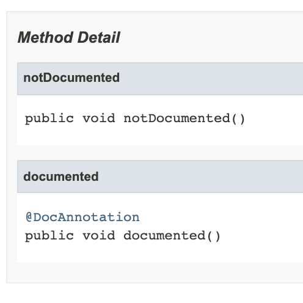

## 12주차 과제
> 자바의 애노테이션에 대해 학습

## 목차
- [애노테이션](#애노테이션)
- [애노테이션 정의하는 방법](#애노테이션-정의하는-방법)
- [메타 애노테이션](#메타-애노테이션)
  - [@Retention](#retention)
  - [@Target](#target)
  - [@Inherited](#inherited)
  - [@Documented](#documented)
- [애노테이션 프로세서](#애노테이션-프로세서)

<br />

## 애노테이션
프로그램에게 추가적인 정보를 제공해주는 메타데이터

컴파일 과정과 실행 과정에서 코드를 어떻게 컴파일하고 처리할 것인지 알려주는 정보

### 사용 용도
- 컴파일러에게 코드 문법 에러를 체크하도록 정보 제공
  - ex. ```@Override```
- 빌드나 배치 시 코드를 자동으로 생성할 수 있도록 정보 제공
- 애플리케이션 실행 시 특정 기능을 수행하도록(클래스의 역할 정의) 정보 제공
  - ex. 스프링의 ```@Controller```

:arrow_double_up:[Top](#12주차-과제)

<br />

## 애노테이션 정의하는 방법
```JAVA
public @interface AnnotationName { }
```
- ```@interface```를 사용해 정의

<br />

애노테이션은 1개 이상의 엘리먼트를 멤버로 가질 수 있으며, 각 엘리먼트는 타입과 이름으로 구성되고 디폴트 값 지정 가능
```JAVA
public @interface MyAnnotation {
  String value();
  String name();
  int count() default 3;
}
```
- 엘리먼트는 **자바 기본 타입, String, enum, Class, 배열 타입** 사용 가능
- 엘리먼트 이름 뒤에는 ```()``` 사용

<br />

### 정의한 ```@MyAnnotation``` 사용 예시
```JAVA
@MyAnnotation(value = "hello", name = "dami")
public class MyClass { }
```
- 기본값이 없는 ```value```와 ```name```은 필수로 기본값 지정
- 기본값이 있는 ```count```는 생략 가능

단, 엘리먼트 이름이 ```value```이고, 다른 엘리먼트의 기본값이 모두 지정되어있는 경우라면 ```value```를 명시하지 않고 바로 값만 입력 가능
```JAVA
// 디폴트값을 지정해야하는 엘리먼트가 value만 있을 때
@MyAnnotation("hello")
public class MyClass { }
```
- 값을 1개만 받을 때 유용하게 사용 가능

:arrow_double_up:[Top](#12주차-과제)

<br />

## 메타 애노테이션
Java5에 추가된 메타 애노테이션은 애노테이션을 선언할 때 사용하는 애노테이션으로, 선언한 애노테이션의 적용 대상, 유지 범위 등을 지정해주는 애노테이션

메타 애노테이션 종류
- @Retention
- @Target
- @Inherited
- @Documented

<br />

### @Retention
정의한 애노테이션을 어느 시점까지 유지할 것인지 지정

애노테이션은 **기본적으로 주석과 같은 취급**을 하기 때문에 메타 애노테이션으로 추가 설정을 하지 않으면 바이트코드를 로딩할 때 애노테이션 정보가 제거되므로 필요시 애노테이션 유지 시점 지정

런타임 시에도 애노테이션 정보를 알기 위해 ```RUNTIME``` 옵션 적용
```JAVA
@Retention(RetentionPolicy.RUNTIME)
public @interface MyAnnotation { }
```

#### 옵션
애노테이션 유지 정책은 ```java.lang.annotation.RetentionPolicy``` 열거 상수로 정의
- ```SOURCE``` : 소스 코드에만 이용 가능하고 바이트코드에서 제거
- ```CLASS``` : 바이트코드에 존재하지만 런타임 시 제거
- ```RUNTIME``` : 바이트코드까지 애노테이션 정보 유지. 리플렉션 활용 가능

<br />

### @Target
정의한 애노테이션의 사용 위치 지정

기본 앨리먼트인 ```value```는 ```ElementType```의 배열 타입
```JAVA
@Target({ElementType.TYPE, ElementType.FIELD})
public @interface MyAnnotation { }
```
- 클래스(+인터페이스, 열거 타입), 필드에만 적용 가능한 애노테이션

#### 옵션
애노테이션 적용 대상은 ```java.lang.annotation.ElementType``` 열거 상수로 정의
- ```TYPE```
- ```TYPE_PARAMETER```
- ```TYPE_USE```
- ```FIELD```
- ```METHOD```
- ```MODULE```
- ```PACKAGE```
- ```PARAMETER```
- ```CONSTRUCTOR```
- ```LOCAL_VARIABLE```
- ```ANNOTATION_TYPE```

<br />

### @Inherited
정의한 애노테이션의 상속 여부 결정
```JAVA
@Inherited
public @interface MyAnnotation {
  String name();
}
```
```JAVA
@MyAnnotation(name = "dami")
public class MyClass { }
```
```JAVA
public class SubClass extends MyClass { }
```
- 클래스 상속 시 애노테이션까지 상속되며, 상속 여부는 리플렉션을 활용해 확인 가능

상속받은 애노테이션 재정의 가능
```JAVA
@MyAnnotation(name = "mongzza")
public class SubClass extends MyClass { }
```

<br />

### @Documented
JavaDoc 문서 생성 시 ```@Documented```를 정의한 애노테이션을 사용한 대상(클래스, 메소드 등)을 설명하는 문서에 애노테이션 설명 추가

```JAVA
@Target(ElementType.METHOD)
public @interface Annotation { }
```
```JAVA
@Target(ElementType.METHOD)
@Documented
public @interface DocAnnotation { }
```
```JAVA
public class Sample {
  @Annotation
  public void notDocumented() { }

  @DocAnnotation
  public void documented() { }
}
```

- ```@Documented``` 애노테이션이 붙은 ```@DocAnnotation```만 JavaDoc에 표시

:arrow_double_up:[Top](#12주차-과제)

<br />

## 애노테이션 프로세서
애노테이션 프로세서는 자바 **컴파일 시** 애노테이션을 분석하고 처리하기 위해 **자바 컴파일러에 포함**되어있는 툴

애노테이션 프로세서를 사용하여 애노테이션으로 컴파일 에러 또는 컴파일 경고를 만들어낼 수 있고, 수많은 보일러 플레이트 코드를 줄이는 것이 가능

컴파일 시점에 애노테이션 프로세서가 ```.java``` 또는 ```.class``` 파일을 입력받아 필요한 코드를 작성하고, ```.java``` 또는 ```.class``` 파일을 내보냄

### AbstractProcessor
.```AbstractProcessor```를 상속받아 애노테이션 프로세서 직접 구현 가능

```JAVA
public class MyProcessor extends AbstractProcessor {

  @Override
  public synchronized void init(ProcessingEnvironment env){ }

  @Override
  public boolean process(Set<? extends TypeElement> annoations, RoundEnvironment env) { }

  @Override
  public Set<String> getSupportedAnnotationTypes() { }

  @Override
  public SourceVersion getSupportedSourceVersion() { }

}
```
- ```init()```
  - 애노테이션 프로세서의 초기화 메소드
  - ```Elements```, ```Types```, ```Filer``` 과 같이 유용한 유틸 클래스 제공
- ```process()```
  - 애노테이션 프로세서의 ```main()``` 메소드 역할
  - ```RoundEnvironment```를 사용해 애노테이션이 적용된 모든 대상 탐색
  - 대상에 필요한 기능(scanning, evaluating, 애노테이션 프로세싱, 자바 파일 생성 등)을 위한 코드 작성
- ```getSupportedAnnotationTypes()```
  - 이 애노테이션 프로세서가 처리할 애노테이션 목록 명시
- ```getSupportedSourceVersion()```
  - 사용하는 자바 버전 명시
  - ```SourceVersion.latestSupported()``` 사용 추천

**애노테이션 프로세서는 JVM 위에서 동작**하기 때문에 다른 자바 애플리케이션에서 사용하는 라이브러리 사용이 가능

:arrow_double_up:[Top](#12주차-과제)

<br />

### Reference
- 신용권, 『이것이 자바다』, 한빛미디어(2015)
- 인프런 강의 - 더 자바, 코드를 조작하는 다양한 방법
- [Enum ElementType](https://docs.oracle.com/javase/9/docs/api/java/lang/annotation/ElementType.html)
- [[Java] Meta Annotation 메타 애노테이션](https://hilucky.tistory.com/280)
- [045.Intellij 에서 javadoc 문서 만들기](https://m.blog.naver.com/PostView.nhn?blogId=jingug1004&logNo=220955114597&proxyReferer=https:%2F%2Fwww.google.com%2F)
- [Annotation Processing 101 (번역)](https://medium.com/@jason_kim/annotation-processing-101-%EB%B2%88%EC%97%AD-be333c7b913)
