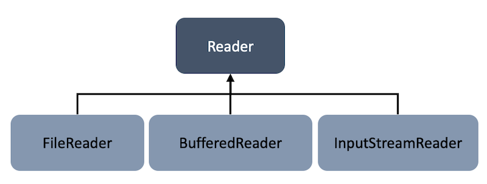
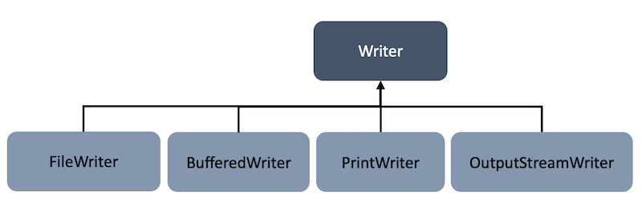
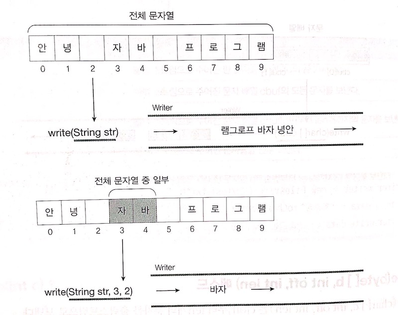
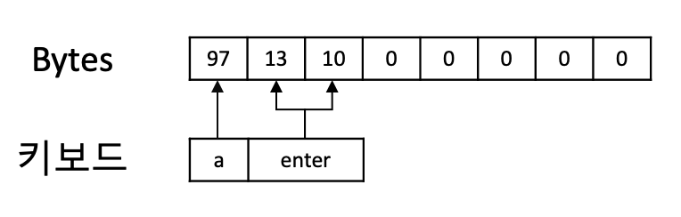

## 13주차 과제
> 자바의 Input과 Output에 대해 학습

## 목차
- [I/O](#io)
- [스트림 (Stream)](#스트림-stream)
  - [바이트 기반 스트림 - InputStream과 OutputStream](#바이트-기반-스트림-inputstream과-outputstream)
  - [문자 기반 스트림 - Reader와 Writer](#문자-기반-스트림-reader와-writer)
  - [표준 스트림](#표준-스트림)
- [버퍼 (Buffer)](#버퍼-buffer)
- [채널 (Channel)](#채널-channel)
- [파일 읽고 쓰기](#파일-읽고-쓰기)

<br />

## I/O
자바의 입출력 API는 **IO**와 **NIO**로 나뉘어있는데, NIO는 Java4부터 새로운 입출력(New Input/Output)이라는 의미로 추가된 ```java.nio``` 패키지에 포함

Java7부터 IO와 NIO의 설계를 개선한 NIO.2 API가 추가되었으며 해당 패키지는 ```java.nio```의 하위 패키지로 통합되어 사용


- ```java.nio.channels```, ```java.nio.charset```, ```java.nio.file``` 등의 패키지가 새로 추가된 NIO.2 API

<br />

### IO와 NIO의 차이점


|구분|IO|NIO|
|---|:---:|:---:|
|입출력 방식|스트림 방식|채널 방식|
|버퍼 방식|non-buffer|buffer|
|비동기 방식|미지원|지원|
|블로킹/넌블로킹 방식|블로킹만 지원|블로킹/넌블로킹 모두 지원|

<br />

#### 블로킹 vs 넌블로킹
IO는 블로킹되는 특징이 있기 때문에 입출력 스트림의 ```read()```, ```write()``` 메소드 호출 시 데이터가 입력되기 전까지 스레드가 블로킹(대기 상태)

IO 스레드가 **블로킹**되면 다른 일을 할 수 없고 블로킹을 빠져나오기 위해 인터럽트할 수도 없으며, 빠져나올 수 있는 **유일한 방법은 스트림을 닫는 것**

NIO는 블로킹과 넌블로킹 모두 가능한데 **블로킹** 되었을 때는 인터럽트를 할 수 있어 빠져나오는 것이 가능하고, **넌블로킹**은 작업 스레드가 입출력 **준비가 완료(현재 바로 읽고 쓸 수 있는 상태)된 채널만 선택**해서 처리하기 때문에 블로킹 미발생
- 멀티플렉서와 셀렉터 객체가 핵심이며 **셀렉터가 여러 채널 중 준비 완료된 채널을 선택하는 방법 제공**

<br />

#### IO vs NIO
IO와 NIO는 **데이터를 입출력한다는 목적은 동일하지만 방식에 차이**가 있으므로 상황에 따라 적절한 API를 사용하는 것이 중요
- **IO를 사용해야 할 때** : 클라이언트 수가 적고 대용량 데이터를 처리해야 하는 경우, 순차적으로 진행해야 하는 경우
  - 버퍼를 사용하지 않고 받은 즉시 처리하므로 덜 복잡함
- **NIO를 사용해야 할 때** : 클라이언트 수가 많고 하나의 입출력 작업이 오래 걸리지 않는 경우
  - 다수의 클라이언트를 비동기 또는 넌블로킹으로 처리 가능
  - 과도한 스레드 생성을 예방하고 효과적으로 재사용 가능

<br />

#### ```java.io``` 패키지의 주요 클래스
|주요 클래스|설명|
|---|---|
|```File```|파일 시스템의 파일 정보를 얻기 위한 클래스|
|```Console```|콘솔로부터 문자를 입출력하기 위한 클래스|
|```InputStream``` / ```OutputStream```|**바이트 단위** 입출력을 위한 최상위 입출력 스트림 클래스|
|```FileInputStream``` / ```FileOutputStream```<br />```DataInputStream``` / ```DataOutputStream```<br />```ObjectInputStream``` / ```ObjectOutputStream```<br />```PrintStream```<br />```BufferedInputStream``` / ```BufferedOutputStream```|**바이트 단위** 입출력을 위한 하위 스트림 클래스|
|```Reader``` / ```Writer```|**문자 단위** 입출력을 위한 최상위 입출력 스트림 클래스|
|```FileReader``` / ```FileWriter```<br />```InputStreamReader``` / ```OutputStreamWriter```<br />```PrintWriter```<br />```BufferedReader``` / ```BufferedWriter```|**문자 단위** 입출력을 위한 하위 스트림 클래스|

<br />

#### NIO 제공 주요 패키지
|주요 클래스|설명|
|---|---|
|```java.nio```|다양한 버퍼 클래스|
|```java.nio.channels```|파일 채널, TCP 채널, UDP 채널 등|
|```java.nio.channels.spi```|```java.nio.channels``` 패키지를 위한 서비스 제공자 클래스|
|```java.nio.charset```|문자셋, 인코더, 디코더 API|
|```java.nio.charset.spi```|```java.nio.charset``` 패키지를 위한 서비스 제공자 클래스|
|```java.nio.file```|파일 및 파일 시스템에 접근하기 위한 클래스|
|```java.nio.file.attribute```|파일 및 파일 시스템의 속성에 접근하기 위한 클래스|
|```java.nio.file.spi```|```java.nio.file``` 패키지를 위한 서비스 제공자 클래스|

:arrow_double_up:[Top](#13주차-과제)

<br />

## 스트림 (Stream)
스트림은 단일 방향으로 연속적으로 흘러가는 것을 의미

IO는 스트림 기반이며, **단방향** 특성상 입력 스트림과 출력 스트림으로 구분되어 있기 때문에 데이터를 읽기 위한 **입력 스트림 ```InputStream과``` 출력하기 위한 출력 스트림 ```OutputStream```을 별도로 생성**하여 사용


**프로그램을 기준**으로 데이터가 들어오면 입력 스트림, 나가면 출력 스트림

다른 프로그램과 통신하기 위해서는 양쪽 프로그램에 각각 입출력 스트림이 필요하므로 총 4개 생성

버퍼같은 데이터 보관 장소가 없기 때문에 읽은 데이터는 즉시 처리하여 별도로 저장하여 사용

### 분류
자바의 입출력 스트림은 크게 두 가지
- **바이트 기반 스트림**
  - 그림, 멀티미디어, 문자 등 모든 종류의 데이터 송수신 가능
  - 데이터를 바이트 단위로 읽고 쓰는 스트림
  - 네이밍은 ```XXXInputStream``` / ```XXXOutputStream```
- **문자 기반 스트림**
  - 문자 데이터만 송수신 가능
  - 데이터를 문자 단위로 읽고 쓰는 스트림
  - 네이밍은 ```XXXReader``` / ```XXXWriter```

:arrow_double_up:[Top](#13주차-과제)

<br />

## 바이트 기반 스트림 - InputStream과 OutputStream
그림, 멀티미디어, 문자 등의 데이터를 바이트 단위로 주고 받는 스트림

두 클래스는 ```AutoCloseable```을 구현하고 있기 때문에 [9주차](./9주차.md#try-with-resources)에 학습한 ```try-with-resources``` 활용 가능

### InputStream

.```InputStream```은 바이트 기반 입력 스트림의 최상위 클래스이며 추상 클래스

<br />

#### 주요 메소드
#### read()
```JAVA
int read();
```
- 입력 스트림으로부터 1바이트를 읽고 읽은 바이트 리턴
- 바이트를 읽지만 리턴 타입이 ```int```이기 때문에 4바이트인 ```int``` 타입의 가장 끝 1바이트에만 데이터 저장
- 더 이상 입력 스트림으로부터 읽을 내용이 없으면 -1 반환
- 사용 예시
  ```JAVA
  InputStream is = new FileInputStream(new File("..."));
  int readByte;

  while ((readByte = is.read()) != -1) { . . . }
  ```

<br />

#### read(byte[] b)
```JAVA
int read(byte[] b);
```
- 입력 스트림으로부터 읽은 바이트를 매개값 ```b```에 저장하고 실제로 읽은 바이트 수 리턴
- 더 이상 입력 스트림으로부터 읽을 내용이 없으면 -1 반환
- 입력 스트림 크기가 매개값으로 주어진 바이트 배열의 크기보다 클 경우, 입력 스트림을 반복해서 끝까지 읽을 때 바이트 배열의 끝까지 채운 후 ```[0]``` 부터 덮어 씌움
- 사용 예시
  ```JAVA
  InputStream is = new FileInputStream(new File("..."));
  int readSize;
  byte[] readBytes = new byte[100];

  while ((readSize = is.read(readBytes)) != -1) { . . . }
  ```
- 주어진 바이트 배열 크기 만큼 한번에 읽어오기 때문에 ```read()```보다 훨씬 효율적

<br />

#### read(byte[] b, int off, int len)
```JAVA
int read(byte[] b, int off, int len);
```
- 입력 스트림으로부터 ```len```개의 바이트만큼 읽고 매개값 ```b```에 ```b[off]```부터 ```len```개 까지 저장하고 실제로 읽은 바이트 수 리턴
- 더 이상 입력 스트림으로부터 읽을 내용이 없으면 -1 반환
- ```off```를 0으로 ```len```을 배열의 길이로 준다면 ```read(byte[] b)```와 동일한 기능

<br />

#### close()
```JAVA
void close();
```
- 사용한 시스템 자원 반납하고 입력 스트림 닫기

<br />

### OutputStream

.```OutputStream```은 바이트 기반 출력 스트림의 최상위 클래스이며 추상 클래스

#### 주요 메소드
#### write(int b)
```JAVA
void write(int b);
```
- 출력 스트림으로 1바이트 전송(```b```의 끝 1바이트)
- 사용 예시
  ```JAVA
  OutputStream os = new FileOutputStream(new File("..."));
  byte[] data = "ABC".getBytes();

  for (int i = 0; i < data.length; i++) {
    os.write(data[i]);
  }
  ```
- [참고] 매개값 타입이 ```int```인 이유?
  - 입력 스트림의 ```read()``` 메소드의 반환값이 ```int```형이고, 입력 스트림의 끝을 알리는 -1 을 반환할 수도 있기 때문이라는데 확실한지 확인 필요
  - 내부적으로는 ```int```의 3비트는 무시하고 마지막 1비트만 사용하여 0 ~ 255 사이의 값만 출력 스트림에 전송하도록 구현되어 있으며, 256 이상의 값 입력 시 256으로 나머지 연산을 한 값이 출력 스트림으로 전달

<br />

#### write(byte[] b)
```JAVA
void write(byte[] b);
```
- 출력 스트림으로 주어진 바이트 배열 ```b```의 모든 바이트 전송

<br />

#### write(byte[] b, int off, int len)
```JAVA
void write(byte[] b, int off, int len);
```
- 출력 스트림으로 주어진 바이트 배열 ```b[off]```부터 ```len```개 까지 바이트 전송

<br />

#### flush()
```JAVA
void flush();
```
- 출력 스트림은 내부에 작은 버퍼가 있어서 데이터가 출력되기 전까지 버퍼에 쌓여이다가 순서대로 출력되는 방식
- 버퍼에 잔류하는 모든 바이트 출력시키고 버퍼를 비우는 역할
- ```close()```는 ```AutoCloseable```를 상속 받는다면 ```try-with-resources```를 활용해 자동으로 스트림 닫기가 가능하지만, ```flush()```는 직접 명시하여 처리

<br />

#### close()
```JAVA
void close();
```
- 사용한 시스템 자원 반납 후 출력 스트림 닫기

:arrow_double_up:[Top](#13주차-과제)

<br />

## 문자 기반 스트림 - Reader와 Writer
오직 문자 데이터만 문자 단위로 주고 받을 수 있는 스트림

바이트 기반 스트림과 마찬가지로 ```AutoCloseable```을 구현하므로 ```try-with-resources``` 활용 가능

### Reader

.```Reader```는 문자 기반 입력 스트림의 최상위 클래스이며 추상 클래스

기본적으로 ```InputStream```과 유사한 동작을 하며 **문자** 처리라는 것만 차이

<br />

#### 주요 메소드
#### read()
```JAVA
int read();
```
- 입력 스트림으로부터 한 개의 문자(2바이트)를 읽고 4바이트 ```int``` 타입으로 반환
- ```int``` 타입의 끝 2바이트에만 문자 데이터 저장
- 더 이상 입력 스트림으로부터 읽을 내용이 없으면 -1 반환
- 반환한 ```int``` 값은 ```char```로 형변환하여 읽어온 문자 사용 가능
- 사용 예시
  ```JAVA
  Reader reader = new FileReader(new File("..."));
  int readData;

  while ((readData = reader.read()) != -1) {
    char charData = (char) readData;
  }
  ```

<br />

#### read(char[] cbuf)
```JAVA
int read(char[] cbuf);
```
- 입력 스트림으로부터 읽은 문자를 매개값 배열의 크기만큼 읽어서 ```cbuf```에 저장하고 실제로 읽은 문자 수 리턴
- 더 이상 입력 스트림으로부터 읽을 내용이 없으면 -1 반환
- 입력 스트림 크기가 매개값으로 주어진 배열의 크기보다 클 경우, 입력 스트림을 반복해서 끝까지 읽을 때 배열의 끝까지 채운 후 ```[0]``` 부터 덮어 씌움
- 사용 예시
  ```JAVA
  Reader reader = new FileReader(new File("..."));
  int readCharNo;
  char[] cbuf = new char[2];

  while ((readCharNo = reader.read(cbuf)) != -1) { . . . }
  ```
- 주어진 배열 크기 만큼 한번에 읽어오기 때문에 ```read()```보다 훨씬 효율적

#### read(char[] cbuf, int off, int len)
```JAVA
int read(char[] cbuf, int off, int len);
```
- 입력 스트림으로부터 ```len```개의 문자만큼 읽고 매개값 ```cbuf```에 ```cbuf[off]```부터 ```len```개 까지 저장하고 실제로 읽은 문자 수 리턴
- 더 이상 입력 스트림으로부터 읽을 내용이 없으면 -1 반환
- ```off```를 0으로 ```len```을 배열의 길이로 준다면 ```read(byte[] b)```와 동일한 기능

<br />

#### close()
```JAVA
void close();
```
- 사용한 시스템 자원 반납하고 입력 스트림 닫기

<br />

### Writer

.```Writer```는 문자 기반 출력 스트림의 최상위 클래스이며 추상 클래스

기본적으로 ```OutputStream```과 유사한 동작을 하며 **문자** 처리라는 것만 차이

<br />

#### 주요 메소드
#### write(int c)
```JAVA
void write(int c);
```
- 출력 스트림으로 문자 1개 전송(```c```의 끝 2바이트)
- 사용 예시
  ```JAVA
  Writer writer = new FileWriter(new File("..."));
  char[] data = "ABC".toCharArray();

  for (char c : data) {
    writer.write(c);
  }
  ```

<br />

#### write(char[] cbuf)
```JAVA
void write(char[] cbuf);
```
- 출력 스트림으로 주어진 문자 배열 ```cbuf```의 모든 문자 전송
- 사용 예시
  ```JAVA
  Writer writer = new FileWriter("...");
  char[] data = "ABC".toCharArray();
  writer.write(data);
  ```

<br />

#### write(char[] cbuf, int off, int len)
```JAVA
void write(char[] b, int off, int len);
```
- 출력 스트림으로 주어진 문자 배열 ```cbuf[off]```부터 ```len```개 까지 문자 전송

<br />

#### write(String str) / write(String str, int off, int len)
```JAVA
void write(String str);
void write(String str, int off, int len);
```
- 문자 스트림을 조금 더 쉽게 보내기 위해 ```String``` 인자 메소드 제공
- 사용 방법은 위와 동일
  

  ###### 출처 : 신용권, 『이것이 자바다』, 한빛미디어(2015), p.1008

<br />

#### flush(), close()
- 위와 동일

:arrow_double_up:[Top](#13주차-과제)

<br />

## 표준 스트림
### 콘솔 입출력
콘솔이란 시스템을 사용하기 위해 키보드로 입력 받고 화면으로 출력하는 소프트웨어 (Linux의 터미널, Windows의 명령 프롬프트, IntelliJ의 콘솔 등)

### 자바가 사용하는 콘솔 입출력
- ```System.in``` : 콘솔로부터 데이터 입력
- ```System.out``` : 콘솔에 데이터 출력
- ```System.err``` : 콘솔에 에러 출력

```JAVA
public final class System {
  public final static InputStream in = null;
  public final static PrintStream out = null;
  public final static PrintStream err = null;
}
```

<br />

### ```System.in```
콘솔로부터 데이터를 입력 받기 위해 ```System``` 클래스의 ```in``` 정적 필드 사용
```JAVA
InputStream is = System.in;
int asciiCode = is.read();
char c = (char) is.read();
```
- ```read()```를 호출하여 콘솔에서 1바이트 입력 가능
- **키보드로 누른 문자는 1바이트로 표현 가능한 아스키 코드**로 반환
  
  - 키보드에서 a를 입력하고 엔터를 입력하면, 총 3개의 아스키 코드가 차례대로 읽힘
    - 엔터 키는 '캐리지 리턴(13)'과 '라인 피드(10)'라는 두 아스키 코드가 결합된 키이기 때문에 2개 반환
- 아스키 코드를 바로 문자로 읽으려면 ```char``` 형변환 사용

단, 아스키 코드로 변환할 수 없는 **한글(2바이트)같은 유니코드**는 ```read()``` 대신 ```read(byte[] b)``` 등의 **매개값이 배열인 메소드** 사용

#### 사용 예시
```JAVA
public class SystemIn {
  public static void main(String[] args) {
    InputStream is = System.in;
    byte[] datas = new byte[100];

    System.out.print("name : ");
    int nameBytes = is.read(datas);
    String name = new String(datas, 0, nameBytes - 2); // 엔터키 아스키 코드 값 제외하기 위해 -2

    System.out.print("comment : ");
    int commentBytes = is.read(datas);
    String comment = new String(datas, 0, commentBytes - 2);

    System.out.println("input name is " + name);
    System.out.println("input comment is " + comment);
  }
}
```

일반적으로 사용하는 방법은 ```java.util``` 패키지의 ```Scanner``` 클래스 사용해서 콘솔 입력
```JAVA
Scanner scanner = new Scanner(System.in);
String msg = scanner.nextLine();
```
- ```Scanner```의 메소드들은 콘솔에서 데이터 입력 후 엔터키 누르면 동작하도록 구현됨

<br />

### ```System.out```
콘솔에 데이터를 출력하기 위해 ```System``` 클래스의 ```out``` 정적 필드 사용

```JAVA
OutputStream os = System.out;
byte a = 97;
os.write(a);
os.flush();
```
실행 결과
```
a
```
- ```System.out```은 ```PrintStream``` 타입이지만 ```PrintStream```은 ```OutputStream```의 하위 클래스이므로 ```OutputStream``` 타입으로도 사용 가능
- ```write(int b)```를 호출하여 콘솔에 1바이트 출력 가능
- 마찬가지로 바이트 값은 아스키 코드인데, ```write()``` 메소드는 **아스키 코드 값을 콘솔에 문자로 출력**
- 한글같은 유니코드는 매개값이 배열인 메소드 사용

#### 사용 예시
```JAVA
public class SystemOut {
  public static void main(String[] args) {
    OutputStream os = System.out;

    for (byte b = 48; b < 58; b++) {
      os.write(b);
    }
    os.write(10); // 라인피드(10) 출력 시 다음 행으로 넘김

    for (byte b = 97; b < 123; b++) {
      os.write(b);
    }
    os.writ(10);

    String hangul = "가나다라마";
    byte[] hangulBytes = hangul.getBytes();
    os.write(hangulBytes)/;

    os.flush();
  }
}
```
실행 결과
```
0123456789
abcdefghijklmnopqrstuvwxyz
가나다라마
```

단, 위 방법은 번거로우니 항상 사용하던 ```PrintStream```의 ```print()```, ```println()``` 메소드 사용

<br />

### ```System.err```


:arrow_double_up:[Top](#13주차-과제)

<br />

## 버퍼 (Buffer)
버퍼를 사용하지 않는 스트림 방식의 IO는 출력 스트림이 1바이트 쓰면 입력 스트림이 1바이트를 읽기 때문에 다소 느린 편. NIO는 **빠른 성능**을 위해서 기본적으로 버퍼를 사용해 **여러 개의 바이트를 한꺼번에 입력받고 출력**하는 방식 사용 (IO는 버퍼를 제공해주는 보조 스트림 사용하여 개선)

NIO의 채널은 무조건 버퍼에 데이터를 보관해야 하기 때문에 버퍼 내 데이터 위치를 이동하며 필요한 부분만 읽고 쓰기 가능. 버퍼에 저장된 데이터를 출력하고 입력된 데이터를 버퍼에 저장.

:arrow_double_up:[Top](#13주차-과제)

<br />

## 채널 (Channel)
입력용과 출력용을 각각 생성해야하는 스트림과 달리, 채널은 **양방향 입출력이 가능하므로 한 개의 채널만 생성**하여 입출력 가능

:arrow_double_up:[Top](#13주차-과제)

<br />

## 파일 읽고 쓰기
IO와 NIO가 제공하는 파일 관련 클래스에 조금 차이가 있으며 NIO가 더 다양한 기능 제공

### File
**IO** 패키지의 ```File``` 클래스가 제공하는 기능
- 파일 크기, 속성, 이름 등의 정보 얻어내는 기능
- 파일 생성, 삭제
- 디렉토리 생성
- 디렉토리 내 파일 리스트 얻어내는 기능
- 기타

```JAVA
File file = new File("/User/file.txt");
```
- 매개값으로 주어진 문자열의 경로에 위치한 파일을 ```File``` 객체로 생성
- 디렉토리 구분자는 사용하는 OS마다 차이
  - ```File.separator``` 상수를 출력하여 해당 OS에서 사용하는 구분자 확인 가능
  - 기본적으로 Windows는 ```\``` 또는 ```/```, Linux는 ```/``` 사용

단, 해당 경로나 파일이 존재하지 않아도 에러가 발생하지 않기 때문에 존재하는지 확인하기 위한 메소드 호출 필요
```JAVA
boolean isExist = file.exists();
```

#### 파일 정보 관련 메소드 종류
```JAVA
boolean canExecute();     // 실행 가능 파일 여부
boolean canRead();        // 읽기 가능 파일 여부
boolean canWrite();       // 수정 및 저장 가능 파일 여부

String getName();         // 파일 이름
String getParent();       // 부모 디렉토리 이름
File getParentFile();     // File 객체로 생성한 부모 디렉토리
String getPath();         // 전체 경로
boolean isDirectory();    // 디렉토리 여부
boolean isFile();         // 파일 여부
boolean isHidden();       // 숨김 파일 여부
long lastModified();      // 마지막 수정 일시
long length();            // 파일 크기

String[] list();                          // 경로에 포함된 파일 및 서브 디렉토리 이름을 모두 배열로 반환
String[] list(FilenameFilter filter);     // 경로에 포함된 파일 및 서브 디렉토리 이름 중 filter에 맞는 것만 반환
File[] listFiles();                       // 경로에 포함된 파일 및  서브 디렉토리 File을 모두 배열로 반환
File[] listFiles(FilenameFilter filter);  // 경로에 포함된 파일 및 서브 디렉토리 File 중 filter에 맞는 것만 반환
```

#### 디렉토리 관련 메소드 종류
```JAVA
boolean createNewFile();  // 새 파일 생성
boolean mkdir();          // 새 디렉토리 생성
boolean mkdirs();         // 경로에 없는 모든 디렉토리 생성
boolean delete();         // 파일 또는 디렉토리 삭제
```

<br />

### FileInputStream
**IO**에서 파일 내용을 **바이트 단위**로 읽어들일 때 사용하는 **바이트 기반 입력 스트림**

바이트 단위이므로 모든 종류의 파일 읽기 가능

#### 사용 방법
```JAVA
// 방법 1
FileInputStream fis = new FileInputStream("..");

// 방법 2
File file = new File("..");
FileInputStream fis = new FileInputStream(file);
```
- ```FileInputStream```의 생성자는 인자로 **파일 경로 문자열**이나 **파일 객체**를 전달 받아 생성

#### 특징
- ```FileInputStream``` 생성 시 파일과 직접 연결되기 때문에 파일이 존재하지 않으면 **checked 예외가 발생**하므로 예외처리 필요
- ```InputStream```의 하위 클래스이기 때문에 사용 방법은 동일

#### 사용 예시
```JAVA
public class FileInputStreamEx {
  public static void main(String[] args) {

    try (FileInputStream fis = new FileInputStream("/User/xxx/FileInputStream.java")) {

      int data;
      while((data = fis.read()) != -1) {
        System.out.write(data);
      }

    } catch (Exception e) { }
  }
}
```

<br />

### FileOutputStream
**IO**에서 **바이트 단위**로 데이터를 파일에 저장하는 **바이트 기반 출력 스트림**

바이트 단위이므로 모든 종류의 데이터를 파일로 저장 가능

#### 사용 방법
```JAVA
// 방법 1
FileOutputStream overwrite = new FileOutputStream("..");
FileOutputStream append = new FileOutputStream("..", true);

// 방법 2
File file = new File("..");
FileOutputStream overwrite = new FileOutputStream(file);
FileOutputStream append = new FileOutputStream(file, true);
```
- 기존에 파일이 이미 존재할 경우 파일을 덮어쓰기 때문에 기존 파일 내용 뒤에 덧붙이려면 두번째 매개값 ```true``` 추가

#### 특징
- ```FileOutputStream``` 생성 시 파일이 없는 경우 자동으로 새로 생성해주지만 디렉토리가 없는 경우 **checked 예외가 발생**하므로 예외처리 필요
- ```OutputStream```의 하위 클래스이기 때문에 사용 방법은 동일
- ```write()``` 메소드 호출 후 잔류 데이터를 완전히 출력하기 위해 반드시 ```flush()``` 호출 후 ```close()```

#### 사용 예시
```JAVA
public class FileCopy {
  public static void main(String[] args) {

    try (FileInputStream fis = new FileInputStream("/User/xxx/FileCopy.java");
        FileOutputStream fos = new FileOutputStream("/User/xxx/copy.java")) {

      int readByteNo;
      byte[] readBytes = new byte[100];
      while((readByteNo = fis.read(readBytes)) != -1) {
        fos.write(readBytes, 0, readByteNo);
      }

      fos.flush();
    } catch (Exception e) { }
  }
}
```

### FileReader, FileWriter
**IO** 제공 클래스이며 이전과 마찬가지로 **문자** 기반이라는 차이점 외 사용법은 동일. 문자 기반이므로 **텍스트 파일만 읽어오거나 저장**할 수 있고 그 외 그림, 오디오, 비디오 등의 파일은 불가능

### Path
**NIO** 제공 인터페이스로, IO의 ```File```과 대응

#### 사용 방법
```JAVA
Path path = Paths.get(String first, String... more);
Path path = Paths.get(URI uri);
```
- ```Path```의 구현 객체를 얻기 위해 ```Paths```의 정적 메소드 ```get()``` 호출

```JAVA
Path path = Paths.get("/User/xxx/file.txt");
Path path = Paths.get("/User/xxx", "file.txt");
Path path = Paths.get("/User", "xxx", "file.txt");
```
- 메소드 인자는 파일 경로이며 한꺼번에 지정하거나 나눠서 지정하는 것이 가능
- 절대 경로, 상대 경로 모두 가능

#### 파일 정보 제공 메소드
```JAVA
int   compareTo(Path other);  // 파일 경로 동일하면 0, 상위 경로면 음수, 하위 경로면 양수 리턴(음수와 양수값의 차이는 문자열의 수)
Path  getFileName();          // 부모 경로를 제외한 파일 또는 디렉토리의 이름만 가진 Path
Path  getName(int index);     // 경로를 디렉토리 구분자로 split한 String[] 배열의 인덱스를 인자로 넘겨 해당 위치의 Path 객체 리턴
int   getNameCount();         // 중첩 디렉토리 수 (/User/xxx/file.txt일 경우 3)
Path  getParent();            // 바로 위 부모 디렉토리의 Path
Path  getRoot();              // 루트 디렉토리의 Path
Path  normalize();            // 상대 경로 표기 시 불필요한 요소 제거
File  toFile();               // java.io.File 객체로 변환
URI   toUri();                // 파일 경로 URI 객체로 변환
String toString();            // 파일 경로 문자열로 변환
FileSystem getFileSystem();   // FileSystem 객체
Iterator<Path> iterator();    // 경로에 있는 모든 디렉토리와 파일
WatchKey register(...);       // WatchService 등록
```

#### 사용 예시
```JAVA
public class PathEx {
  public static void main(String[] args) {
    Path path = Paths.get("/User/aaa/bbb/file.txt");

    System.out.println("File name is " + path.getFileName());
    System.out.println("Parent Directory name is " + path.getParent().getFileName());
    System.out.println("Paths count is " + path.getNameCount());
    System.out.println();

    for (int i = 0; i < path.getNameCount(); i++) {
        System.out.println(path.getName(i));
    }
    System.out.println();

    for (Path tmp : path) {
        System.out.println(tmp.getFileName());
    }
  }
}
```
실행 결과
```
File name is file.txt
Parent Directory name is bbb
Paths count is 4

User
aaa
bbb
file.txt

User
aaa
bbb
file.txt
```

### FileSystem
**NIO** 제공 인터페이스

운영체제의 파일 시스템에 접근하기 위한 용도로 사용하며 구현 객체는 ```FileSystems```의 정적 메소드인 ```getDefault()```로 접근
```JAVA
FileSystem fileSystem = FileSystems.getDefault();
```

#### 제공 메소드
```JAVA
Iterable<FileStore> getFileStores();      // 드라이버 정보를 가진 FileStore 객체 목록 리턴
Iterable<Path>      getRootDirectories(); // 루트 디렉토리 정보를 가진 Path 객체 목록 리턴
String              getSeparator();       // 디렉토리 구분자 리턴
```

#### 사용 예시
```JAVA
public FileSystemEx {
  public static void main(String[] args) {
    FileSystem fileSystem = FileSystems.getDefault();

    for (FileStore store : fileSystem.getFileStores()) {
      System.out.println("Driver name is " + store.name());
      System.out.println("FileSystem is " + store.type());
      System.out.println("Total space is " + store.getTotalSpace() + "Bytes");
      System.out.println("Using space is " + (store.getTotalSpace() - store.getUnallocatedSpace()) + "Bytes");
      System.out.println("Usable space is " + store.getUsableSpace() + "Bytes");
      System.out.println();
    }

    System.out.println("Separator is " + fileSystem.getSeparator());
    System.out.println();

    for(Path path : fileSystem.getRootDirectories) {
      System.out.println(path.toString());
    }
  }
}
```
실행 결과
```JAVA
Driver name is /dev/disk2s1
FileSystem is hfs
Total space is 524247040Bytes
Using space is 402042880Bytes
Usable space is 122204160Bytes

Separator is /

/
```

#### 파일 속성 읽기 및 생성/삭제 관련 메소드
[참조](https://docs.oracle.com/javase/7/docs/api/java/nio/file/Files.html)

### WatchService
자바 7에서 추가된 기능으로 디렉토리 내부에서 파일 생성, 삭제, 수정 등의 내용 변화를 감시하기 위해 사용(파일 변경 통지 매커니즘)

#### 사용 방법
```JAVA
// (1)
// WatchService 생성
WatchService watchService = FileSystems.getDefault().newWatchService();

// (1)
// register로 WatchService 등록 및 파일 변경 감지 종류(생성, 삭제, 수정) 지정
path.register(watchService, StandardWatchEventKinds.ENTRY_CREATE,
                            StandardWatchEventKinds.ENTRY_MODIFY,
                            StandardWatchEventKinds.ENTRY_DELETE);

// (3)
while(true) {
  WatchKey watchKey = watchService.take();

  // (4)
  List<WatchEvent<?>> list = watchKey.pollEvents();

  // (5)
  for (WatchEvent watchEvent : list) {
    // . . .
  }

  // (6)
  boolean valid = watchKey.reset();
  if (!valid) {
    break;
  }
}

// (7)
watchService.close();
```

1. 위와 같이 설정해두면 파일 변경 발생 시 ```WatchEvent``` 발생
2. ```WatchService```는 해당 이벤트 정보를 가진 ```WatchKey```를 생성하여 큐에 추가
3. 프로그램은 무한 루프를 돌면서 ```WatchService```의 ```take()``` 메소드를 호출하여 ```WatchKey```가 큐에 들어올 때까지 대기하다가 큐에 들어오면 ```WatchKey```를 얻어 처리
4. ```WatchKey```의 ```pollEvents()``` 메소드를 호출해서 이벤트 리스트 획득(여러 개의 파일 동시 변경 가능. ```WatchEvent```는 파일 당 한 개만 생성)
5. 이후 리스트에서 ```WatchEvent```를 하나씩 꺼내서 적절히 처리
6. 사용한 ```WatchKey```는 ```reset()``` 메소드로 초기화
7. ```WatchKey```가 더이상 유효하지 않으면 ```WatchService.close()```


:arrow_double_up:[Top](#13주차-과제)

<br />

### Reference
- 신용권, 『이것이 자바다』, 한빛미디어(2015)

<br />

## TODO
- 보조스트림 내용 보충하기
- TCP 채널 블로킹/넌블로킹/동기/비동기 방식 구현
