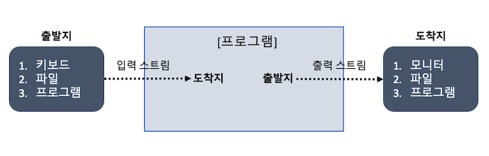

## 13주차 과제
> 자바의 Input과 Output에 대해 학습

## 목차
- [I/O](#io)
  - [스트림 (Stream)](#스트림-stream)
  - [버퍼 (Buffer)](#버퍼-buffer)
  - [채널 (Channel)](#채널-channel)
- [InputStream과 OutputStream](#inputstream과-outputstream)
- [Byte와 Character 스트림](#byte와-character-스트림)
- [표준 스트림](#표준-스트림)
- [파일 읽고 쓰기](#파일-읽고-쓰기)

<br />

## I/O
자바의 입출력 API는 **IO**와 **NIO**로 나뉘어있는데, NIO는 Java4부터 새로운 입출력(New Input/Output)이라는 의미로 추가된 ```java.nio``` 패키지에 포함

Java7부터 IO와 NIO의 설계를 개선한 NIO.2 API가 추가되었으며 해당 패키지는 ```java.nio```의 하위 패키지로 통합되어 사용


- ```java.nio.channels```, ```java.nio.charset```, ```java.nio.file``` 패키지가 새로 추가된 NIO.2 API

<br />

### IO와 NIO의 차이점


|구분|IO|NIO|
|---|:---:|:---:|
|입출력 방식|스트림 방식|채널 방식|
|버퍼 방식|non-buffer|buffer|
|비동기 방식|미지원|지원|
|블로킹/넌블로킹 방식|블로킹만 지원|블로킹/넌블로킹 모두 지원|

IO와 NIO는 데이터를 입출력한다는 목적은 동일하지만 방식에 차이가 있으므로 상황에 따라 적절한 API를 사용하는 것이 중요
- IO를 사용해야 할 때 : 클라이언트 수가 적고 대용량 데이터를 처리해야 하는 경우, 순차적으로 진행해야 하는 경우
  - 버퍼를 사용하지 않고 받은 즉시 처리하므로 덜 복잡함
- NIO를 사용해야 할 때 : 클라이언트 수가 많고 하나의 입출력 작업이 오래 걸리지 않는 경우
  - 다수의 클라이언트를 비동기 또는 넌블로킹으로 처리 가능
  - 과도한 스레드 생성을 예방하고 효과적으로 재사용 가능

#### ```java.io``` 패키지의 주요 클래스
|주요 클래스|설명|
|---|---|
|File|파일 시스템의 파일 정보를 얻기 위한 클래스|
|Console|콘솔로부터 문자를 입출력하기 위한 클래스|
|InputStream / OutputStream|**바이트 단위** 입출력을 위한 최상위 입출력 스트림 클래스|
|FileInputStream / FileOutputStream<br />DataInputStream / DataOutputStream<br />ObjectInputStream / ObjectOutputStream<br />PrintStream<br />BufferedInputStream / BufferedOutputStream|**바이트 단위** 입출력을 위한 하위 스트림 클래스|
|Reader / Writer|**문자 단위** 입출력을 위한 최상위 입출력 스트림 클래스|
|FileReader / FileWriter<br />InputStreamReader / OutputStreamWriter<br />PrintWriter<br />BufferedReader / BufferedWriter|**문자 단위** 입출력을 위한 하위 스트림 클래스|

#### java.nio 패키지의 주요 클래스


### 스트림 (Stream)
스트림은 단일 방향으로 연속적으로 흘러가는 것을 의미

IO는 스트림 기반이며, 입력 스트림과 출력 스트림으로 구분되어 있기 때문에 데이터를 읽기 위한 입력 스트림 ```InputStream과``` 출력하기 위한 출력 스트림 ```OutputStream```을 별도로 생성하여 사용


**프로그램을 기준**으로 데이터가 들어오면 입력 스트림, 나가면 출력 스트림

다른 프로그램과 통신하기 위해서는 양쪽 프로그램에 각각 입출력 스트림 총 4개가 필요

#### 분류
- **바이트 기반 스트림**
  - 그림, 멀티미디어, 문자 등 모든 종류의 데이터 송수신 가능
  - 데이터를 바이트 단위로 읽고 쓰는 스트림
  - 네이밍은 ```XXXInputStream``` / ```XXXOutputStream```
- **문자 기반 스트림**
  - 문자 데이터만 송수신 가능
  - 데이터를 문자 단위로 읽고 쓰는 스트림
  - 네이밍은 ```XXXReader``` / ```XXXWriter```


<br />

### 버퍼 (Buffer)

<br />

### 채널 (Channel)

:arrow_double_up:[Top](#13주차-과제)

<br />

## InputStream과 OutputStream
두 클래스는 ```Closeable```을 구현하고 있기 때문에 [9주차](./9주차.md#try-with-resources)에 학습한 ```try-with-resources``` 활용 가능

### InputStream

.```InputStream```은 바이트 기반 입력 스트림의 최상위 클래스이며 추상 클래스

<br />

#### 주요 메소드
#### read()
```JAVA
int read();
```
- 입력 스트림으로부터 1바이트를 읽고 읽은 바이트 리턴
- 바이트를 읽지만 리턴 타입이 ```int```이기 때문에 4바이트인 ```int``` 타입의 가장 끝 1바이트에만 데이터 저장
- 더 이상 입력 스트림으로부터 읽을 내용이 없으면 -1 반환
- 사용 예시
  ```JAVA
  InputStream is = new FileInputStream(new File("..."));
  int readByte;

  while ((readByte = is.read()) != -1) { . . . }
  ```

<br />

#### read(byte[] b)
```JAVA
int read(byte[] b);
```
- 입력 스트림으로부터 읽은 바이트를 매개값 ```b```에 저장하고 실제로 읽은 바이트 수 리턴
- 더 이상 입력 스트림으로부터 읽을 내용이 없으면 -1 반환
- 입력 스트림 크기가 매개값으로 주어진 바이트 배열의 크기보다 클 경우, 입력 스트림을 반복해서 끝까지 읽을 때 바이트 배열의 끝까지 채운 후 ```[0]``` 부터 덮어 씌움
- 사용 예시
  ```JAVA
  InputStream is = new FileInputStream(new File("..."));
  int readSize;
  byte[] readBytes = new byte[100];

  while ((readSize = is.read(readBytes)) != -1) { . . . }
  ```
- 주어진 바이트 배열 크기 만큼 한번에 읽어오기 때문에 ```read()```보다 훨씬 효율적

<br />

#### read(byte[] b, int off, int len)
```JAVA
int read(byte[] b, int off, int len);
```
- 입력 스트림으로부터 ```len```개의 바이트만큼 읽고 매개값 ```b```에 ```b[off]```부터 ```len```개 까지 저장하고 실제로 읽은 바이트 수 리턴
- 더 이상 입력 스트림으로부터 읽을 내용이 없으면 -1 반환
- ```off```를 0으로 ```len```을 배열의 길이로 준다면 ```byte(byte[] b)```와 동일한 기능

<br />

#### close()
```JAVA
void close();
```
- 사용한 시스템 자원 반납하고 입력 스트림 닫기

<br />

### OutputStream

.```OutputStream```은 바이트 기반 출력 스트림의 최상위 클래스이며 추상 클래스

#### 주요 메소드
#### write(int b)
```JAVA
void write(int b);
```
- 출력 스트림으로 1바이트 전송(```b```의 끝 1바이트)
-
- [참고] 매개값 타입이 ```int```인 이유?
  - 입력 스트림의 ```read()``` 메소드의 반환값이 ```int```형이고, 입력 스트림의 끝을 알리는 -1 을 반환할 수도 있기 때문이라는데 확실한지 확인 필요
  - 내부적으로는 ```int```의 3비트는 무시하고 마지막 1비트만 사용하여 0 ~ 255 사이의 값만 출력 스트림에 전송하도록 구현되어 있으며, 256 이상의 값 입력 시 256으로 나머지 연산을 한 값이 출력 스트림으로 전달

#### write(byte[] b)
```JAVA
void write(byte[] b);
```
- 출력 스트림으로 주어진 바이트 배열 ```b```의 모든 바이트 전송

#### write(byte[] b, int off, int len)
```JAVA
void write(byte[] b, int off, int len);
```
- 출력 스트림으로 주어진 바이트 배열 ```b[off]```부터 ```len```개 까지 바이트 전송

#### flush()
```JAVA
void flush();
```
- 버퍼에 잔류하는 모든 바이트 출력

#### close()
```JAVA
void close();
```
- 사용한 시스템 자원 반납 후 출력 스트림 닫기

:arrow_double_up:[Top](#13주차-과제)

<br />

## Byte와 Character 스트림
:arrow_double_up:[Top](#13주차-과제)

<br />

## 표준 스트림
System.in, System.out, System.err

:arrow_double_up:[Top](#13주차-과제)

<br />

## 파일 읽고 쓰기

:arrow_double_up:[Top](#13주차-과제)

<br />

### Reference
- 신용권, 『이것이 자바다』, 한빛미디어(2015)
