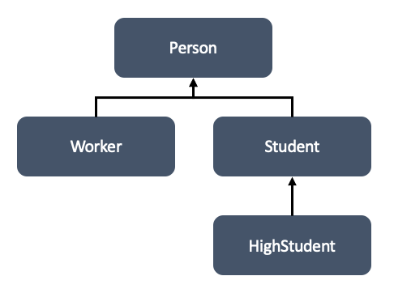

## 14주차 과제
> 자바의 제네릭에 대해 학습

## 목차
- [제네릭 정의](#제네릭-정의)
- [제네릭 사용법](#제네릭-사용법)
- [제네릭 주요 개념](#제네릭-주요-개념)
  - [바운디드 타입](#바운디드-타입)
  - [와일드 카드](#와일드-카드)
- [제네릭 메소드 만들기](#제네릭-메소드-만들기)
- [Erasure](#erasure)

## 제네릭 정의
Java 5부터 추가되어 클래스와 인터페이스, 메소드를 정의할 때 **타입을 파라미터로 사용**할 수 있게 하는 역할

#### 타입 파라미터
변수명과 동일한 규칙으로 작성할 수 있지만, **일반적으로 대문자 알파벳 한 글자로 표현**

<br />

제네릭은 **제네릭 타입**과 **제네릭 메소드**로 분류
#### 제네릭 타입
```JAVA
public class Example<T> {
  private T t;
}
```
- 타입 파라미터가 있는 클래스 또는 인터페이스

#### 제네릭 메소드
```JAVA
public <T, R> R method(T t) { }
```
- 매개 타입과 리턴 타입으로 타입 파라미터를 갖는 메소드

자세한 내용은 아래에서 설명

<br />

### 제네릭의 장점
- **컴파일 시 강한 타입 체크 가능**
  - 코드 작성 시점에 잘못 사용한 타입 때문에 **런타임 중 발생하는 에러를 방지**하기 위해, 자바 컴파일러는 제네릭 코드에 대한 강한 타입 체크 수행
- **불필요한 타입 변환 과정 제거**
  ```JAVA
  // 비제네릭 코드
  List list = new ArrayList();
  list.add("hello");
  String str = (String) list.get(0); // 타입 변환 필요

  // 제네릭 코드
  List<String> list = new ArrayList<>();
  list.add("hello");
  String str = list.get(0); // 타입 변환 불필요
  ```
  - ```List``` 저장 요소를 ```String```으로 제한하기 때문에 요소 사용 시 캐스팅 불필요

:arrow_double_up:[Top](#14주차-과제)

<br />

## 제네릭 사용법
### 제네릭 타입
```JAVA
public class 클래스명<T> { . . . }
public interface 인터페이스명<T> { . . . }
public class 클래스명<K, V> { . . . }
```
- 클래스 또는 인터페이스 이름 뒤에 "< >" 부호가 붙고, 사이에 타입 파라미터 위치
- 두 개 이상의 멀티 타입 파라미터 사용 가능

<br />

#### 타입 파라미터를 사용하지 않은 경우
```JAVA
// 비제네릭 타입
public class Box {
  private Object object;

  public void set(Object object) { this.object = object; }
  public Object get() { return object; }
}
```
```JAVA
public class Ex {
  public static void main(String[] args) {
    Box box = new Box();

    box.set("hello");                       // String을 Object로 자동 형변환
    String str = (String) box.get();        // Object를 String으로 강제 형변환

    box.set(new Integer());                 // Integer를 Object로 자동 형변환
    Integer integer = (Integer) box.get();  // Object를 Integer로 강제 형변환
  }
}
```
- 위와 같은 타입 변환이 빈번해지면 전체 프로그램 성능에 좋지 않은 영향

#### 타입 파라미터를 사용한 경우
타입 변환 문제 해결 가능
```JAVA
public class Box<T> {
  private T t;

  public void set(T t) { this.t = t; }
  public T get() { return t; }
}
```
```JAVA
public class Ex {
  public static void main(String[] args) {
    // Java 6
    // Box<String> box = new Box<String>();

    // Java 7 이후
    Box<String> box = new Box<>();

    box.set("hello");
    String str = box.get();
  }
}
```
- 타입 변환 미발생
- Java 7부터 **다이아몬드 연산자**(<>)를 사용하여 컴파일러가 타입 파라미터를 유추해서 자동 설정

제네릭을 사용한 코드가 **컴파일된 클래스파일**을 열어보면 다음과 같이 변경되어 있는 것을 확인 가능
```JAVA
public static void main(String[] args) throws Exception {
  Box<String> box = new Box();    // 타입 파라미터 제거
  box.set("hello");
  String str = (String)box.get(); // 형변환
}
```
- 제네릭 사용 시 컴파일러가 알아서 형변환 처리
- 런타임 시에는 제네릭 특성에 따라 타입을 **소거** 처리
- 소거 내용은 [아래](#erasure)에서 설명

<br />

### 멀티 타입 파라미터
```JAVA
public class Product<T, M> {
  private T kind;
  private M model;

  public T getKind() { return this.kind; }
  public M getModel() { return this.model; }

  public void setKind(T kind) { this.kind = kind; }
  public void setModel(M model) { this.model = model; }
}

public class Ex {
  public static void main(String[] args) {
    Product<Tv, String> tv = new Product<>();
    Product<Car, String> car = new Product<>();

    tv.setKind(new Tv());
    car.setKind(new Car());
  }
}
```
**두 개 이상**의 멀티 타입 파라미터 사용 가능

<br />

### 제네릭 타입의 상속과 구현
#### 다른 타입처럼 부모 클래스 역할 가능
```JAVA
public class Product<T, M> { . . . }
```
```JAVA
public class ChildProduct<T, M> extends Product<T, M> { . . . }
```
```JAVA
// 자식 제네릭 타입은 타입 파라미터 추가 가능
public class ChildProduct<T, M, C> extends Product<T, M> {
  private C company;

  public C getCompany() { return this.company; }
  public void setCompany(C company) { this.company = company; }
}
```

<br />

#### 제네릭 인터페이스를 구현한 타입도 제네릭 타입
```JAVA
public interface Storage<T> {
  public void add(T item, int index);
  public T get(int index);
}
```
```JAVA
public class StorageImpl<T> implements Storage<T> {
  private T[] array;

  public StorageImpl(int capacity) {
    this.array = (T[]) (new Object[capacity]);
  }

  @Override
  public void add(T item, int index) { . . . }

  @Override
  public T get(int index) { . . . }
}
```

:arrow_double_up:[Top](#14주차-과제)

<br />

## 제네릭 주요 개념
### 바운디드 타입
**제한된 타입 파라미터**. 종종 타입 파라미터에 구체적인 타입을 제한할 필요가 있을 때 바운디드 타입을 사용하며, **제네릭 타입이나 제네릭 메소드를 정의할 때 사용**하는 방법

타입 파라미터 뒤에 ```extends``` 키워드를 붙이고 상위 타입 명시
```JAVA
<T extends 최상위 타입>
```

반대로 **언바운디드 타입 Unbounded Type**은 ```<T>```나 ```<?>```와 같이 제한을 두지 않은 타입

<br />

#### 제네릭 타입의 바운디드 타입 정의 방법
```JAVA
public class Box<T extends Number> { . . . }
```
- 숫자만 사용 가능한 제네릭 타입인 경우 ```Number```의 하위 클래스로 제한 가능

#### 제네릭 메소드의 바운디드 타입 정의 방법
```JAVA
public <T extends Number> int compare(T t1, T t2) {
  double v1 = t1.doubleValue(); // Number의 메소드
  double v2 = t2.doubleValue(); // Number의 메소드
  return Double.compare(v1, v2);
}
```
- 중괄호{} 내 구현부에서 타입 파라미터 변수로 사용 가능한 것은 상위 타입 ```Number```의 멤버(필드, 메소드)로 제한
- ```Number```의 하위 타입에만 있는 멤버는 사용 불가능
- 제네릭 메소드는 [아래](#제네릭-메소드-만들기)에서 자세히 설명


<br />

### 와일드 카드
? 기호를 와일드 카드라고 표현하며, **제네릭 타입을 메소드의 매개값으로 전달**할 때 구체적인 타입 대신 와일드 카드 사용 가능
- **```제네릭타입<?>```** : 제한 없음. 모든 클래스나 인터페이스 가능
- **```제네릭타입<? extends 상위타입>```** : 상위 클래스 제한. 해당 상위 타입을 포함한 하위 타입만 지정 가능
- **```제네릭타입<? super 하위타입>```** : 하위 클래스 제한. 해당 하위 타입을 포함한 하위 타입의 상위 타입만 지정 가능

<br />

#### 사용 예시
```JAVA
public class Course<T> {
  private String name;
  private T[] students; // 수강생의 타입을 외부에서 전달

  public Course(String name, int capacity) {
    this.name = name;
    students = (T[]) (new Object[capacity]); // 타입 파라미터로 배열 생성하는 방법
  }
}
```

###### 그림 : 수강생 타입 구조

제네릭 타입 ```Course```가 있을 때 세 가지 와일드 카드 사용 방법
  1. Course<?>
      ```JAVA
      public void registerCourse(Course<?> course) {}
      ```
      - 모든 타입(Person, Worker, Student, HighStudent) 가능
      <br/>
  2. Course<? extends 상위타입>
      ```JAVA
      public void registerCourse(Course<? extends Student> course) {}
      ```
      - Student, HighStudent 타입만 사용 가능
      <br/>
  3. Course<? super 하위타입>
      ```JAVA
      public void registerCourse(Course<? super Worker> course) {}
      ```
      - Worker, Person 타입만 사용 가능

:arrow_double_up:[Top](#14주차-과제)

<br />

## 제네릭 메소드 만들기
제네릭 메소드는 메소드의 **매개 타입과 리턴 타입이 타입 파라미터**인 메소드

리턴 타입 앞에 다이아몬드 연산자<>로 **메소드에서 사용할 타입 파라미터 목록**을 작성하면 리턴 타입과 매개 타입으로 해당 타입 파라미터를 사용 가능
```JAVA
// <T, R> R method(T t)
public <타입파라미터, ...> 리턴타입 메소드명(매개변수, ...) {}
```

<br />

#### 사용 예시
```JAVA
public class Util {
  // 제네릭 메소드 정의 예시 1.
  public static <T> Box<T> boxing(T t) {
    Box<T> box = new Box<>();
    box.set(t);
    return box;
  }

  // 제네릭 메소드 정의 예시 2.
  public static <K, V> boolean compare(Pair<K, V> p1, Pair<K, V> p2) {
    boolean keyCompare = p1.getKey().equals(p2.getKey());
    boolean valueCompare = p1.getValue().equals(p2.getValue());

    return keyCompare && valueCompare;
  }
}
```
```JAVA
// 제네릭 메소드가 사용하는 제네릭 타입 1.
public class Box<T> {
  private T t;

  public void set(T t) { this.t = t; }
  public T get() { return t; }
}
```
```JAVA
// 제네릭 메소드가 사용하는 제네릭 타입 2.
public class Pair<K, V> {
  private K key;
  private V value;

  // ...
}
```
```JAVA
// 실행부
public class Ex {
  public static void main(String[] args) {
    // 제네릭 메소드 호출 1.
    Box<String> box = Util.boxing("hello");

    // 제네릭 메소드 호출 2.
    Pair<Integer, String> p1 = new Pair<>(1, "apple");
    Pair<Integer, String> p2 = new Pair<>(2, "grape");
    boolean isSame = Util.compare(p1, p2);
  }
}
```
- 제네릭 메소드 호출은 다른 메소드와 똑같이 호출하며, **컴파일러가 매개값을 보고 구체적인 타입을 추정**하여 처리

:arrow_double_up:[Top](#14주차-과제)

<br />

## Erasure
제네릭의 타입 소거(Generics Type Erasure)

제네릭은 타입을 컴파일 시에만 검사하고, **소거**에 의해 **런타임 시점에는 해당 타입 정보가 제거**되어 알 수 없는 것

### 소거 규칙
- 언바운디드 타입(```<?>```, ```<T>```)은 ```Object```로 변환
- 바운디드 타입은 ```extends``` 뒤에 작성한 객체로 변환
  - 예) ```<T extends Number>``` => ```Number```로 변환
- 제네릭 타입을 사용할 수 있는 클래스, 인터페이스, 메소드에만 소거 규칙 적용
- 타입 안정성 보장을 위해 필요 시 형변환 코드 추가
- 확장된 제네릭 타입은 다형성 보존을 위해 브릿지 메소드 생성

<br />

### 예시
#### 언바운디드 타입 컴파일 시점(소거 전)
```JAVA
public class Box<T> {
  public void method(T t) {
    System.out.println(t.toString());
  }
}
```

#### 언바운디드 타입 런타임 시점(소거 후)
```JAVA
public class Box {
  public void method(Object t) {
    System.out.println(t.toString());
  }
}
```

<br />

#### 바운디드 타입 컴파일 시점(소거 전)
```JAVA
public class Box<T extends Number> {
  private T data;

  public T getData() {
    return data;
  }

  public void setData(T data) {
    this.data = data;
  }
}
```

#### 바운디드 타입 런타임 시점(소거 후)
```JAVA
public class Box {
  private Number data;

  public Number getData() {
    return data;
  }

  public void setData(Number data) {
    this.data = data;
  }
}
```

:arrow_double_up:[Top](#14주차-과제)

<br />

### Reference
- 신용권, 『이것이 자바다』, 한빛미디어(2015)
- [자바의 제네릭 타입 소거, 리스트에 관하여 (Java Generics Type Erasure, List)](https://jyami.tistory.com/99)
- [[Java] Generic Type erasure란 무엇일까?](https://devlog-wjdrbs96.tistory.com/263)
