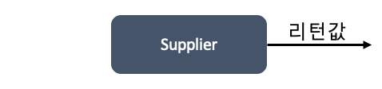
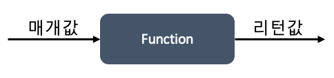
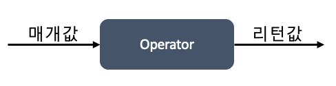
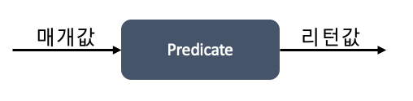

## 15주차 과제
> 자바의 람다식에 대해 학습

## 목차
- [람다식](#람다식)
- [람다식 사용법](#람다식-사용법)
- [함수형 인터페이스](#함수형-인터페이스)
- [Variable Capture](#variable-capture)
- [메소드, 생성자 레퍼런스](#메소드-생성자-레퍼런스)

## 람다식
자바는 객체 지향 언어이지만, 병렬 처리와 이벤트 지향 프로그래밍에 적합한 함수형 프로그래밍이 부각됨에 따라 **함수형 프로그래밍 지원을 위해 람다식 도입**

람다식은 익명 함수를 생성하기 위한 식

자바가 람다식을 수용한 이유
- 코드의 간결화
- 컬렉션 요소를 필터링하거나 매핑하여 원하는 결과를 쉽게 집계 가능

### 사용 예시
```JAVA
// 익명함수
Runnable runnable = new Runnable() {
  @Override
  public void run() { . . . }
};
```
```JAVA
// 람다식
Runnable runnable = () -> { . . . };
```
- ```(매개변수) -> {실행코드}``` 형식
- 런타임 시 **인터페이스의 익명 구현 객체**로 생성

:arrow_double_up:[Top](#15주차-과제)

<br />

## 람다식 사용법
### 람다식 작성 방법
```JAVA
(타입 매개변수, ...) -> { 실행문; ... }
```
```JAVA
() -> { 실행문; }
```
- ```(타입 매개변수)```는 오른쪽 중괄호 {} 블록을 실행하기 위해 필요한 값을 제공하는 역할
- 전달할 매개변수가 없다면 소괄호만 입력

<br />

### 사용 예시
```JAVA
(int a) -> { System.out.println(a); } // 기본적인 람다식
```
```JAVA
(a) -> { System.out.println(a); }     // 매개 타입은 런타임 시 자동 인식 가능하므로 일반적으로 생략해서 사용
```
```JAVA
a -> System.out.println(a)            // 한 개의 매개변수만 있다면 소괄호 생략 가능, 한 줄의 실행문만 있다면 중괄호 생략 가능
```
```JAVA
(x, y) -> { return x + y; }           // 실행 후 리턴값이 필요하다면 return문 사용 가능
```
```JAVA
(x, y) -> x + y                       // 실행부에 return문만 있을 경우
```

:arrow_double_up:[Top](#15주차-과제)

<br />

## 함수형 인터페이스
### 타겟 타입
```JAVA
인터페이스 변수 = 람다식;
```
자바는 메소드를 단독으로 선언할 수 없고 항상 클래스의 구성 멤버로 선언하며, 이에 따라 **람다식은 단순히 메소드를 선언하는 것이 아니라 메소드를 가진 객체를 생성**

람다식은 인터페이스 변수에 대입하여 사용하며, **인터페이스의 익명 구현 객체를 생성**하는 것
- 인터페이스가 직접 객체화할 수 없는 것을 람다식이 해줌

이 때, **람다식이 대입될 인터페이스를 람다식의 타겟 타입**이라고 지칭하는데, 모든 인터페이스가 람다식의 타겟 타입이 될 수는 없으며 **함수형 인터페이스만 타겟 타입**이 가능

<br />

### 함수형 인터페이스 @FunctionalInterface
**하나의 추상 메소드가 선언된 인터페이스**

람다식은 하나의 메소드만 정의하기 때문에 두 개 이상의 추상 메소드가 선언된 인터페이스는 타겟 타입 불가능

**```@FunctionalInterface```**
- 함수형 인터페이스 작성 시 두 개 이상의 추상 메소드가 선언되지 않도록 컴파일러가 체크하게 하는 애노테이션
- 애노테이션을 추가하지 않아도 추상 메소드가 한 개라면 함수형 인터페이스

```JAVA
@FunctionalInterface
public interface MyFunctionalInterface {
  void method();
  void otherMethod(); // 컴파일 에러
}
```

<br />

### 사용 예시
#### 매개변수와 리턴값이 없는 람다식
```JAVA
// 정의
@FunctionalInterface
public interface MyFunctionalInterface {
  void method();
}
```
```JAVA
// 사용
MyFunctionalInterface print = () -> System.out.println("Hello");
fi.method();
```

#### 매개변수가 있는 람다식
```JAVA
// 정의
@FunctionalInterface
public interface MyFunctionalInterface {
  void method(int x);
}
```
```JAVA
// 사용
MyFunctionalInterface printX = x -> System.out.println(x);
fi.method(10);
```

#### 리턴값 있는 람다식
```JAVA
// 정의
@FunctionalInterface
public interface MyFunctionalInterface {
  int method(int x, int y);
}
```
```JAVA
// 사용
MyFunctionalInterface calcSum = (x, y) -> x + y;
int result = fi.method(5, 10);
```

<br />

### 표준 API의 함수형 인터페이스
자바 8부터 ```java.util.function``` 패키지에서 표준 API로 제공하는 함수형 인터페이스

|종류|추상 메소드 특징|
|----|----|
|Consumer|매개값 有 / 리턴값 無|
|Supplier|매개값 無 / 리턴값 有|
|Function|매개값 有 / 리턴값 有<br />주로 매개값을 리턴값으로 매핑(타입변환)|
|Operator|매개값 有 / 리턴값 有<br />주로 매개값의 연산 결과 리턴|
|Predicate|매개값 有 / 리턴 타입 boolean<br />매개값을 조사해서 true/false 리턴|

표준 함수형 인터페이스의 목적은 메소드 또는 생성자의 매개 타입으로 사용되어 람다식을 대입하기 위함

<br />

#### Consumer 인터페이스
매개값을 받아서 ```accept()``` 메소드에서 처리하는 인터페이스


```JAVA
@FunctionalInterface
public interface Consumer<T> {
    void accept(T t);
}
```

- 매개 변수의 타입과 수에 따른 Consumer 종류
  |인터페이스 명|추상 메소드|설명|
  |---|---|---|
  |Consumer\<T\>|void accept(T t)|객체 T를 받아 소비|
  |BiConsumer<T, U>|void accept(T t, U u)|객체 T와 U를 받아 소비|
  |DoubleConsumer|void accept(double value)|double 값을 받아 소비|
  |IntConsumer|void accept(int value)|int 값을 받아 소비|
  |LongConsumer|void accept(long value)|long 값을 받아 소비|
  |ObjDoubleConsumer\<T\>|void accept(T t, double value)|객체 T와 double 값을 받아 소비|
  |ObjIntConsumer\<T\>|void accept(T t, int value)|객체 T와 int 값을 받아 소비|
  |ObjLongConsumer\<T\>|void accept(T t, long value)|객체 T와 long 값을 받아 소비|


**사용 예시**
```JAVA
Consumer<String> consumer = t -> System.out.println(t);
consumer.accept("java");

BiConsumer<String, Integer> biConsumer = (t, u) -> System.out.println(t + u);
biConsumer.accept("java", "8");

DoubleConsumer doubleConsumer = d -> System.out.println(d);
doubleConsumer.accept(8.0);

ObjIntConsumer<String> objConsumer = (t, i) -> System.out.println(t + i);
objConsumer.accept("JAVA", 8);
```

<br />

#### Supplier 인터페이스
.```getXXX()``` 메소드 실행 후 호출한 곳으로 결과 데이터를 리턴(공급)



```JAVA
@FunctionalInterface
public interface Supplier<T> {
    T get();
}
```

- Supplier 종류
  |인터페이스 명|추상 메소드|
  |---|---|
  |Supplier\<T\>|T get()|
  |BooleanSupplier|boolean getAsBoolean()|
  |DoubleSupplier|double getAsDouble()|
  |IntSupplier|int getAsInt()|
  |LongSupplier|long getAsLong()|


**사용 예시**
```JAVA
IntSupplier diceNumber = () -> {
  int num = (int) (Math.random() * 6) + 1;
  return num;
}
```

<br />

#### Function 인터페이스
매개값과 리턴값이 있는 ```applyXXX()``` 메소드를 실행하여, 매개값을 리턴값으로 매핑(타입 변환)



- 매개 변수 타입과 리턴 타입에 따른 Function 종류
  |인터페이스 명|추상 메소드|설명|
  |---|---|---|
  |Function<T, R>|R apply(T t)|객체 T를 R로 매핑|
  |BiFunction<T, U, R>|R apply(T t, U u)|객체 T, U를 R로 매핑|
  |DoubleFunction<R>|R apply(double value)|double을 객체 R로 매핑|
  |IntFunction<R>|R apply(int value)|int를 객체 R로 매핑|
  |IntToDoubleFunction|double applyAsDouble(int value)|int를 double로 매핑|
  |IntToLongFunction|long applyAsLong(int value)|int를 long으로 매핑|
  |LongToDoubleFunction|double applyAsDouble(long value)|long을 double로 매핑|
  |LongToIntFunction|int applyAsInt(long value)|long을 int로 매핑|
  |ToDoubleBiFunction<T, U>|double applyAsDouble(T t, U u)|객체 T, U를 double로 매핑|
  |ToDoubleFunction<T>|double applyAsDouble(T t)|객체 T를 double로 매핑|
  |ToIntBiFunction<T, U>|int applyAsInt(T t, U u)|객체 T, U를 int로 매핑|
  |ToIntFunction<T, U>|int applyAsInt(T t)|객체 T를 int로 매핑|
  |ToLongBiFunction<T, U>|long applyAsLong(T t, U u)|객체 T, U를 long으로 매핑|
  |ToLongFunction<T>|long applyAsLong(T t)|객체 T를 long으로 매핑|

**사용 예시**
```JAVA
public class Student {
  private String name;
  private int englishScore;
  private int mathScore;

  public Student(String name, int englishScore, int mathScore) {
    this.name = name;
    this.englishScore = englishScore;
    this.mathScore = mathScore;
  }

  public String getName() { return name; }
  public int getEnglishScore() { return englishScore; }
  public int getMathScore() { return mathScore; }
}
```
```JAVA
public class FunctionEx {
  private static final List<Student> list = Arrays.asList(
    new Student("홍길동", 90, 96);
    new Student("홍홍홍", 95, 93);
  );

  // 함수형 인터페이스를 메소드 인자로 두어 람다식을 메소드 인자에 전달 가능
  public static void printName(Function<Student, String> function) {
    for(Student student : list) {
      // 람다식 실행
      System.out.print(function.apply(student) + " ");
    }
    System.out.println();
  }

  public static void printScore(ToIntFunction<Student> function) {
    for(Student student : list) {
      // 람다식 실행
      System.out.print(function.applyAsInt(student) + " ");
    }
    System.out.println();
  }
}
```
실행 코드
```JAVA
public class Ex {
  public static void main(String[] args) {
    System.out.println("[Student name]");
    printName(t -> t.getName());

    System.out.println("[English Score]");
    printScore(t -> t.getEnglishScore());

    System.out.println("[Math Score]");
    printScore(t -> t.getMathScore());
  }
}
```

<br />

#### Operator 인터페이스
Function과 동일하게 ```applyXXX()``` 메소드를 사용하지만 매개값으로 연산 수행 후 동일한 타입으로 리턴값 제공



- 매개 변수의 타입과 수에 따른 Operator 종류
  |인터페이스 명|추상 메소드|
  |---|---|
  |BinaryOperator\<T\>|BiFunction<T, U, R>의 하위 인터페이스|
  |UnaryOperator\<T\>|Function<T, R>의 하위 인터페이스|
  |DoubleBinaryOperator|double applyAsDouble(double value1, double value2)|
  |DoubleUnaryOperator|double applyAsDouble(double value)|
  |IntBinaryOperator|int applyAsInt(int value1, int value2)|
  |IntUnaryOperator|int applyAsInt(int value)|
  |LongBinaryOperator|long applyAsLong(long value1, long value2)|
  |LongUnaryOperator|long applyAsLong(long value)|
  - 주어진 타입의 매개값을 연산 후 반환하는 방식

**사용 예시**
```JAVA
public class OperatorEx {
  private static int[] scores = { 92, 95, 87 };

  public static int maxOrMin(IntBinaryOperator operator) {
    int result = scores[0];

    for (int score : scores) {
      // 람다식 실행
      result = operator.applyAsInt(result, score);
    }

    return result;
  }

  public static void main(String[] args) {
    // 최대값
    int max = maxOrMin(
      (a, b) -> {
        if (a >= b) return a;
        else return b;
      }
    );

    // 최소값
    int min = maxOrMin(
      (a, b) -> {
        if (a <= b) reutrn a;
        else return b;
      }
    );
  }
}
```

<br />

#### Predicate 인터페이스
매개변수와 boolean 리턴 타입이 있는 ```test()``` 메소드로 매개값을 조사해서 true/false 반환



- 매개 변수의 타입과 수에 따른 Predicate 종류
  |인터페이스 명|추상 메소드|
  |---|---|
  |Predicate\<T\>|boolean test(T t)|
  |BiPredicate<T, U>|boolean test(T t, U u)|
  |DoublePredicate|boolean test(double value)|
  |IntPredicate|boolean test(int value)|
  |LongPredicate|boolean test(long value)|

<br />

#### 디폴트 및 정적 메소드
디폴트 및 정적 메소드는 추상메소드가 아니기 때문에 함수형 인터페이스에 추가해도 함수형 인터페이스 성질 유지 가능

- ```Consumer```, ```Function```, ```Operator``` 타입이 제공하는 디폴트 메소드
  - ```andThen()```
  - ```compose()```

- ```Predicate``` 타입이 제공하는 디폴트 및 정적 메소드
  - ```and()```
  - ```or()```
  - ```negate()```
  - ```isEqual()```

- ```BinaryOperator``` 타입이 제공하는 정적 메소드
  - ```minBy()```
  - ```maxBy()```

:arrow_double_up:[Top](#15주차-과제)

<br />

## Variable Capture
익명 객체 또는 람다식으로 인스턴스 구현 시 필요한 정보를 복사해서 넘겨주는 것이 Variable Capture

람다식 외부에 선언된 변수 중 람다식 내에서 사용 가능한 변수의 범위
- static 변수
- 인스턴스 변수
- 로컬 변수

람다식을 선언하면 인스턴스 객체가 **힙 메모리**에 생성되기 때문에 각 변수 범위에 따라 람다식에서 사용하는데 제약이 있음

<br />

### static 변수
static 변수는 자바 프로그램 실행 시 **메소드 메모리**에 생성되어 프로그램 종료 시까지 유지되기 때문에 람다식에서 제약 없이 읽기/수정 가능

```JAVA
public class EventConsumerImpl {
  private static String someStaticVar = "Some text";

  public void attach(MyEventProducer eventProducer){
    eventProducer.listen(e -> {
      System.out.println(someStaticVar);
    });
  }
}
```

<br />

### 인스턴스 변수
인스턴스 변수는 람다식과 동일하게 **힙 메모리**에 생성되므로 람다식에서 제약 없이 읽기/수정 가능

주의할 점은 익명 객체 내부의 ```this```는 익명 객체 자체를 참조하지만, **람다식의 ```this```는 익명 객체가 아닌, 람다식을 실행한 객체의 참조**

```JAVA
public interface MyInterface {
  void method();
}
```
```JAVA
public class UsingThis {
  public int outter = 10;

  class Inner {
    int inner = 20;

    void usingThisMethod() {
      // 람다식으로 메소드 구현
      MyInterface mi = () -> {
        // 바깥 객체의 참조를 얻어오는 두 가지 방법 (this.outter 는 불가능)
        System.out.println(UsingThis.this.outter);
        System.out.println(outter);

        // 람다식은 람다식을 실행한 객체를 참조
        System.out.println(this.inner);
      };

      mi.method();
    }
  }
}
```
실행 코드
```JAVA
public class UsingThisEx {
  public static void main(String[] args) {
    UsingThis usingThis = new UsingThis();
    UsingThis.Inner inner = usingThis.new Inner();
    inner.usingThisMethod();
  }
}
```

<br />

### 로컬 변수
- 메소드 매개 변수
- 메소드 내에 정의된 변수

로컬 변수는 **스택 메모리**에 생성되고, **메소드 종료 시 메모리에서 사라지기 때문**에 람다식에서 **읽기만 가능**

읽기만 가능하다는 특징 때문에 자바 7까지는 익명 객체 외부에 선언된 로컬 변수를 내부에서 참조하려면 ```final```이어야만 가능했는데, 자바 8부터는 **유사 파이널, effectively final**이라는 개념을 도입하여 컴파일러가 람다식 내에서 사용하는 변수가 변경되지 않는다고 판단하면 **알아서 ```final```로 해석**하여 컴파일

```JAVA
public interface MyFactory {
    public String create(char[] chars);
}
```
```JAVA
public void method() {
  String myString = "Test";

  MyFactory myFactory = (chars) -> {
      return myString + ":" + new String(chars);
  };
}
```

:arrow_double_up:[Top](#15주차-과제)

<br />

## 메소드, 생성자 레퍼런스
메소드를 참조해서 메소드의 매개 변수 정보와 리턴 타입을 알아내어, 람다식에서 불필요한 매개 변수를 제거하는 것이 목적

두 개의 값을 받아 큰 수를 리턴하는 ```Math``` 클래스의 ```max()``` 정적 메소드를 람다식에서 다음과 같은 방법으로 사용
```JAVA
(left, right) -> Math.max(left, right);
```

위 방법은 두 값을 단순히 매개값으로 전달하는 역할만 하기 때문에 이러한 경우 **메소드 참조**를 이용하여 코드 축소 가능
```JAVA
Math::max;
```
```JAVA
// 두 개의 int값을 받아 int값을 리턴하는 IntBinaryOperator 사용
IntBinaryOperator operator = Math::max;
```

#### 메소드 참조가 가능한 경우
- static 메소드
- 인스턴스 메소드
- 생성자 참조

<br />

### 메소드 참조
- static 메소드 : 클래스 이름 뒤에 ```::``` 기호 붙이고 정적 메소드 이름 작성
- 인스턴스 메소드 : 객체를 생성한 다음, 참조 변수 뒤에 ```::``` 기호 붙이고 인스턴스 메소드 이름 작성

#### 사용 예시
```JAVA
public class Calculator {
  public static int staticMethod(int x, int y) {
    return x + y;
  }

  public int instanceMethod(int x, int y) {
    return x + y;
  }
}
```
```JAVA
public class MethodRefEx {
  public static void main(String[] args) {
    IntBinaryOperator operator;

    /* static 메소드 참조 */
    //operator = (x, y) -> Calculator.staticMethod(x, y);
    operator = Calculator::staticMethod;
    System.out.println(operator.applyAsInt(1, 2));

    /* 인스턴스 메소드 참조 */
    Calculator calc = new Calculator();
    //operator = (x, y) -> calc.instanceMethod(x, y);
    operator = calc::instanceMethod;
    System.out.println(operator.applyAsInt(3, 4));
  }
}
```

<br />

### 람다식 매개 변수의 메소드 참조
위 방법은 람다식 외부 클래스 멤버 메소드를 호출했지만, 다음과 같이 **람다식 매개 변수의 메소드를 호출**하는 경우도 존재
```JAVA
(a, b) -> { a.instanceMethod(b); }
```

이런 경우는 **```a```의 클래스 이름 뒤에 ```::``` 기호를 붙이고 메소드 이름을 작성** 하여 사용

#### 사용 예시
```JAVA
public class ArgumentRefEx {
  public static void main(String[] args) {
    ToIntBiFunction<String, String> function;

    //function = (a, b) -> a.compareToIgnoreCase(b);
    function = String::compareToIgnoreCase;
    System.out.println(function.applyAsInt("JAVA8", "JAVA8"));
  }
}
```

<br />

### 생성자 참조
생성자 참조는 객체 생성을 의미. 다음과 같이 단순히 객체 생성 후 리턴만 하는 경우를 생성자 참조로 표현 가능
```JAVA
(a, b) -> { return new Clazz(a, b); }
```
```JAVA
// 생성자 참조
Clazz::new;
```
- 생성자가 오버로딩되어 여러 개라면, **컴파일러는 함수형 인터페이스의 추상 메소드와 동일한 매개 변수 타입과 개수를 가지고 있는 생성자를 찾아** 실행

#### 사용 예시
```JAVA
public class Member {
  private String name;
  private String id;

  public Member() {
    System.out.println("Member()");
  }

  public Member(String id) {
    System.out.println("Member(String id)");
    this.id = id;
  }

  public Member(String name, String id) {
    System.out.println("Member(String name, String id)");
    this.name = name;
    this.id = id;
  }
}
```
```JAVA
public class ConstructorRefEx {
  public static void main(String[] args) {
    Function<String, Member> function1 = Member::new;
    Member member1 = function1.apply("user1");

    BiFunction<String, String, Member> function2 = Member::new;
    Member member2 = function2.apply("dami", "user2");
  }
}
```
- 매개변수 개수에 따라 각각 다른 생성자 실행

:arrow_double_up:[Top](#15주차-과제)

<br />

### Reference
- 신용권, 『이것이 자바다』, 한빛미디어(2015)
- [Java Lambda Expressions](http://tutorials.jenkov.com/java/lambda-expressions.html#variable-capture)
- [Java Lambda (5) 변수 범위](https://futurecreator.github.io/2018/08/02/java-lambda-variable-scope/)
