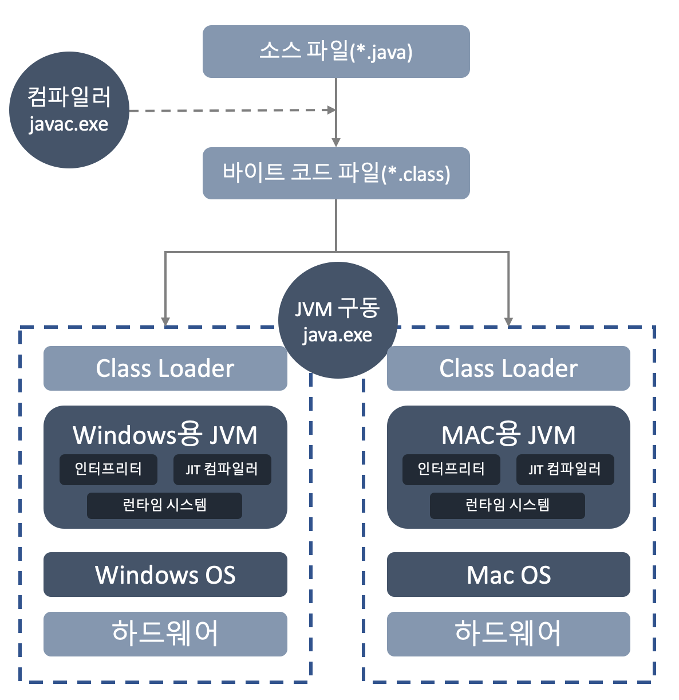
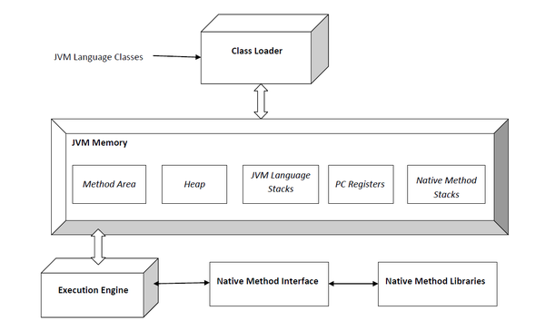

## 1주차 과제
> JVM은 무엇이며 자바 코드는 어떻게 실행하는 것인가.

### 학습 목표
자바 소스 파일(.java)을 JVM으로 실행하는 과정 이해하기

#### JVM이란
- Java Virtual Machine
- 자바 프로그램은 완전한 기계어가 아닌 바이트코드이기 때문에 운영체제가 자바 프로그램을 해석하고 실행할 수 있도록 가상의 운영체제 역할을 하는 것 (자바 바이트코드를 실행하는 주체)
- 운영체제와 자바 프로그램을 중개하는 역할
  - JVM을 통해 자바 프로그램은 여러 운영체제에서 동일한 실행 결과 도출 가능
  - 개발자는 운영체제와 상관없이 자바 프로그램 개발 가능
- 운영체제에 종속적
  - 자바 프로그램을 운영체제가 이해하는 기계어로 번역하여 실행하기 때문에 운영체제에 맞는 버전 설치 필요

##### 자바 프로그램 실행 단계

1. 확장자가 .java인 자바 파일 작성
2. 컴파일러로 소스 파일을 컴파일하여 확장자가 .class인 바이트코드 파일 생성
3. JVM 구동 시 바이트코드 파일을 해석하고 운영체제에 맞게 기계어로 번역 (바이트코드는 하나지만 JVM에 의해 번역되는 기계어는 운영체제에 따라 차이)

#### 컴파일하는 방법
- 컴파일을 하기 위해 가장 먼저 javac.exe 파일이 포함된 JDK 설치 필요
- javac.exe 실행하여 컴파일
  - 컴파일 명령 수행 시 다른 디렉토리에서도 쉽게 실행할 수 있도록 Path 환경 변수에 JDK 내부의 bin 디렉토리 경로 등록 필요
  - cmd 창에서 수행 시 명령어는 ```javac```
    - ex. ```javac Hello.java```
- IDE 사용 시 코드 작성 과정 자체가 컴파일

#### 실행하는 방법
- 컴파일 결과 생성된 .class 파일 사용
- JVM 구동을 위해 java.exe 실행
  - cmd 창에서 수행 시 명령어는 ```java```
  - 만들어진 바이트코드 파일을 cmd 창에서 실행 명령 시 명령어는 ```java```
    - ex. ```java Hello```
- IDE 사용 시 실행 작업

##### 컴파일 버전과 실행 버전
- 상위 버전으로 컴파일 된 바이트코드는 하위 버전에서 실행 불가능
  - UnsupportedClassVersionError 발생
  - 단, 컴파일 시 옵션 추가함으로써 해결 가능
  - 스프링 등 여러 프레임워크에서 이런 경우 고려해서 컴파일 옵션 적용하여 출시
- 하위 버전으로 컴파일 된 바이트코드는 상위 버전에서 실행 가능

##### javac 옵션
- 컴파일에 필요한 참조 클래스의 경로 설정 옵션
  - ```javac -classpath(cp) C:\java\classes C:\java\Hello.java```
  - 참조 경로가 여러개인 경우 ;로 구분
- 클래스 파일을 생성할 루트 디렉토리 설정 옵션
  - ```javac -d C:\java\classes Hello.java```
- 지정한 JVM에서 실행 가능하도록 클래스 파일 생성 옵션(-target)
  - ```javac Hello.java -source 1.8 -target 1.8```
  - 워닝 발생 시 이전 버전의 rt.jar 위치 명시
- 인코딩 옵션
  - ```javac -encoding utf-8 Hello.java```
- 디버깅 정보 생성 옵션
  - ```javac -g:none:``` 디버깅 정보 미생성
  - ```javac -g:{lines, vars, source}:``` 각각 라인정보, 지역변수, 소스파일 정보를 나타내며 디버깅 정보 생성
- 경고 메시지 미생성 옵션
  - ```javac -nowarn Hello.java```
- 중단된 API 위치 출력
  - ```javac -deprecation Hello.java```

#### 바이트코드란
- JVM이 이해할 수 있는 언어로 변환된 소스 코드
  - 반드시 자바 언어가 아니어도 JVM이 이해할 수 있다면 실행 가능(ex. Kotlin)
- 자바 컴파일러에 의해 변환되는 코드의 명령어 크기가 1바이트여서 바이트코드라 불림
  - ```javap``` 명령 사용하여 op코드 확인 가능
- 확장자는 .class
- JVM 설치만 되어있으면 어떤 운영체제에서도 실행 가능

#### JVM 구성 요소

출처 : https://ko.wikipedia.org/wiki/%EC%9E%90%EB%B0%94_%EA%B0%80%EC%83%81_%EB%A8%B8%EC%8B%A0
- 클래스 로더
  - JVM 구동 시 바이트코드 로딩
  - 생성된 클래스의 인스턴스를 메모리에 로드
- 런타임 데이터 저장소
  - Method
    - JVM 시작 시 생성
    - 클래스 로더로 읽어온 바이트코드에서 클래스별로 런타임 상수풀, 필드 데이터, 메소드 데이터, 메소드 코드, 생성자 코드 등을 분류하여 저장
    - 모든 스레드가 공유
  - Heap
    - 객체와 배열이 생성 및 저장되는 영역
    - JVM Stack 영역의 변수나 다른 객체의 필드에서 참조하는 객체가 저장된 곳
      - 참조하지 않을 경우 GC에 의해 제거
  - JVM Stack
    - 스레드 시작 시 할당
    - 각 스레드마다 개별 존재
      - 별도로 스레드를 생성하지 않는다면 main 스레드만 존재하므로 JVM Stack은 한 개
    - 메소드를 호출할 때마다 프레임을 추가(push)하고, 메소드 종료 시 해당 프레임을 제거(pop)
      - 메소드 단위의 스택
      - 프레임 내부에는 로컬 변수 스택이 있으며 변수가 초기화될 때 추가(push)
      - 변수는 선언된 블록을 벗어나면 제거(pop)
    - primitive 타입 변수는 스택 영역에 직접 값 저장
    - **참조 타입 변수는 값이 아닌 Heap이나 Method 영역의 객체 주소를 값으로 저장**
      - 실제 값은 Heap이나 Method에 저장
  - PC 레지스터
    - 현재 실행 중인 JVM 명령의 주소 저장
    - 각 스레드마다 개별 존재
- 실행 엔진
  - 클래스 로더를 통해 런타임 데이터 저장소에 저장된 바이트코드를 명령어 단위로 읽어서 실행
  - 자바 인터프리터
  - JIT 컴파일러
  - 가비지 컬렉터

#### JIT 컴파일러란
- Just In Time
- 기계어로 빠르게 변환해주는 JVM 내부의 최적화된 컴파일러
- 자바는 JVM을 통해 실행 가능한 기계어로 번역되기 때문에 컴파일 시 기계어를 만드는 C나 C++와의 속도차가 있지만 JIT 컴파일러를 통해 격차 감소 가능

##### JIT 동작 과정
- JVM 내에서 바이트코드를 한 줄 씩 실행하는 **Interpreter 방식**과 내부적으로 해당 메소드가 얼마나 자주 수행되는지 체크하고 일정 기준 넘어가면 바이트코드 전체를 컴파일하는 **JIT 컴파일러**가 동시 실행
- JIT에 의해 기계어로 해석된 코드는 캐시에 보관하여 한 번 컴파일 된 후 빠르게 수행 가능
- JVM 종류(오라클, IBM)에 따라 Interpreter와 JIT 사용 방식에 차이

#### JDK와 JRE의 차이
- JDK = JRE + 자바 개발 도구
##### JDK
- Java Development Kit
- 자바 개발 도구
- 자바 프로그램 개발에 필요한 JVM, 라이브러리 API, 컴파일러 등의 개발 도구
##### JRE
- Java Runtime Environment
- 자바 실행 환경
- 프로그램 실행에 필요한 JVM, 라이브러리 API
- Java9 부터 JRE 따로 배포는 제외

### Reference
- 신용권, 『이것이 자바다』, 한빛미디어(2015), p.7~10, 140~142
- [cmd에서 자바 컴파일 및 실행 방법!](https://5street.tistory.com/6)
- [알기쉽게 정리한 JAVA의 컴파일과정 및 JVM 메모리 구조, JVM GC](https://aljjabaegi.tistory.com/387)
- [자바 프로그래밍](http://tcpschool.com/java/java_intro_programming)
- [JAVAC 명령어의 옵션 정리](http://sjava.net/2008/02/javac-%EB%AA%85%EB%A0%B9%EC%96%B4%EC%9D%98-%EC%98%B5%EC%85%98-%EC%A0%95%EB%A6%AC/)
