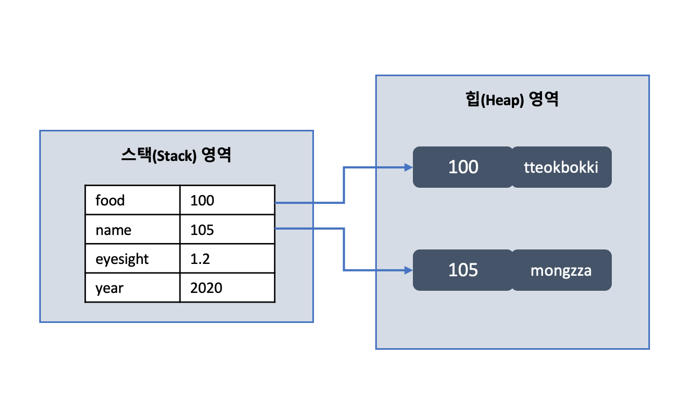
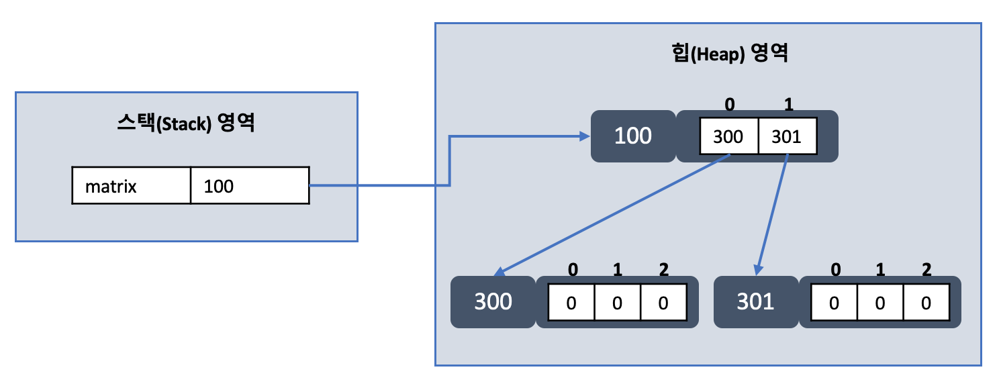

## 2주차 과제
> 자바 데이터 타입, 변수 그리고 배열

### 학습 목표
자바의 프리미티브 타입, 변수 그리고 배열을 사용하는 방법을 익힙니다.

### 프리미티브 타입 종류와 값의 범위 그리고 기본 값
- 프리미티브 타입은 기본(원시) 타입
- 정수, 실수, 문자, 논리 리터럴을 직접 저장하는 타입
- 정수 타입
    |타입|메모리 사용 크기|기본값|값 범위|
    |----|----|----|----|
    |byte|1byte / 8bit|0|-2^7^ ~ 2^7^-1 (-128 ~ 127)|
    |char|2byte / 16bit|'\u0000'|0 ~ 2^16^-1(유니코드: \u0000 ~ \uFFFF, 0 ~ 65535)|
    |short|2byte / 16bit|0|-2^15^ ~ 2^15^-1 (-32,768 ~ 32,767)|
    |int|4byte / 32bit|0|-2^31^ ~ 2^31^-1 (-2,147,483,648 ~ 2,147,483,647)|
    |long|8byte / 64bit|0L|-2^63^ ~ 2^63^-1|
- 실수 타입
    |타입|메모리 사용 크기|기본값|값 범위|
    |----|----|----|----|
    |float|4byte / 32bit|0.0f|(+/-)1.4E-45 ~ (+/-)3.4028235E38|
    |double|8byte / 64bit|0.0d or 0.0|(+/-)4.9E-324 ~ (+/-)1.7976931348623157E308|
- 논리 타입
    |타입|메모리 사용 크기|기본값|값 범위|
    |----|----|----|----|
    |boolean|1byte / 8bit|false|true, false|


### 프리미티브 타입과 레퍼런스 타입
- 자바의 데이터 타입 분류 : 프리미티브 타입, 레퍼런스 타입
#### 프리미티브 타입
- 프리미티브 타입은 기본(원시) 타입
- 정수, 실수, 문자, 논리 리터럴을 직접 저장하는 타입
- 변수에 저장하는 값은 실제 값
#### 레퍼런스 타입
- 레퍼런스 타입은 참조 타입
- 객체(Object)의 번지를 참조하는 타입
- 배열, 열거, 클래스, 인터페이스 타입
- 변수에 저장하는 값은 실제 값을 가리키고 있는 메모리의 주소

<center><span style="font-size: 13px; color: #999;">출처 : 신용권, 『이것이 자바다』, 한빛미디어(2015), p.139</span></center>
<br/>

#### 각 타입의 메모리 저장 구조
```
// 프리미티브 타입
int year = 2020;
double eyesight = 1.2;

// 레퍼런스 타입
String name = "mongzza";
String food = "tteokbokki";
```

<center><span style="font-size: 13px; color: #999;">출처 : 신용권, 『이것이 자바다』, 한빛미디어(2015), p.139</span></center>
<br/>

- 변수는 스택 영역에 생성
- 참조 타입 변수의 객체는 힙 영역에 생성
- 참조 타입은 실제 값(ex. 문자열)을 힙의 객체에 저장

### 리터럴
- 소스 코드 내에서 직접 입력된 값
- 값의 종류에 따라 정수 리터럴, 실수 리터럴, 문자 리터럴, 논리 리터럴로 구분
- 일반적으로 리터럴은 '상수'와 같은 의미이지만 프로그램에서의 상수의 의미와 구분하기 위해 '리터럴'이라는 용어 사용
  - 상수 : 값을 한 번 저장하면 변경할 수 없는 변수
- 정수 리터럴
  - 저장 타입은 byte, char, short, int, long
  - 소수점이 없는 정수 리터럴은 10진수
    - ```0, 98, -100```
  - 0으로 시작하는 정수 리터럴은 8진수
    - ```08, -03```
  - 0x 또는 0X로 시작, 0~9 숫자, ABCDEF 또는 abcdef로 구성된 리터럴은 16진수
    - ```0x5, 0xA, 0xB3, 0xAC08```
- 실수 리터럴
  - 저장 타입은 float, double
  - 소수점이 있는 실수 리터럴은 10진수 실수
    - ```0.38, -3.14```
  - 대문자 E 또는 소문자 e를 포함한 리터럴은 10진수 지수와 가수10
    - ```5E7``` (= 5 x 10^7^)
    - ```0.12e-5``` (= 0.12 x 10^-5^)
- 문자 리터럴
  - 저장 타입은 char
  - 작은따옴표로 묶은 텍스트는 하나의 문자 리터럴
    - ```'G', '손', '\t', '\n'```
- 문자열 리터럴
  - 저장 타입은 String
  - 큰따옴표로 묶은 텍스트는 문자열 리터럴
    - ```"안녕하세요", "탭 \t 만큼 이동", "개행 \n 문자"```
- 논리 리터럴
  - 저장 타입은 boolean
  - true와 false는 논리 리터럴

### 변수 선언 및 초기화하는 방법
#### 변수 선언
- **타입 변수명;** 으로 변수 선언
  - ```int score;``` ```float eyesight;``` ```char star;```
- 선언한 타입에 따라 사용할 수 있는 값의 종류와 범위가 달라지므로 신중히 판단 후 선언
- 변수가 어떤 값을 저장하고 있는지 쉽게 알 수 있도록 의미 있는 이름 사용
- 변수명은 자바가 정한 명명 규칙 적용

  |규칙|예시|
  |----|----|
  |첫 번째 글자는 문자, '$', '_'만 가능<br/>숫자로 시작 불가능|가능 : price, &#36;price, _company<br/>불가능 : 1v, @speed, $#value|
  |영어 대소문자 구분|firstname과 firstName은 다른 변수|
  |[관례] 첫 문자는 영어 소문자, 다른 단어를 붙일 경우 이어 붙이는 첫 문자에 대문자 사용|maxSpeed, firstName, carColor|
  |문자 길이 무제한||
  |자바 예약어는 사용 불가능|private, class, null, catch 등<br/>사용 시 컴파일 에러 발생|

#### 변수 초기화
- 선언한 변수에 대입 연산자(=)를 사용하여 변수 초기화
  ```
  int score;
  score = 100;
  ```
- 선언과 동시에 초기화 가능
  ```
  int score = 100;
  ```

### 변수의 스코프와 라이프타임
- 변수의 종류는 인스턴스 변수, 클래스 변수, 로컬 변수
#### 인스턴스 변수
- 클래스 내에서 메소드나 블록의 외부에 선언하는 변수
  ```JAVA
  class Example {
    int x, y; // 인스턴스 변수

    void method() {
      . . .
    }

    public static void main(String[] args) {
      . . .
    }

  }
  ```
- **스코프**
  - static 메소드를 제외한 클래스 블록 내부에서 사용 가능
- **라이프타임**
  - 객체가 공간 할당 받으면 생성, 힙메모리에서 제거되면 삭제
  - 해당 객체가 메모리에 머물러있는 동안 생명 유지

#### 클래스 변수
- 클래스 내에서 메소드나 블록의 외부에 ```static```으로 선언하는 변수
  ```JAVA
  class Example {
    static int result; // 클래스 변수

    void method() {
      . . .
    }

    public static void main(String[] args) {
      . . .
    }
  }
  ```
- **스코프**
  - 클래스 블록 내부 전역에서 사용 가능
- **라이프타임**
  - 클래스가 메모리에 로드되어있는 동안 또는 프로그램이 종료될 때까지 생명 유지

#### 로컬 변수
- 인스턴스 변수와 클래스 변수가 아닌 모든 종류의 변수
- 메소드의 파라미터 변수도 포함
  ```JAVA
  class Example {
    void method(int x, int y) { // 로컬 변수
      int sum = x + y; // 로컬 변수
      System.out.println(sum);
    }

  }
  ```
- **스코프**
  - 로컬 변수가 선언된 순간부터 선언되어있는 블록이 끝날 때까지 사용 가능
- **라이프타임**
  - 선언되어있는 블록이 실행 종료될 때까지 생명 유지

#### 변수의 스코프
- 변수는 중괄호 {} 블록 내에서 선언되고 사용
- 중괄호 블록은 클래스, 생성자, 메소드, 각종 제어문 예약어, 예외처리 예약어 등에서 사용
- 변수는 블록 내 어디서든 선언 가능하지만 **선언된 블록 내에서만 사용 가능**
- 변수 스코프를 벗어나서 사용할 경우 컴파일 에러 발생
- 인스턴스 변수명, 클래스 변수명과 똑같은 변수명을 로컬 변수명으로는 사용 가능
  - 인스턴스 변수명에 ```this``` 키워드 사용
  - 클래스 변수명에 ```클래스.변수``` 사용
- 로컬 변수명은 중첩된 블록 내에서 똑같은 변수명 사용 불가능
  ```JAVA
  class Example {
    int x, y;           // 인스턴스 변수
    static int result;  // 클래스 변수

    void method(int x, int y) { // 로컬 변수
      this.x = x;
      this.y = y;

      int sum = x + y; // 로컬 변수
      System.out.println(sum);

      Example.result = sum;
    }

    void otherMethod() {
      int x, y;

      {
        int x = 5; // 동명 로컬 변수 생성. 에러 발생
      }
    }

    void anotherMethod(int x) {
      int y = 1;
      if (x > 0) {
        int sum = x + y;
      }

      System.out.println(sum); // sum 변수 선언된 블록 이미 종료. 에러 발생
    }
  }
  ```

### 타입 변환, 캐스팅 그리고 타입 프로모션
#### 타입 변환
- 데이터 타입을 다른 데이터 타입으로 변환하는 것
- 타입 변환의 종류는 자동(묵시적) 타입 변환, 강제(명시적) 타입 변환
- **자동 타입 변환(Promotion)**
  - 프로그램 실행 중 자동으로 타입 변환 발생
  - 작은 크기(메모리)를 가지는 타입이 큰 크기를 가지는 타입에 저장될 때 발생 <br/> ```큰 크기 타입 = 작은 크기 타입```
  - 크기 순으로 byte(1) < short(2) < int(4) < long(8) < float(4) < double(8)
    - long < float인 이유는 float가 표현할 수 있는 값의 범위가 더 크기 때문
  - 작은 그릇의 물을 큰 그릇에 담는 것과 마찬가지이기 때문에 데이터 손실 미발생
  ```JAVA
  // 정수 -> 실수 변환 시 끝자리 .0 저장
  int intValue = 200;
  double doubleValue = intValue; // == 200.0

  // 문자 -> 정수 변환 시 유니코드 값 저장
  char charValue = 'A';
  int intValue = charValue; // == 65
  ```
  - **예외**
    - char는 byte보다 큰 크기지만 char는 양수 범위만 가능하기 때문에 음수도 저장 가능한 byte 타입은 char로 자동 변환 불가능
    - => 강제 타입 변환으로 해결
- **강제 타입 변환(Casting)**
  - 큰 데이터 타입을 작은 데이터 타입으로 쪼개서 저장
  - 캐스팅 연산자 '()' 사용 <br/> ```작은 크기 타입 = (작은 크기 타입)큰 크기 타입```
  - 변환하려는 작은 타입이 가질 수 있는 범위의 값보다 큰 타입의 값이 클 경우 데이터 손실 발생
  - int 타입에 저장된 값이 유니코드 범위(0~65535)라면 (char) 캐스팅 연산자를 사용해 변환 가능
  - 실수타입 -> 정수타입 변환 시 소수점 이하는 버리고 정수만 저장
  - **주의할 점**
    - 손실이 발생하지 않도록, 변환할 타입의 최소값과 최대값을 벗어나는지 반드시 검사 필요
    - 각 타입별 최대값, 최소값 상수 활용 (ex. Integer.MAX_VALUE, Integer.MIN_VALUE)
    - int -> float 대신 int -> double 지향
      - float = 부호(1bit) + 지수(8bit) + **가수(23bit)**
      - double = 부호(1bit) + 지수(11bit) + **가수(52bit)**
      - int(32bit)가 가수 크기로 표현 가능한 값이어야 값 손실 없이 변환 가능
- 연산식에서 서로 다른 타입의 피연산자가 있을 경우, 두 피연산자 중 **크기가 큰 타입으로 자동 변환** 후 연산 수행
  ```JAVA
  int intValue = 10;
  double doubleValue = 5.5;

  double result = intValue + doubleValue; // == 15.5
  int sum = intValue + (int)doubleValue;  // == 15 (int로 사용할 경우 강제 타입 변환)
  ```
  ```JAVA
  char charValue = 'A';
  int result = charValue + 1; // == 66 (자동 변환)
  charValue = (char) result;  // == 'B'
  ```

### 1차 및 2차 배열 선언하기
#### 배열
- 같은 타입의 많은 데이터를 효율적으로 다룰 수 있는 방법
- <u>같은 타입</u>의 데이터를 <u>연속된 공간</u>에 나열시키고, 각 데이터에 <u>인덱스</u>를 부여한 자료구조
- 한 번 생성된 배열은 길이 수정 불가
  - 새로 생성하고 기존 배열 복사
- 레퍼런스 변수이고 객체이기 때문에 힙 영역에 생성

#### 배열 선언
- 1차원 배열 선언 방법
  - ```타입[] 변수;``` ```타입 변수[];```
  - ```String[] foods = {"떡볶이", "치킨", "치즈볼"}```
  - 중괄호는 주어진 값을 항목으로 가지는 배열 객체를 힙에 생성하고 배열 객체의 주소값을 반환
  - 이미 선언된 배열 변수에 나중에 값을 추가하는 경우
    - ```new``` 연산자로 객체 생성 후 값 목록 지정
      ```JAVA
      String[] foods;
      foods = {"떡볶이", "치킨", "치즈볼"}; // 컴파일 에러
      foods = new String[] {"떡볶이", "치킨", "치즈볼"}; // 성공
      ```
  - 메소드의 매개값으로 배열 전달하는 경우
    - ```new``` 사용
      ```JAVA
      int sum = add(new int[]{3, 4, 5});
      ```
  - 배열 객체 미리 생성 후 추후 값만 변경하는 경우
    - 반드시 배열 크기를 알고 있어야 가능
    - 각 배열 값은 데이터 타입의 기본값으로 자동 초기화
    ```JAVA
    타입[] 변수 = new 타입[길이];
    String[] foods = new String[3]; // foods[0]~food[2]는 null로 초기화
    ```
- 2차원 배열 선언 방법
  - ```타입[][] 변수;``` ```타입[][] 변수 = new 타입[행크기][열크기]```
  - ```int[][] matrix = new int[2][3];```
  - 2차원 배열 저장 구조
    
    <center><span style="font-size: 13px; color: #999;">출처 : 신용권, 『이것이 자바다』, 한빛미디어(2015), p.162</span></center>
    <br/>
  - 수학 행렬 구조가 아닌 계단식 구조 사용 가능
  ```JAVA
  int[][] matrix = new int[2][];
  matrix[0] = new int[2]; // matrix[0][0], matrix[0][1]
  matrix[1] = new int[3]; // matrix[1][0], matrix[1][1], matrix[1][2]
  ```

### 타입 추론, var
#### 타입 추론 (Type Inference)
- 컴파일러가 타입을 유추하는 것
- 자바의 컴파일러는 컴파일 시 타입 정보 제거
- 실행 시 Object 인스턴스로 넘어가고 이 때 적절한 타입으로 캐스팅
- Java 10 이전까지는 제네릭, 람다에 대한 타입 추론만 지원

#### var
- Java 10부터 변수에 대한 타입 추론을 지원하는 ```var``` 추가
- 키워드는 아니기 때문에 변수명, 메소드명, 패키지명으로 사용 가능
- 클래스명 인터페이스명으로는 사용 불가
- 로컬 변수로 선언 가능하고, 선언과 동시에 초기화 필수
- for문 인덱스로 사용 가능
- try-with-resource문 변수로 사용 가능
- 컴파일러는 초기화 값을 통해 타입 유추
- 주의할 점
  - 다이아몬드 연산자에 사용 시 컴파일 에러 발생
    ```var messages = new ArrayList<>(); // 컴파일 에러```
  - 코드를 이해하는데 어려움이 있을 수 있기 때문에 변수 네이밍 중요
- 올바른 사용 방법
  ```JAVA
  var success1 = 1;
  var success2 = new int[4];
  var success3 = java.util.List.of(1, 2); // List<Integer>
  var success4 = "x".getClass();          // Class<? extends String>
  var success5 = new ArrayList<String>();
  ```
- 틀린 사용 방법
  ```JAVA
  var fail1 = 2, fail2 = 3.4; // multiple declarators
  var fail3[] = new int[4];   // extra braket pairs
  var fail4;                  // no initializer
  var fail5 = {6};            // array initializer
  var fail6 = () -> "hello";  // lambda not in an assignment context
  var fail7 = null            // null type
  ```
- [참고] ```var```가 추가되면서 non-denotable type 사용 가능
  ```JAVA
  void method() {
    // non-denotable type
    (new Object() {
      public void foo() {
        System.out.println("foo");
      }
    }).foo();

    // java10 이전
    Object before10 = new Object() {
      public void foo() {
        System.out.println("foo");
      }
    };
    before10.foo(); // 런타임 에러

    // java10 이후
    var after10 = new Object() {
      public void foo() {
        System.out.println("foo");
      }
    };
    after10.foo(); // 실행 가능
  }
  ```

### Reference
- 신용권, 『이것이 자바다』, 한빛미디어(2015), p.30-59, 138-139
- [자바 - 타입에 따른 변수의 기본값](https://linuxism.ustd.ip.or.kr/94)
- [Scope and lifetime of variables in Java](https://www.startertutorials.com/corejava/scope-lifetime-variables-java.html)
- [Java Lambda (2) 타입 추론과 함수형 인터페이스](https://futurecreator.github.io/2018/07/20/java-lambda-type-inference-functional-interface/)
- [Java의 var](https://johngrib.github.io/wiki/java10-var/)
- [[인포큐] 자바 10 지역 변수 타입 추론](https://www.youtube.com/watch?v=iL-hr64hts4)
- [Java 10 Released](https://www.infoq.com/news/2018/03/Java10GAReleased/)
