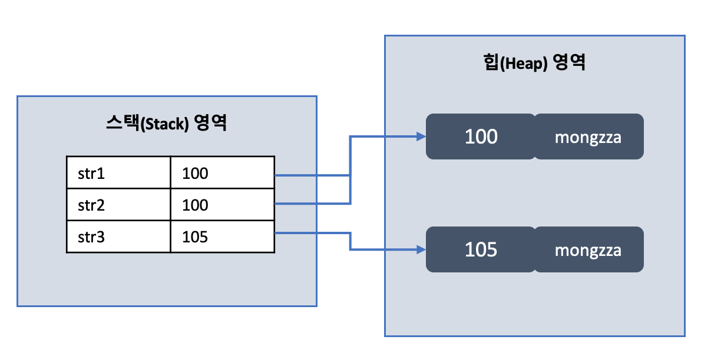
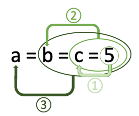

## 3주차 과제
> 자바가 제공하는 다양한 연산자 학습


## 산술 연산자
- 이항 : ```+``` ```-``` ```*``` ```/``` ```%```
- 사칙연산 및 나머지 계산
- 산출값은 숫자
- 다른 타입 간 연산 수행 결과
    1. ```byte + byte``` ==> ```int + int```
        - 피연산자가 모두 정수 타입이고, ```int``` 보다 작은 타입이면 모두 int로 변환 후 연산 수행
          - **why?** JVM이 기본적으로 32비트 단위로 계산
        - 최종 산출 타입은 ```int```
    2. ```int + long``` ==> ```long + long```
        - 피연산자가 모두 정수 타입이고, ```long```이 있을 경우 모두 ```long```으로 변환 후 연산 수행
        - 최종 산출 타입은 ```long```
    3. ```int + double``` ==> ```double + double```
        - 피연산자 중 실수 타입이 있을 경우 크기가 큰 실수 타입으로 변환 후 연산 수행
        - 최종 산술 타입은 연산식 내 가장 큰 실수 타입
- 예시
  ```JAVA
  // byte 덧셈
  byte b1 = 1, b2 = 1;
  byte byteSum = b1 + b2;   // (X) 컴파일 에러 발생
  int intSum = b1 + b2;     // (O) 성공
  ```
  ```JAVA
  // 정수 나눗셈
  int x = 10, y = 4;
  int result1 = x / y;              // == 2
  double result2 = x / y;           // == 2.0 (연산의 결과가 대입되기 때문에 2.5가 아닌 2.0 저장)
  double result3 = (x * 1.0) / y;   // == 2.5 (실수 타입으로 변환하여 연산 수행)
  double result4 = (double) x / y;  // == 2.5 (캐스팅 후 연산 수행)
  double result5 = x / (double) y;  // == 2.5 (캐스팅 후 연산 수행)
  ```
  ```JAVA
  // 문자 타입 연산
  char c1 = 'A' + 1;        // == 'B' (자바는 리터럴 간 연산은 타입 변환 없이 해당 타입으로 계산)
  char c2 = 'A';            // == 'A'
  char c3 = c2 + 1;         // 컴파일 에러, 변수 c2는 int로 변환 후 연산을 수행하기 때문에 에러 발생
  char c4 = (char)(c2 + 1); // == 'B' (캐스팅 후 연산 수행)
  ```
- 주의할 점
  - 오버플로우
    - 연산 후 결과값이 작성한 산출 타입으로 충분히 표현할 수 없는 값이면 오버플로우가 발생하여 쓰레기값 저장
    - 변수끼리 바로 연산하지 않고 메소드 인자로 넘기면 메소드가 오버플로우를 탐지하여 예외 처리 가능
  - 실수 타입의 정확한 계산
    - 실수 연산 시 근사치로 처리하기 때문에 정확한 계산이 필요하면 정수 연산 후 실수 타입에 대입
  - ```/``` ```%``` 사용
    - 우측 피연산자가 정수 타입 0이라면 실행 시 ```ArithmeticException``` 발생
    - 우측 피연산자가 실수 타입 0.0 또는 0.0F라면 ```/``` 연산 시 Infinity 값을 갖고, ```%``` 연산 시 NaN(Not a Number) 산출
      - 연산 결과가 Infinity 또는 NaN인지 확인하기 위해 ```Double.isInfinite()``` ```Double.isNaN()``` 사용


## 비트 연산자
- 단항 : ```~```
  - 정수 타입의 피연산자에만 사용
  - 산출 결과 ```int``` 타입
  - 연산 수행 전에 피연산자의 이진수를 ```int```로 변환하여 비트 반전
  - 피연산자를 이진수로 표현했을 때, 비트값이 0이면 1로 1이면 0으로 반전
  - 최상위 비트인 부호 비트를 포함하여 모든 비트가 반전
    - ex. ```~10 == -11``` (00 ... 01010 ==> 11 ... 10101)
  - 예시
    ```JAVA
    byte b1 = 10;
    byte b2 = ~b1;  // int로 변환하기 때문에 컴파일 에러 발생
    int b3 = ~b1;   // 성공
    ```
- 이항 : ```&``` ```|``` ```^``` ```<<``` ```>>``` ```>>>```
  - 데이터를 비트 단위로 연산
  - 피연산자는 정수 타입인 0과 1 또는 ```boolean``` 만 가능
  - 비트 논리 연산자 : ```&``` ```|``` ```^```
    - 피연산자가 ```boolean``` 타입일 경우 일반 논리 연산자 역할
    - 피연산자가 정수 타입일 경우 비트 논리 연산자
      - 연산 수행 전에 피연산자의 이진수를 ```int```로 변환하여 연산
    - ```&``` : AND(논리곱) 연산
    - ```|``` : OR(논리합) 연산
    - ```^``` : XOR(배타적 논리합) 연산
    - 예시
      ```JAVA
      byte b1 = 45, b2 25;
      byte result1 = b1 & b2;   // 컴파일 에러 발생
      int result2 = b1 & b2;    // 성공

      45(00000000 00000000 00000000 00101101)
      &
      25(00000000 00000000 00000000 00011001)
      =
      9 (00000000 00000000 00000000 00001001)
      ```
  - 비트 이동(shift) 연산자 : ```<<``` ```>>``` ```>>>```
    - 데이터의 비트를 좌우로 밀어서 이동시키는 연산
    - ```a << b``` : a의 각 비트를 b만큼 왼쪽으로 이동(빈자리는 0)
      ```JAVA
      int result = 1 << 3;

      1(00000000 00000000 00000000 00000001) << 3
      =
      8(00000000 00000000 00000000 00001000)
      // 왼쪽 끝 0 세 개 밀림, 오른쪽 끝 0 세 개 추가
      ```
    - ```a >> b``` : a의 각 비트를 b만큼 오른쪽으로 이동(빈자리는 a의 최상위 부호 비트와 같은 값)
      ```JAVA
      int result = -8 >> 3;

      -8(11111111 11111111 11111111 11111000) >> 3
      =
      -1(11111111 11111111 11111111 11111111)
      // 왼쪽 끝 부호와 같은 1 세 개 추가, 오른쪽 끝 0 세 개 밀림
      ```
    - ```a >>> b``` : a의 각 비트를 b만큼 오른쪽으로 이동(빈자리는 0)
      ```JAVA
      int result = -8 >>> 3;

      -8(11111111 11111111 11111111 11111000) >>> 3
      =
      536880911(00011111 11111111 11111111 11111111)
      // 왼쪽 끝 부호 0 세 개 추가, 오른쪽 끝 0 세 개 밀림
      ```


## 관계 연산자(비교 연산자)
- 이항 : ```<``` ```<=``` ```>``` ```>=``` ```==``` ```!=```
- 대소나 동등을 비교해서 ```boolean``` 타입 산출
- 대소 연산자 : ```<``` ```<=``` ```>``` ```>=```
  - ```boolean``` 타입을 제외한 모든 기본 타입에 사용 가능
- 동등 연산자 : ```==``` ```!=```
  - 모든 기본 타입에 사용 가능
- 연산 수행 전, 타입 변환을 통해 피연산자 타입 일치 후 산출
- 피연산자가 ```char``` 타입이면 유니코드 값으로 비교 연산
  ```JAVA
  'A' == 65   // true, 65 == 65
  3 == 3.0    // true, 3.0 == 3.0
  ```
- 주의할 점
  - 실수 타입 비교 연산
    ```JAVA
    0.1 == 0.1f // false, 0.1 == 0.10000000149011612
    ```
    - 이진 포맷의 가수를 사용하는 **모든 실수 타입은 0.1을 정확히 표현 불가능**
    - 0.1f는 0.1의 **근사값**으로 표현되어 불일치 발생
    - **해결방법**은 피연산자를 모두 float이나 정수로 캐스팅 후 비교 연산
  - String 타입 비교 연산
    - String은 자바의 기본 타입이 아닌 **객체 참조 타입**이기 때문에 비교 연산자 사용 시 **객체의 주소값 비교**
    - String 값 자체의 대소 비교 시, ```compareTo()```메소드 사용, 동등 비교 시 ```equals()```메소드 사용
    ```JAVA
    String str1 = "mongzza";
    String str2 = "mongzza";
    String str3 = new String("mongzza");

    str1 == str2        // true
    str1 == str3        // false
    str1.equals(str2)   // true
    str1.equals(str3)   // true
    ```
    


## 논리 연산자
- 단항 : ```!```
  - 논리 부정 연산자
- 이항 : ```&&``` ```||``` ```&``` ```|``` ```^```
- 피연산자는 ```boolean``` 타입만 가능
- ```&&```와 ```&```
  - 산출 결과는 같지만 연산 과정 차이
  - ```&&``` : 왼쪽의 피연산자가 false라면 오른쪽 피연산자 계산 없이 바로 false 산출
  - ```&``` : 양쪽 피연산자 모두 평가해서 산출
  - ```&&```가 조금 더 효율적
- ```||```와 ```|```
  - ```||``` : 왼쪽의 피연산자가 true라면 오른쪽 피연산자 계산 없이 바로 true 산출
  - ```|``` : 양쪽 피연산자 모두 평가해서 산출
  - ```||```가 조금 더 효율적
- 단, ```&&```와 ```||```의 오른쪽 항이 평가되지 않음으로써 예상 외의 결과가 발생할 수 있으므로 주의


## instanceof
- 이항 비교 연산자
- ```객체 instanceof 타입 ```
- 객체의 타입 확인 연산자
  - 객체가 특정 클래스나 인터페이스의 자식클래스인지 비교
- 산출 결과는 ```boolean``` 타입
- 비교하려는 객체가 null인 경우 ```false``` 반환
  ```JAVA
  String str1 = "mongzza";
  Animal tiger = new Tiger();
  Integer i = 3;

  str1 instanceof Character // false
  str1 instanceof Object    // true
  tiger instanceof Animal   // true
  i instanceof Integer      // true
  ```
- [참고] 클래스 간 강제 타입 변환
  - 상속 관계에 있는 클래스 간 강제 타입 변환을 하려면 자식 타입이 부모 타입으로 변환되어 있는 상태에서만 가능
  - 부모 타입의 변수가 부모 객체를 참조할 경우 변환 불가능
    ```JAVA
    Parent parent = new Parent();
    Child child = (Child) parent; // 런타임 에러 발생(ClassCastException)
    ```
  - 메소드 인자로 넘기면 가능
    ```JAVA
    public void method(Vehicle vehicle) {
      if (vehicle instanceof Bus) {
        Bus bus = (Bus) vehicle;    // 안전하게 강제 타입 변환
      }
    }
    ```


## assignment(=) operator
- 이항 : ```=``` ```+=``` ```-=``` ```*=``` ```/=``` ```%=``` ```&=``` ```^=``` ```|=``` ```<<=``` ```>>=``` ```>>>=```
- 오른쪽 피연산자의 값을 왼쪽 피연산자 변수에 저장
- ```변수 = 리터럴 or 변수 or 다른 연산식```
- 단순 대입 연산자 : ```=```
- 복합 대입 연산자 : ```+=``` ```-=``` ```*=``` ```/=``` ```%=``` ```&=``` ```^=``` ```|=``` ```<<=``` ```>>=``` ```>>>=```
  - 오른쪽 피연산자와 왼쪽 피연산자의 연산 수행 결과를 왼쪽 피연산자에 대입
  - ```a += b```는 ```a = a + b```와 동일
- 모든 연산자들 중 **가장 낮은 우선순위**이기 때문에 다른 모든 연산 수행 후 마지막에 대입
- 연산 진행 방향은 오른쪽에서 왼쪽(<-)으로 진행
  


## 화살표(->) 연산자
- 화살표(->) 기호를 사용하여 람다 표현식 작성 가능
- ```(타입 매개변수, ...) -> { 실행코드; ... }```
  - 왼쪽의 매개변수를 사용해 오른쪽 중괄호를 실행
- 자바의 타입 추론 능력에 의해 타입 생략 가능(대체로 생략하여 사용)
  - ```(매개변수, ...) -> { 실행코드; ... }```
- 매개변수가 하나일 때 () 생략 가능, 실행문이 하나일 때 {} 생략 가능
  - ```(a) -> { System.out.println(a) }```
  - ```a -> System.out.println(a)```
- 매개변수가 없으면 반드시 () 작성
  - ```() -> System.out.println("Hello");```
- 표현식의 연산 결과 ```return``` 가능
  - ```(x, y) -> { return x + y; }```
- ```return```문만 있을 경우 {} 생략 가능
  - ```(x, y) -> x + y```


## 3항 연산자
- 세 개의 피연산자 사용
- ```?```와 ```:``` 사용
- ```조건식 ? 값 또는 연산식1(true) : 값 또는 연산식2(false)```
  - ```?``` 앞 조건식의 결과가 ```true```면 연산식1을 수행하고, ```false```면 연산식2 수행


## 연산자 우선 순위
- 우선순위 내림차순

  |연산자|연산 방향|
  |---|---|
  |증감(++, --) 부호(+, -) 비트(~) 논리(!)|<----|
  |산술(*, /, %)|---->|
  |산술(+, -)|---->|
  |쉬프트(<<, >>, >>>)|---->|
  |비교(<, >, <=, >=, instanceof)|---->|
  |비교(==, !=)|---->|
  |논리(&)|---->|
  |논리(^)|---->|
  |논리(\|)|---->|
  |논리(&&)|---->|
  |논리(\|\|)|---->|
  |조건(?: )|---->|
  |대입(=, +=, -=, *=, )|<----|


## Java 13. switch 연산자
1. ```case L -> ``` 방식
    - 기존 switch는 ```break``` 미사용 시, 다음 ```case```로 이어지고, 각 ```case```마다 ```break```를 작성해야 하는 번거로움
    - 변경 후, ```:```대신 ```->``` 연산자를 사용하여 ```break```없이 한 개의 표현식은 한 개의 ```case```로 인식
    - 콤마(,)를 사용하여 한 ```case```에 여러 값 입력 가능
    ```JAVA
    switch(day) {
      case MONDAY, FRIDAY, SUNDAY -> System.out.println(6);
      case TUESDATE               -> System.out.println(7);
      case THURSDATY, SATURDAY    -> System.out.println(8);
      case WEDNESDAY              -> System.out.println(9);
    }
    ```
2. 반환값이 있는 표현식으로 사용 가능
    - 기존에는 ```switch```문 내에서 새로운 로컬 변수를 사용하려면 switch 블록 내부에서만 사용하거나, 블록 외부에 변수 선언 후 사용 가능
    - 변경 후, ```switch```문을 사용하여 값 반환 가능
    ```JAVA
    int numLetters = switch(day) {
      case MONDAY, FRIDAY, SUNDAY -> 6;
      case TUESDATE               -> 7;
      case THURSDATY, SATURDAY    -> 8;
      case WEDNESDAY              -> 9;
    };
    ```
    ```JAVA
    T result = switch(arg) {
      case L1 -> e1;
      case L2 -> e2;
      default -> e3;
    };
    ```
3. ```yield``` 키워드 추가
    - 메소드의 ```return```과 비슷한 역할
    - ```switch```문 ```case```의 값 반환 처리
    ```JAVA
    int j = switch(day) {
      case MONDAY   -> 0;
      case THUSDAY  -> 1;
      case default  -> {
        int k = day.toString().length();
        int result = f(k);
        yield result;
      }
    };
    ```
    - 기존 방식의 ```switch```문에서도 사용 가능
    ```JAVA
    int result = switch(s) {
      case "Foo" :
          yield 1;
      case "Bar" :
          yield 2;
      default:
          System.out.println("Neither Foo nor Bar");
          yield 0;
    };
    ```
4. 확실한 ```default``` 검증
    - ```switch``` 표현식으로 값 반환 시, 반드시 ```default```에 반환할 값이나 ```yield``` 필요
      - 작성하지 않을 경우 컴파일 에러 발생
    - 단, ```enum```의 경우 모든 케이스를 입력하면 컴파일러가 ```default```를 삽입해주기 때문에 생략 가능

### Reference
- 신용권, 『이것이 자바다』, 한빛미디어(2015)
- [What is the instanceof operator used for in Java?](https://www.educative.io/edpresso/what-is-the-instanceof-operator-used-for-in-java?utm_source=Google%20AdWords&aid=5082902844932096&utm_medium=cpc&utm_campaign=kb-dynamic-edpresso&gclid=CjwKCAiA-_L9BRBQEiwA-bm5fiuMNSHVunLNJEy41HgKVtuYiWwit6wfbZppc7PgpZRErhirrXKa4BoCVOcQAvD_BwE)
- [JEP 354: Switch Expressions (Second Preview)](https://openjdk.java.net/jeps/354)
