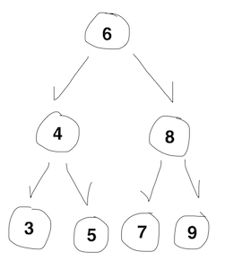
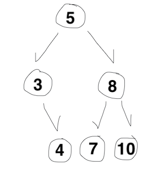

## 5주차 과제
> 자바의 Class에 대해 학습

## 클래스 정의하는 방법
### 클래스 개념
- 자바의 클래스는 객체를 정의하는 틀 또는 설계도
- 동일한 속성과 행위를 수행하는 객체의 집합
### 클래스 구조
- **필드(field)**
  - 클래스에 포함된 변수
    - 클래스 변수(static variable)
    - 인스턴스 변수(instance variable)
    - 지역 변수(local variable)
  - 객체의 상태를 나타내는 값
  - 객체와 관련된 데이터를 저장
  - 변수 선언 방법과 동일
- **메소드(method)**
  - 객체의 행위(동작)를 수행하는 블록
  - 필드값 조작
  - 외부로부터 매개변수를 전달 받아 처리하거나, 실행한 값을 반환
- **생성자(constructor)**
  - 객체 생성과 동시에 인스턴스 변수를 초기화
  - 필드를 초기화하거나 메소드를 호출하여 객체 사용 준비
  - 메소드와 비슷하게 생겼지만 클래스 이름이 있고, 반환 타입이 없는 구조
  - 초기화하지 않을 경우 자동 초기값

    |변수 데이터 타입|초기값|
    |---|:---:|
    |char|'\u0000'|
    |byte, short, int|0|
    |long|0L|
    |float|0.0F|
    |double|0.0 or 0.0D|
    |boolean|false|
    |참조타입|null|

### 클래스 정의 방법
```JAVA
// 클래스
접근제어자 class 클래스명 {
  // 필드
  접근제어자 데이터타입 변수명;

  // 생성자
  접근제어자 클래스명() {
    // 초기화 할 코드
  }

  // 메소드
  접근제어자 반환타입 메소드명() {
    // 처리할 코드
  }
}
```
```JAVA
public class Phone {
  // 필드
  private String name;
  private int capacity;
  private double version;
  ///////////////////////

  // 생성자
  public Phone() { }

  public Phone(String name) {
    this.name = name;
  }
  ///////////////////////

  // 메소드
  public String getName() {
    return name;
  }

  public void call(String number) {
    . . .
    System.out.println("call");
  }
  ///////////////////////
}
```
- 클래스 내 정의 순서는 필드, 생성자, 메소드 순
- 클래스, 필드, 생성자, 메소드에 여러 제어자 키워드를 사용하여 접근 범위 지정 가능
  - **접근 제어자** (클래스, 필드, 생성자, 메소드)

    |종류|범위|
    |---|---|
    |private|선언된 클래스 내에서만 접근 가능|
    |(default)|접근 제어자를 별도로 지정하지 않은 경우<br/>선언된 클래스와 같은 패키지 내에서만 접근 가능|
    |protected|선언된 클래스와 같은 패키지에 있거나 선언된 클래스를 상속받는 자식 클래스 내에서만 접근 가능|
    |public|모든 클래스에서 접근 가능|
  - **abstract** (클래스, 메소드)
    - 선언부만 있고 구현부가 없는 클래스나 메소드
    - 예시
      ```JAVA
      abstract class Car {        // 추상 클래스
        abstract void brake();    // 추상 메소드
      }
      ```
  - **static** (메소드, 필드)
    - 클래스가 메모리에 올라갈 때 생성되고 프로그램 종료 시 제거
    - 객체를 생성하지 않고도 ```클래스명.변수명``` / ```클래스명.메소드명```으로 외부에서 사용 가능
    - 애플리케이션 전역적으로 사용 가능한 공유 메소드, 공유 변수
  - **final** (클래스, 메소드, 필드)
    - 클래스
      - 상속하지 못하는 클래스
    - 메소드
      - 자식 클래스에서 재정의하지 못하는 메소드
    - 필드
      - 값이 한 번 할당되면 이후 재할당하지 못하는 키워드
  - **static final** (메소드, 필드)
    - 자주 사용하는 제어자 조합
    - 필드
      - 클래스가 메모리에 올라감과 동시에 값을 할당하여 상수 취급하기 위해 사용
      - **[주의]** 단, 자바 기본 타입에 사용 시 상수 역할을 하지만, 참조 타입에 사용 시 참조하는 객체의 내부 상태값이 변경될 수 있어 불변이 아니므로 주의하여 사용(ex. Collection 타입)
  - 불가능한 제어자 조합
    - final abstract class
      - final 클래스는 상속이 불가능
      - abstract 클래스는 무조건 상속 필요
    - static abstract method
      - static 메소드는 메모리가 로드되면 바로 사용 가능한 메소드
      - abstract 메소드는 구현부가 없는 메소드
    - private abstract method
      - private 메소드는 다른 클래스에서 접근 불가하므로 상속 불가능
      - abstract 메소드는 무조건 상속해서 재정의 필요
    - private final method
      - 불가능하지는 않지만 불필요한 조합
      - 두 키워드 모두 재정의가 불가능하기 때문에 중복 의미

## 객체 만드는 방법 (new 키워드 이해하기)
- 참조변수 선언 후 생성하는 방법
  ```
  클래스이름 변수이름;
  변수이름 = new 클래스이름();
  ```
  ```JAVA
  Phone phone;
  phone = new Phone();
  ```
- 선언과 동시에 생성하는 방법
  ```
  클래스이름 변수이름 = new 클래스이름();
  ```
  ```JAVA
  Phone phone = new Phone();
  ```
- 자바의 ```new``` 연산자
  - **객체 생성** 시 사용하는 연산자
    - 힙 메모리 영역에 데이터 저장 공간을 할당받고
    - 생성된 공간(객체)의 메모리 주소를 반환하고
    - 생성자를 호출
  - 따라서 ```new```로 생성된 변수는 실제 데이터가 아닌 참조 값을 갖게 됨
  - 인스턴스를 다루기 위해서는 ```new```를 사용해 참조값을 저장한 변수로만 접근 가능


## 메소드 정의하는 방법
```JAVA
접근제어자 반환타입 메소드명(매개변수 목록) {
  // 처리할 코드 구현
}
```
```JAVA
public String getName() {
  return name;
}
```
```JAVA
public void call(String number) {
  . . .
  System.out.println("call");
}
```
- ```void```는 반환할 값이 없는 메소드에 반환타입 대신 사용
- 한 메소드는 한 기능만 수행하도록 구현
- 매개변수 개수는 제한이 없지만 적을수록 가독성 향상
- 메소드 오버로딩(Overloading)
  - **같은 이름의 메소드**를 **매개변수 타입과 종류를 다르게 지정**하여 여러개 정의하는 것
    - 반환 타입은 관계 없음
  - 메소드에 사용하는 이름 절약 가능
  - 메소드 호출 시 매개변수로 전달할 데이터 타입과 개수 제약 감소
  - 예시
    ```JAVA
    public void println() {
      newline();
    }

    public void println(boolean x) {
      print(x);
      newline();
    }

    public void println(int x) {
      print(x);
      newline();
    }

    public void println(String str1, String str2) {
      . . .
    }

    . . .
    ```

## 생성자 정의하는 방법
```JAVA
접근제어자 클래스명() {
  // 초기화 할 코드
}

접근제어자 클래스명(매개변수1, 매개변수2, . . .) {
  // 초기화 할 코드
}
```
```JAVA
public Phone() { }

public Phone(String name) {
  this.name = name;
}
```
- 반환값이 없지만 ```void``` 미사용
- 초기화를 위한 데이터를 매개변수로 전달 받아 사용
- 매개변수 타입과 개수에 따라 여러개 정의 가능(오버로딩, Overloading)
- 생성자를 작성하지 않을 경우 컴파일러가 매개변수가 없는 default 생성자 자동 제공
  ```JAVA
  // default 생성자
  클래스명() { }
  ```
  - 예시
    ```JAVA
    public class Clazz {
      int number;
    }
    ```
    ```JAVA
    public class Other {
      public static void main(String[] args) {
        Clazz clazz = new Clazz();
      }
    }
    ```
- default 생성자가 아닌 생성자를 하나라도 작성한 경우 default 생성자는 자동 정의되지 않기 때문에 사용하려면 추가 작성 필요
  - 예시
    ```JAVA
    public class Clazz {
      int number;

      public Clazz(int number) {
        this.number = number;
      }
    }
    ```
    ```JAVA
    public class Other {
      public static void main(String[] args) {
        Clazz fail = new Clazz();     // 컴파일 에러 발생
        Clazz success = new Clazz(10);
      }
    }
    ```
- 한 생성자에서 다른 생성자 호출 가능
  - 생성자 오버로딩이 많아질 경우 중복 코드를 제거하기 위해 사용
  - 생성자의 맨 위에 작성
  - ```this()``` 메소드 사용
  - 예시
    ```JAVA
    public class Clazz {
      int number1;
      int number2;

      public Clazz() { }

      public Clazz(int number1) {
        this();
        this.number1 = number1;
      }

      public Clazz(int number1, int number2) {
        this(number1);
        this.number2 = number2;
      }
    }
    ```

## this 키워드 이해하기
```JAVA
public class Clazz {
  private int number;

  public Clazz(int number) {
    this.number = number;
  }
}
```
- 인스턴스가 자기 자신을 참조할 때 사용하는 변수
- 인스턴스 변수 number와 지역변수 number를 구분하기 위해 사용
- this는 인스턴스 메소드에서만 사용 가능하며 클래스 메소드(static method)에서는 사용 불가능
  - 메모리에 생성되는 시점이 다르기 때문에
  - 클래스 메소드에서는 아직 생성되지 않았을 수도 있는 인스턴스 객체 사용 불가능
- 모든 인스턴스 메소드에는 ```this``` 참조 변수가 숨겨진 지역 변수로 존재
- 생성자를 호출하는 ```this()```메소드 와는 다른 역할


## 과제
- 요구사항
  - int 값을 가지고 있는 이진 트리를 나타내는 **Node** 클래스 정의
    - int value, Node left, Node right 필드 필요
  - **BinaryTree** 클래스 정의
    - 주어진 노드를 기준으로 출력하는 **bfs(Node node)**, **dfs(Node node)** 메소드 구현
    - DFS는 왼쪽, 루트, 오른쪽 순으로 순회

- 이진 트리 개념

  

  - 각 노드가 최대 두 개의 자식 노드를 가질 수 있는 재귀 자료 구조
  - 모든 노드 값은 왼쪽 서브 트리의 노드 값 보다 크고, 오른쪽 서브 트리의 노드 값보다 작음
  - 이진 트리의 일반적인 유형은 이진 탐색 트리
  - 이진 트리 연산 종류
    - 노드 추가
    - 노드 삭제
    - 노드 값 탐색
    - 트리 순회
      - DFS (Depth-First Search)
        - 깊이 우선 탐색
        - 형제 노드 탐색 전에 가능한 자식 노드까지 최대한 깊이 탐색
        - 구현 방법은 전위 순회, 중위 순회, 후위 순회 방법
          - 루트 순서 기준으로 전/중/후 구분
          - 전위 : 루트 -> 왼 -> 오 (그림 : 6 4 3 5 8 7 9)
          - 중위 : 왼 -> 루트 -> 오 (그림 : 3 4 5 6 7 8 9)
          - 후위 : 왼 -> 오 -> 루트 (그림 : 3 5 4 7 9 8 6)
          - (과제는 중위 순회 방법으로 구현)
      - BFS (Breadth-First Search)
        - 너비 우선 탐색
        - 같은 레벨에 있는 노드 모두 탐색 후 다음 레벨 탐색
        - 루트에서 시작하여 왼쪽 -> 오른쪽 순서로 탐색
        - 각 레벨에서 순서대로 노드를 기억하기 위해 **Queue** 사용

- [소스 코드](../live-study/src/main/java/week5)
  - Node 클래스
    ```JAVA
    public class Node {
      int value;
      Node left;
      Node right;

      public Node(int value) {
          this.value = value;
          this.left = null;
          this.right = null;
      }
    }
    ```
  - BinaryTree 클래스
    ```JAVA
    public BinaryTree {

      public void dfs(Node node) {
        if (null == node) {
            return;
        }  
        dfs(node.left);
        System.out.println(node.value);
        dfs(node.right);
      }

      public void bfs(Node node) {
        if (null == node) {
            return;
        }

        Queue<Node> queue = new LinkedList<>();

        queue.add(node);
        while (!queue.isEmpty()) {
            if (null != node.left) {
                queue.add(node.left);
            }
            if (null != node.right) {
                queue.add(node.right);
            }

            if (null != queue.peek()) {
                System.out.println(queue.poll().value);
                node = queue.peek();
            }
        }
      }    
    }
    ```
  - 실행 결과
    - 이진트리 입력 값 : 5, 8, 10, 3, 7, 4
    - 이진트리

      

    ```
    // dfs
    3
    4
    5
    7
    8
    10
    ```
    ```
    // bfs
    5
    3
    8
    4
    7
    10
    ```


### Reference
- [TCP school](http://www.tcpschool.com/java/java_class_intro)
- [[자바(JAVA) 개념] 클래스(class) 선언방법 / 필드 / 생성자](https://devuna.tistory.com/4)
- [[JAVA/자바] new 연산자](https://m.blog.naver.com/PostView.nhn?blogId=heartflow89&logNo=220955262405&proxyReferer=https:%2F%2Fwww.google.com%2F)
- [자바의 final 는 언제 사용할까?](https://blog.lulab.net/programming-java/java-final-when-should-i-use-it/)
- [[Java] static변수와 static 메소드](https://mangkyu.tistory.com/47)
- [Implementing a Binary Tree in Java](https://www.baeldung.com/java-binary-tree)
