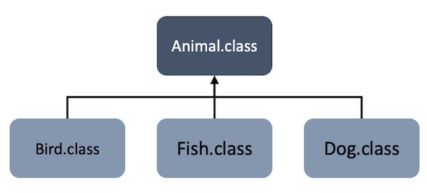

# 6주차 과제
> 자바의 상속에 대해 학습

## 목차
- [상속 (Inheritance)](#상속-inheritance)
- [자바 상속의 특징](#자바-상속의-특징)
- [super 키워드와 super() 메소드](#super-키워드와-super-메소드)
- [메소드 오버라이딩](#메소드-오버라이딩)
- [메소드 디스패치 (Method Dispatch)](#메소드-디스패치-method-dispatch)
  - [스태틱 메소드 디스패치 (Static Method Dispatch)](#스태틱-메소드-디스패치-static-method-dispatch)
  - [다이나믹 메소드 디스패치 (Dynamic Method Dispatch)](#다이나믹-메소드-디스패치-dynamic-method-dispatch)
  - [더블 디스패치 (Double Dispatch)](#더블-디스패치-double-dispatch)
- [추상 클래스](#추상-클래스)
- [final 키워드](#final-키워드)
- [Object 클래스](#object-클래스)

## 상속 (Inheritance)
부모가 자식에게 물려주는 행위
자바는 부모 클래스의 멤버를 자식 클래스에게 상속 가능
- 부모 클래스 = 상위 클래스
- 자식 클래스 = 하위 클래스 or 파생 클래스


:arrow_double_up:[Top](#6주차-과제)

## 자바 상속의 특징
### 1. extends 키워드를 사용하여 상속
```JAVA
class 자식클래스명 extends 부모클래스 {
  // 필드
  // 생성자
  // 메소드
}
```
### 2. 다중 상속 불가능
자바는 다중 상속을 허용하지 않기 때문에 여러 개의 부모 클래스 상속 불가능
```JAVA
class SportsCar extends Car, Vehicle {
  . . .
}
```
- 다중 상속 시 컴파일 에러 발생
  - ```Class cannot extend multiple classes```
### 3. 부모 메소드를 자식 클래스에서 재정의(오버라이딩) 가능
부모 클래스의 모든 메소드가 자식 클래스에 맞게 설계될 수는 없기 때문에 자바는 자식 클래스에서 부모 클래스의 기능을 수정해서 사용할 수 있는 오버라이딩(Overriding) 기능 제공

### 4. 부모의 private 접근 제한을 갖는 멤버는 상속 불가능
private 제한자는 오로지 선언된 클래스 내부에서만 접근 가능하므로 외부에서 사용할 수 있게 하는 상속은 불가능
만약 상속이 필요할 경우, 다른 접근 제한자(public, protected) 사용

### 5. final 클래스는 상속할 수 없고, final 메소드는 오버라이딩 불가능
final 키워드는 해당 선언이 최종 상태이고, 결코 수정될 수 없음을 의미하여 상속과 오버라이딩이 불가능

### 6. 자바의 모든 클래스는 Object 클래스의 자식/자손 클래스
자바의 최상위 클래스는 ```Object``` 클래스
클래스 선언 시 다른 클래스를 상속받지 않으면 암시적으로 ```java.lang.Object``` 클래스를 상속


:arrow_double_up:[Top](#6주차-과제)

## super 키워드와 super() 메소드

### super 키워드
자식이 부모 메소드를 호출해야하는 경우 ```super``` 키워드 사용

부모 객체를 참조하고 있기 때문에 부모에 직접 접근 가능
```JAVA
super.부모메소드();
```
```JAVA
public class Airplane {
  public void land() { }
  public void fly() {
    System.out.println("일반 비행");
  }
  public void takeOff() { }
}

public class SupersonicAirplane extends Airplane {
  public static final int NORMAL = 1;
  public static final int SUPERSONIC = 2;

  public int flyMode = NORMAL;

  @Override
  public void fly() {
    if (flyMode = SUPERSONIC) {
      System.out.println("초음속 비행");
    } else {
      // 부모 메소드 호출
      super.fly();
    }
  }
}
```

### super() 메소드
**부모의 기본 생성자를 호출**하는 역할 (반드시 자식 생성자의 첫 줄에 위치)

자바는 자식 객체를 생성하면 부모 객체가 먼저 생성되고 자식 객체는 그 다음에 생성되는 구조
```JAVA
public class CellPhone { . . . }
public class IPhone extends CellPhone { . . . }
```
```JAVA
IPhone iPhone = new IPhone();
```


- ```CellPhone```을 상속받는 자식 클래스 ```IPhone```
- ```IPhone```을 생성했을 때 내부 메모리 구조를 보면 부모 객체가 생성된 것 확인 가능

객체를 생성하려면 생성자를 호출해야 하는데 부모 클래스의 생성자를 호출한 곳은? **자식 생성자의 맨 첫 줄**<br />
자식 클래스의 생성자를 명시적으로 선언하지 않았다면 컴파일러가 자동으로 다음과 같은 기본 생성자 생성
```JAVA
public IPhone() {
  super();
}
```
첫 줄의 ```super();```를 통해 다음과 같이 부모 클래스의 생성자가 호출되는 것
```JAVA
public CellPhone() { }
```

<br />

자식 클래스에서 ```super();```를 명시적으로 작성하지 않아도 컴파일러가 자동으로 추가
```JAVA
public class People { }
```
```JAVA
public class Student extends People {
  public int studentNo;

  public Student(int studentNo) {
    //super();가 숨겨져 있는 것
    this.studentNo = studentNo;
  }
}
```
부모 클래스에 기본 생성자가 없고 매개변수를 갖는 생성자만 있다면 자식 클래스에서 반드시 ```super(매개값,..);```를 직접 명시
```JAVA
public class People {
  public String name;
  public String ssn;

  public People(String name, String ssn) {
    this.name = name;
    this.ssn = ssn;
  }
}
```
```JAVA
public class Student extends People {
  public int studentNo;

  public Student(String name, String ssn, int studentNo) {
    super(name, ssn);
    this.studentNo = studentNo;
  }
}
```
  - 부모 클래스 ```People```에는 기본 생성자가 없기 때문에 자식 클래스 ```Student```에서 반드시 매개값을 갖는 ```super(name, ssn);``` 호출
  - ```super(name, ssn);```를 작성하지 않은 경우 컴파일 에러 발생
    - ```There is no default constructor available in 'People'```

:arrow_double_up:[Top](#6주차-과제)

## 메소드 오버라이딩
메소드를 오버라이딩하면 자식 객체의 메소드 호출 시 부모 기능은 숨겨지고 자식이 재정의한 기능 실행
```JAVA
class Parent {
  void method1() {}

  void method2() {}
}

class Child extends Parent {
  @Override
  void method2() {}

  void method3() {}
}
```
```JAVA
class Example {
  public static void main(String[] args) {
    Child child = new Child();

    child.method1();  // 상속 받은 부모 메소드 호출
    child.method2();  // 재정의한 자식 메소드 호출
    child.method3();  // 자식 메소드 호출
  }
}
```
### 오버라이딩 할 때 주의할 점
**부모의 메소드와 동일한 메소드 시그니처(메소드 이름, 매개변수 리스트) 사용**
  - @Override 어노테이션을 사용하면 부모 메소드를 정확히 오버라이딩 했는지 확인 가능
  - 어노테이션 사용하지 않을 경우 실수로 오타 발생 시 새로운 메소드를 정의하는 것
  - 사용하는 IDE에 따라 오버라이딩 메소드 자동 생성 기능 지원

**부모 메소드의 접근 제한자보다 강한 제한 사용 불가능**
  - 부모 : public => 자식 : public 가능
  - 부모 : default => 자식 : public, protected, default 가능

**새로운 예외 추가 불가능**

:arrow_double_up:[Top](#6주차-과제)

## 메소드 디스패치 (Method Dispatch)
메소드 디스패치란 어떤 메소드를 호출할지 결정하여 실제로 실행시키는 과정<br />
자바는 런타임 시 객체를 생성하고, 컴파일 시에는 생성할 객체 타입에 대한 정보만 보유

### 스태틱 메소드 디스패치 (Static Method Dispatch)
스태틱 메소드 디스패치는 구현 클래스를 통해 컴파일 시점에서 컴파일러가 어떤 메소드를 호출할지 명확하게 알고 있는 경우<br />
컴파일 시 생성된 바이트코드에도 정보가 남아있으며 애플리케이션 실행 전에 호출할 메소드 결정<br />
대표적으로, 메소드를 오버로딩(Overloading)하면 매개변수 타입과 개수에 따라 어떤 메소드를 호출할지 알 수 있는 경우(메소드 시그니처 변경)<br />
상위 클래스가 있더라도 하위 클래스(구현 클래스)로 선언을 하고 하위 클래스의 인스턴스를 생성
```JAVA
public class Animal {
  public String method() { . . . }
}
```
```JAVA
// 예시 1
public static void main(String[] args) {
  // 스태틱 메소드 디스패치
  Animal animal = new Animal();
  System.out.println(animal.method());
}

// 예시 2
public class Example {
  private Animal animal;

  public Example(Animal animal) {
    this.animal = animal;
  }

  public void print() {
    // 스태틱 메소드 디스패치
    System.out.println(animal.method());
  }
}
```

### 다이나믹 메소드 디스패치 (Dynamic Method Dispatch)
다이나믹 메소드 디스패치는 인터페이스나 추상 클래스에 정의된 추상 메소드를 호출하는 경우로, 호출되는 메소드가 런타임 시 동적으로 결정되는 것<br />
인터페이스 또는 추상 클래스로 선언하고 구현/상속 받은 하위 클래스의 인스턴스를 생성<br />
컴파일러가 알고 있는 타입에 대한 정보를 토대로 런타임 시 해당 타입의 객체를 생성하고 메소드를 호출
```JAVA
public interface Animal {
  String method();
}

public class Dog implements Animal {

  @Override
  public String method() { . . . }

  public void bark() { . . . }
}

public class Cat implements Animal {

  @Override
  public String method() { . . . }

  public void meow() { . . . }
}
```
```JAVA
// 예시 1
public static void main(String[] args) {
  // 다이나믹 메소드 디스패치
  Animal animal = new Dog();
  System.out.println(animal.method());
}

// 예시 2
public class Example {
  private Animal animal;

  public Example(Animal animal) {
    this.animal = animal;
  }

  public void print() {
    // 다이나믹 메소드 디스패치
    System.out.println(animal.method());
  }
}
```
  - 런타임 전에는 객체 생성이 되지 않기 때문에 ```Animal animal = new Dog();```를 해도, 컴파일러는 ```Dog```가 생성됨을 알 수 없으므로 ```Animal```이 정의한 ```method()``` 메소드만 접근 가능
  - ```Example``` 클래스의 생성자 인자로 넘어오는 매개값의 타입이 ```Dog```인지 ```Cat```인지(혹은 그 외)는 실행 시 확인 가능
    - 실행 시 동적으로 확인해서 다이나믹 디스패치

자주 사용하는 컬렉션 타입에도 다이나믹 메소드 디스패치 사용
```JAVA
public static void main(String[] args) {
  // 다이나믹 메소드 디스패치
  List<String> list = new ArrayList();
  list.add("123");
}
```
자바는 메소드 호출 시, 호출한 객체를 매개 변수에 묵시적으로 함께 전달(위 코드에서는 ```ArrayList``` 전달)하기 때문에 메소드 내부에서 ```this```를 통해 호출 객체 참조가 가능<br />
이는 다이나믹 메소드 디스패치의 근거

### 더블 디스패치 (Double Dispatch)
다이나믹 메소드 디스패치가 2번 발생하는 것<br />
디자인 패턴 중 **방문자 패턴 (Visitor Pattern)** 과 밀접한 관계

#### [참고] 방문자 패턴 (Visitor Pattern)
일반적으로 OOP는 객체가 스스로 행위를 수행하게 하지만, 경우에 따라(ex. 확장성 고려, OCP 위배) 객체의 행위 수행을 외부 클래스에 위임

이 때 사용하는 디자인 패턴 종류는 전략 패턴, 커맨드 패턴, 방문자 패턴
- 전략 패턴 (Strategy Pattern)
  - 하나의 객체가 여러 동작을 하게 하는 패턴 (1:N)
- 커맨드 패턴 (Command Pattern)
  - 하나의 객체가 하나의 동작(+보조 동작)을 하게 하는 패턴 (1:1)
- 방문자 패턴 (Visitor Pattern)
  - 여러 객체에 대해 각 객체의 동작들을 지정하는 패턴 (N:N)

방문자 패턴의 UML 다이어그램은 다음과 같은 형태


###### 출처 : https://www.geeksforgeeks.org/visitor-design-pattern/

### 더블 디스패치 구현 예시
#### element
```JAVA
public interface ItemElement {
  int accept(ShoppingCartVisitor visitor);
}

public class Book implements ItemElement {
  private int price;
  private String isbn;

  public Book(int price, String isbn) {
    this.price = price;
    this.isbn = isbn;
  }

  public int getPrice() {
    return this.price;
  }

  @Override
  public int accept(ShoppingCartVisitor visitor) {
    return visitor.visit(this);
  }
}

public class Fruit implements ItemElement {
  private String name;
  private int pricePerKg;
  private int weight;

  public Fruit(String name, int pricePerKg, int weight) {
    this.name = name;
    this.pricePerKg = pricePerKg;
    this.weight = weight;
  }

  public int getPricePerKg() {
    return pricePerKg;
  }

  public int getWeight() {
    return weigth;
  }

  @Override
  public int accept(ShoppingCartVisitor visitor) {
    return visitor.visit(this);
  }
}
```
- ```visit()``` 메소드 호출 시 어떤 item(```Book``` or ```Fruit```)의 메소드를 호출할지 결정하는 다이나믹 메소드 디스패처 1번 발생

#### visitor
```JAVA
public interface ShoppingCartVisitor {
  int visit(Book book);
  int visit(Fruit fruit);
}

public class SsgDotCom implements ShoppingCartVisitor {
  @Override
  public int visit(Book book) {
    int price = book.getPrice();
    if (price > 50) {
      price -= 5;
    }
    return price;
  }

  @Override
  public int visit(Fruit fruit) {
    return fruit.getPricePerKg() * fruit.getWeight();
  }
}

public class GsShop implements ShoppingCartVisitor {
  @Override
  public int visit(Book book) {
    return book.getPrice();
  }

  @Override
  public int visit(Fruit fruit) {
    int price = fruit.getPricePerKg() * fruit.getWeight();
    return price - price * (5 / 100);
  }
}
```
- 각 item마다 조건문으로 분기처리를 하지 않고, 다이나믹 디스패처를 활용할 수 있도록 따로 구현
- visitor가 추가될 경우, ```ShoppingCartVisitor```의 구현 클래스만 추가

#### client
```JAVA
public class ShoppingCartClient {
  public static void main(String[] args) {
    List<ShoppingCartVisitor> visitors = Arrays.asList(new SsgDotCom(), new GsShop());
    List<ItemElement> items = Arrays.asList(
      new Book(20, "1234"),
      new Book(100, "5678"),
      new Fruit(10, 2, "Banana"),
      new Fruit(5, 5, "Apple")
    );

    items.forEach(item -> visitors.forEach(visitor -> item.accept(visitor)));
  }
}
```
- 분기처리 없이 다이나믹 메소드 디스패처를 통해 기능 수행 가능
- ```accept()``` 메소드 호출 시 어떤 visitor(```SsgDotCom``` or ```GsShop```)의 메소드를 호출할지 결정하는 다이나믹 메소드 디스패처 1번 발생
- 상단 ```ItemElement``` 구현 클래스에서 다이나믹 메소드 디스패처 1번 발생했으므로 **총 2번 발생**

#### 더블 디스패치 장단점
- 장점
  - 로직이 변경되어도 모든 item 구현 클래스를 수정하지 않고, visitor 구현 클래스만 수정함으로써 변경 가능
  - 새로운 item이 필요하면, 추가할 item 구현 클래스를 선언하고 visitor 인터페이스에 메소드 정의만 추가하여 기존 item은 수정 불필요
- 단점
  - 설계 시 ```visit()``` 메소드의 반환타입을 알고 있어야하며 그렇지 않으면 인터페이스와 모든 구현체 변경 필요
  - visitor 구현체가 많아질수록 확장성 감소

:arrow_double_up:[Top](#6주차-과제)

## 추상 클래스
### 추상 클래스 개념
추상(abstract)이란 실체 간에 공통되는 특성을 추출한 것<br />
추상 클래스는 객체를 직접 생성할 수 있는 실체 클래스의 공통적인 특성(필드, 메소드)을 추출해서 선언한 클래스<br/>



추상 클래스는 인스턴스 생성 불가능
```JAVA
Animal animal = new Animal(); // (X)
Animal animal = new Dog();    // (O)
```

추상 클래스의 목적은 **첫째로**, 실체 클래스의 공통 필드와 메소드 이름을 통일하기 위함이고, **둘째로**, 실체 클래스의 작성 시간을 절약하기 위함

### 추상 클래스 선언
클래스 선언 시 ```abstract``` 키워드 추가
```JAVA
public abstract class 클래스 {
  // 필드
  // 생성자
  // 메소드
}
```
- 추상 클래스를 상속받은 자식 객체가 생성될 때, 내부에서 ```super``` 메소드가 호출되어 추상 클래스 객체를 생성하기 때문에 생성자 필요

추상 클래스
```JAVA
public abstract class Phone {
  public String owner;

  public Phone(String owner) {
    this.owner = owner;
  }

  public void turnOn() {
    Systemt.out.println("on");
  }

  public void turnOff() {
    Systemt.out.println("off");
  }
}
```
실체 클래스
```JAVA
public class SmartPhone extends Phone {
  public Phone(String owner) {
    super(owner);
  }

  public void call() {
    System.out.println("call");
  }
}
```
호출
```JAVA
public static void main(String[] args) {
  SmartPhone phone = new SmartPhone();

  phone.turnOn();
  phone.call();
  phone.turnOff();
}
```

### 추상 메소드 오버라이딩
추상 클래스는 자식 클래스의 공통 기능을 추출해 구현한 클래스이지만, 경우에 따라 자식 클래스마다 구현 내용이 달라질 수 있기 때문에 필요 시 추상 메소드를 작성<br />
추상 메소드는 추상 클래스에서만 선언 가능하며, 메소드 선언부만 있는 형태<br />
자식 클래스가 반드시 실행 내용을 구현하게 하기 위해 추상 메소드 선언
```JAVA
public abstract 리턴타입 메소드이름(매개변수,..);
protected abstract 리턴타입 메소드이름(매개변수,..);
```
추상 메소드
```JAVA
public abstract class Animal {
  public abstract void sound();
}
```
추상 메소드 구현
```JAVA
public class Dog {
  @Override
  public void sound() {
    System.out.println("bark");
  }
}
public class Cat {
  @Override
  public void sound() {
    System.out.println("meow");
  }
}
```
호출
```JAVA
public static void main(String[] args) {
  animalSound(new Dog());
  animalSound(new Cat());
}

private static void animalSound(Animal animal) {
  animal.sound();
}
```
- 동물의 울음 소리는 동물마다 다르기 때문에 ```Animal```을 상속 받은 하위 클래스에서 ```sound()```를 직접 구현하도록 강제
- 공통 **특징**만 추출하고, 실제 구현은 하위 클래스에서 처리

:arrow_double_up:[Top](#6주차-과제)

## final 키워드
클래스, 필드, 메소드 선언 시 사용 가능한 키워드
해당 선언이 최종 상태이고, 더 이상 수정될 수 없음을 의미

### final 클래스
클래스 선언 시 final 키워드를 사용하면, 이 클래스는 상속할 수 없는 클래스임을 의미
부모 클래스가 될 수 없으며 자식 클래스를 만들 수 없는 클래스
```JAVA
public final class 클래스명 { . . . }
```
```JAVA
public class Example extends String { . . . }
```
- 대표적으로 ```String``` 클래스가 있으며 상속하면 컴파일 에러 발생
  - ```Cannot inherit from final 'java.lang.String'```

### final 메소드
메소드 정의 시 final 키워드를 사용하면, 이 메소드는 오버라이딩할 수 없는 메소드임을 의미
상속받은 부모 클래스의 final 메소드는 자식 클래스에서 재정의 불가능
```JAVA
public final 리턴타입 메소드명(매개변수,..) { . . . }
```
```JAVA
public class Car {
  public final void stop() {}
}

public class SportsCar extends Car {
  @Override
  public void stop() {}
}
```
- 재정의하면 컴파일 에러 발생
  - ```'stop()' cannot override 'stop()' in 'Car'; overridden method is final```

:arrow_double_up:[Top](#6주차-과제)

## Object 클래스
자바의 최상위 클래스는 ```Object``` 클래스<br />
클래스 선언 시 다른 클래스를 상속받지 않으면 암시적으로 ```java.lang.Object``` 클래스를 상속<br />
모든 객체는 ```Object```로 자동 타입 변환 가능


.```Object``` 클래스는 필드가 없고 메소드들로 구성
```JAVA
public class Object {

    private static native void registerNatives();
    static {
        registerNatives();
    }

    public final native Class<?> getClass();

    public native int hashCode();

    public boolean equals(Object obj) {
        return (this == obj);
    }

    protected native Object clone() throws CloneNotSupportedException;

    public String toString() {
        return getClass().getName() + "@" + Integer.toHexString(hashCode());
    }

    public final native void notify();

    public final native void notifyAll();

    public final native void wait(long timeout) throws InterruptedException;

    public final void wait(long timeout, int nanos) throws InterruptedException {
        if (timeout < 0) {
            throw new IllegalArgumentException("timeout value is negative");
        }

        if (nanos < 0 || nanos > 999999) {
            throw new IllegalArgumentException(
                                "nanosecond timeout value out of range");
        }

        if (nanos > 0) {
            timeout++;
        }

        wait(timeout);
    }

    public final void wait() throws InterruptedException {
        wait(0);
    }

    protected void finalize() throws Throwable { }
}
```
  -  ```native``` 키워드는 자바가 아닌 언어(주로 C, C++)로 구현 후 자바에서 사용하고자 할 때 사용
      - 구현 시 JNI(Java Native Interface) 사용
  - ```final``` 키워드가 없는 메소드는 재정의 가능

### 객체 비교(equals())
```JAVA
public boolean equals(Object obj) {
    return (this == obj);
}
```
두 객체의 논리적인 값을 비교
  - 논리적인 값이란 객체가 저장하고 있는 데이터를 의미
  - 기본 타입의 경우 실제 데이터
  - 참조 타입의 경우 참조하는 객체의 주소값
  - 참조 타입의 실제 데이터를 비교하기 위해 ```equals()``` 재정의
    - ex. ```String```

재정의 할 때, 매개값으로 넘어오는 객체가 기준 객체와 동일한 타입인지 비교하는 과정 필요
```JAVA
public class Member {
  private int id;

  @Override
  public boolean equals(Object obj) {
    if (obj instanceof Member) {
      Member member = (Member) obj;
      if (id.equals(member.id)) {
        return true;
      }
    }

    return false;
  }
}
```
  - ```instanceof```를 사용하여 넘어온 매개값이 ```Member``` 타입인지 확인

### 객체 해시코드(hashcode())
```JAVA
public native int hashCode();
```
객체를 식별할 하나의 정수값<br />
객체의 메모리 주소값을 이용해서 해시코드를 만들어 리턴하기 때문에 객체마다 다른 값 보유<br />
객체 동등 비교 시 비교 대상 값이 변경되지 않는다면 해시코드 메소드는 같은 객체로 판단하여 같은 값을 반환

**주의할 점**
- ```equals()```와 ```hashcode()```는 항상 함께 재정의
- 이유는 HashSet, HashMap, HashTable 타입 사용 시 문제가 발생할 수 있기 때문
  - 해당 타입은 ```hashCode()``` 메소드로 리턴된 해시코드 값을 비교한 후 다르면 다른 객체, 같으면 ```equals()```로 다시 비교
  - 이 때, key에 저장한 타입이 ```hashcode()```를 재정의하지 않았다면 ```Object```의 ```hashCode()```를 사용하여 같은 객체로 판단하고자 하는 객체를 다른 객체라고 볼 수 있기 때문에 문제 발생


예시로, ```Key``` 클래스에서 서로 다른 객체간에 ```number``` 필드 값이 같다면 동일한 객체로 판단하고자 할 때

#### hashCode()를 재정의하지 않은 경우
```JAVA
public class Key {
  public int number;

  @Override
  public boolean equals(Object obj) {
    if (obj instanceof Member) {
      Member member = (Member) obj;
      if (id.equals(member.id)) {
        return true;
      }
    }

    return false;
  }
}
```
```JAVA
public class Example {
  public static void main(String[] args) {
    HashMap<Key, String> hashMap = new HashMap<>();

    hashMap.put(new Key(1), "홍길동");

    String value = hashMap.get(new Key(1));
    System.out.println(value);
  }
}
```
실행 결과
```
null
```

#### hashCode()를 재정의한 경우
```JAVA
public class Key {
  . . .

  @Override
  public int hashCode() {
    return number;
  }
}
```
실행 결과
```
홍길동
```

** 참고로 인텔리제이는 ```equals()```와 ```hashcode()``` 재정의 자동 완성 기능 제공

### 객체 문자정보(toString())
```JAVA
public String toString() {
    return getClass().getName() + "@" + Integer.toHexString(hashCode());
}
```
객체를 문자열로 표현한 값 반환<br />
기본적으로 ```"클래스명@16진수해시코드"```로 구성된 문자 정보 반환

**예시**
```JAVA
public class SmartPhone {
  private String company;
  private String os;

  public SmartPhone(String company, String os) {
    this.company = company;
    this.os = os;
  }

  @Override
  public String toString() {
    return company + ", " + os;
  }
}
```
```JAVA
public static void main(String[] args) {
  SmartPhone myPhone = new SmartPhone("Apple", "iOS");

  System.out.println(myPhone);
}
```
실행 결과
```
Apple, iOS
```
  - ```System.out.println();```은 매개값이 기본 타입이면 그대로 출력, 참조 타입 객체면 ```toString()``` 호출해서 받은 반환값 출력

### 객체 복제(clone())
```JAVA
protected native Object clone() throws CloneNotSupportedException;
```
원본 객체의 필드값과 동일한 값을 가지는 새로운 객체를 생성하는 것<br />
원본 객체의 데이터가 훼손되지 않도록 안전하게 보호하기 위해 객체 복제<br />
이 메소드를 사용하여 객체를 복제하려면 반드시 ```Cloneable``` 인터페이스를 구현

.```Cloneable``` 인터페이스
  ```JAVA
  public interface Cloneable {
  }
  ```
  - 구현할 메소드가 정의되어있지 않지만 클래스 설계자가 복제를 허용함을 명시하기 위해 사용
  - ```clone()``` 호출 시 ```Cloneable```이 구현되어있지 않다면 예외 발생
    - ```CloneNotSupportedException```
    - checked 예외이기 때문에 ```try-catch``` 또는 ```thorws```로 예외처리 필요

객체를 복제하는 방법은 **얕은 복제**와 **깊은 복제** 두 가지 방법

#### 얕은 복제(thin clone)


- 단순히 **필드 값을 복사**해서 객체를 복제하는 것
- 기본 타입 필드는 값 복사, 참조 타입 필드는 객체 주소값 복사
- ```Object```의 ```clone()``` 메소드는 얕은 복제된 객체를 리턴

```JAVA
public class Member implements Cloneable {
  public String id;
  public String name;

  public Member(String id, String name) {
    this.id = id;
    this.name = name;
  }

  public Member getMember() {
    Member cloned = null;
    try {
      cloned = (Member) clone();
    } catch(CloneNotSupportedException e) { }

    return cloned;
  }

  @Override
  public String toString() {
    return id + ", " + name;
  }
}
```
```JAVA
public class Example {
  public staic void main(String[] args) {
    Member member = new Member("111", "홍길동");

    Member cloned = member.getMember();
    cloned.name = "홍홍홍";

    System.out.println(member);
    System.out.println(cloned);
  }
}
```
실행 결과
```
111, 홍길동
111, 홍홍홍
```
  - ```String``` 타입의 경우 참조 타입이지만 **불변 객체**이기 때문에 복제 후 새로운 ```String``` 객체 반환
  - 따라서, 얕은 복제로도 원본에 영향 미치지 않는 복제 가능

#### 깊은 복제(deep clone)


- **참조 타입 필드**의 경우 얕은 복제 사용 시 문제 발생
- 참조 타입은 객체의 주소값을 복사하므로 원본 객체의 참조 필드와 복제 객체의 참조 필드가 같은 위치를 가리키게 되어 복제 객체의 참조 필드 값을 변경하면 원본 객체에서도 변경
- 따라서, 깊은 복제 필요
- 깊은 복제를 하려면 ```Object```의 ```clone()```을 재정의하여 사용

```JAVA
public class Member implements Cloneable {
  public String id;
  public int[] scores;
  public Car car;

  public Member(String id, int[] scores, Car car) {
    this.id = id;
    this.scores = scores;
    this.car = car;
  }

  public Member getMember() {
    Member cloned = null;
    try {
      cloned = (Member) clone();
    } catch(CloneNotSupportedException e) { }

    return cloned;
  }

  @Override
  public Oject clone() throws CloneNotSupportedException {
    // 얕은 복제 가능한 필드 복제
    Member cloned = (Member) super.clone();
    // 각 참조 타입 필드 깊은 복제
    cloned.scores = Arrays.copyOf(this.scores, this.scores.length);
    cloned.car = new Car(this.car.model);

    return cloned;
  }

  @Override
  public String toString() {
    return id + ", " + scores + ", " + car;
  }
}
```
```JAVA
public class Example {
  public staic void main(String[] args) {
    Member member = new Member("111", new int[] {10, 20}, new Car("아반떼"));

    Member cloned = member.getMember();
    cloned.scores = new int[] {20, 5};
    cloned.car = new Car("소나타");

    System.out.println(member);
    System.out.println(cloned);
  }
}
```
실행 결과
```
111, [10, 20], 아반떼
111, [20, 5], 소나타
```
  - 깊은 복제를 했기 때문에 ```Member```의 참조 타입 필드인 ```scores```와 ```car```의 값을 변경해도 원본 객체 데이터는 그대로 유지

### 객체 소멸자(finalize())
```JAVA
protected void finalize() throws Throwable { }
```
더이상 참조하지 않는 배열이나 객체는 **가비지 콜렉터(Garbage Collector, GC)** 가 힙 영역에서 자동으로 소멸 처리<br />
GC는 소멸 처리 직전에 객체의 소멸자인 ```finalize()``` 호출<br />
객체 소멸 전에 마지막으로 사용했던 자원(데이터 연결, 파일 등)을 닫고 싶거나 중요한 데이터를 저장하고 싶다면 재정의

**어떤 객체가 소멸되는지 확인하는 예시 코드**
```JAVA
public class Counter {
  private int no;

  public Counter(int no) {
    this.no = no;
  }

  @Override
  protected void finalize() throws Throwable {
    System.out.println(no + "번 객체 소멸");
  }
}
```
```JAVA
public static void main(String[] args) {
  Counter counter = null;

  for(int i = 0; i < 100; i++) {
    counter = new Counter(i);
    counter = null;
    System.gc();
  }
}
```
  - 반복해서 많은 객체를 생성하고 더이상 사용하지 않는 null 대입
  - ```System.gc();```를 사용해 가능한 빨리 GC 작업 수행하도록 요청
  - GC는 전략에 따라 JVM에 의해 자동 실행되므로 ```finalize()``` 호출 시점은 명확히 알 수 없음

:arrow_double_up:[Top](#6주차-과제)

### Reference
- 신용권, 『이것이 자바다』, 한빛미디어(2015)
- [자바 native 키워드](https://fors.tistory.com/80)
- [토비의 봄 (재사용성과 다이나믹 디스패치)](http://wonwoo.ml/index.php/post/1475)
- [Visitor design pattern](https://www.geeksforgeeks.org/visitor-design-pattern/)
- [[JAVA] Static Method Dispatch, Dynamic Method Dispatch, Double Dispatch](https://defacto-standard.tistory.com/413)
- [토비의봄#01. Double Dispatch](https://multifrontgarden.tistory.com/133)
- [더블 디스패치 double dispatch](https://dbbymoon.tistory.com/9)
