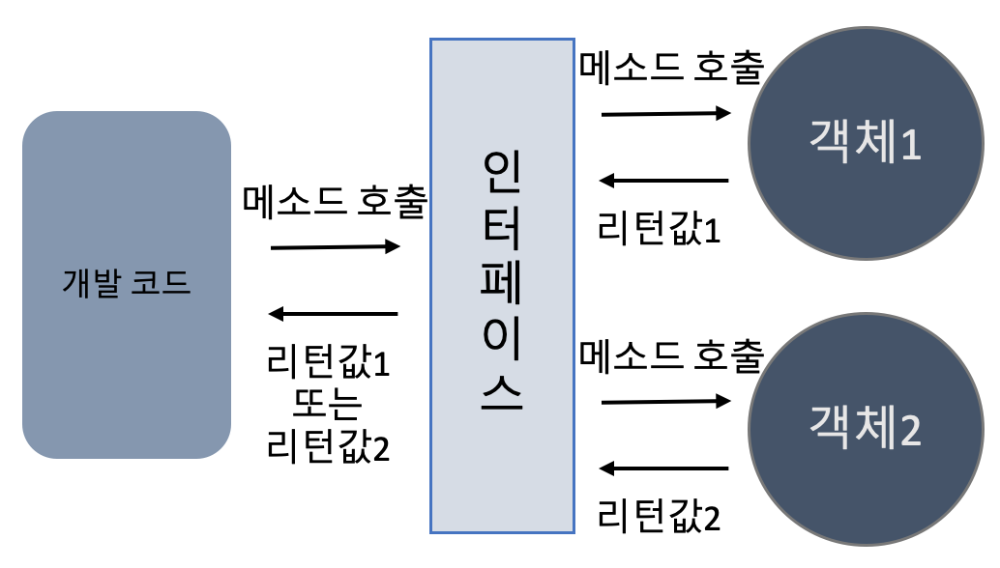

## 7주차 과제
> 자바의 패키지에 대해 학습

## 목차
- [인터페이스 개념](#인터페이스-개념)
- [인터페이스 정의하는 방법](#인터페이스-정의하는-방법)
- [인터페이스 구현하는 방법](#인터페이스-구현하는-방법)
- [인터페이스 레퍼런스를 통해 구현체를 사용하는 방법](#인터페이스-레퍼런스를-통해-구현체를-사용하는-방법)
- [인터페이스 상속](#인터페이스-상속)
- [인터페이스의 Default 메소드, 자바 8](#인터페이스의-default-메소드-자바-8)
- [인터페이스의 static 메소드, 자바 8](#인터페이스의-static-메소드-자바-8)
- [인터페이스의 private 메소드, 자바 9](#인터페이스의-private-메소드-자바-9)

<br />

## 인터페이스 개념
자바의 인터페이스란 객체의 사용 방법을 정의한 타입.

개발 코드와 객체가 서로 통신하는 접점 역할을 하며, 개발 코드가 인터페이스의 메소드를 호출하면 인터페이스는 객체의 메소드를 호출. 이 때, 개발 코드는 객체의 내부 구조를 알 필요 없이 인터페이스의 메소드만 알면 됨

### 인터페이스 사용 이유
개발 코드를 수정하지 않고 사용할 객체를 변경하기 위해 사용. 개발 코드 변경없이 실행 내용과 리턴값을 다양화할 수 있는 장점



<br />

## 인터페이스 정의하는 방법
인터페이스는 .java 파일로 작성하고, .class 파일로 컴파일되기 때문에 물리적 형태는 클래스와 동일

정의 방법
```JAVA
(public) interface 인터페이스명 {
  // 상수
  타입 상수명 = 값;

  // 추상 메소드
  타입 메소드명(매개변수, ...);

  // 디폴트 메소드
  default 타입 메소드명(매개변수, ...) {
    . . .
  }

  // 정적 메소드
  static 타입 메소드명(매개변수, ...) {
    . . .
  }
}
```
- 구성 멤버는 상수, 메소드
- 객체로 생성할 수 없기 때문에 생성자를 가질 수 없음

<br />

#### 상수 필드
상수는 인터페이스에 고정된 값으로 런타임 시 데이터 변경이 불가능하며, ```static {}``` 블록으로 초기화할 수 없기 때문에 **선언 시 반드시 초기값 대입**

필드 접근제어자는 ```public static final```이 생략된 형태로, 모든 필드가 상수

상수명은 대문자로 작성하고, 단어 구분은 언더바(_)로 연결하는 것이 관례

```JAVA
public interface RemoteControl {
  int MAX_VOLUME = 10;
  int MIN_VOLUME = 0;
}
```

#### 추상 메소드
객체가 수행할 수 있는 기능의 이름을 정의해둔 메소드. 선언부만 있으며 실제 구현부는 인터페이스 구현 클래스에서 작성

default, static을 제외한 메소드의 접근제어자는 ```public abstract```가 생략된 형태로, **기본적으로 모든 메소드가 추상 메소드**

```JAVA
public interface RemoteControl {
  void turnOn();
  void turnOff();
  void setVolume(int volume);
}
```

#### 디폴트 메소드, 정적 메소드
JAVA 8에서 추가된 메소드로, 추상 메소드와 달리 반드시 구현부가 있어야 하며 자세한 내용은 아래에서 설명

<br />

## 인터페이스 구현하는 방법

### implements 키워드
일반 클래스에 인터페이스를 구현함을 뜻하는 ```implements``` 키워드 추가
```JAVA
public class 구현클래스명 implements 인터페이스명 {
  // 인터페이스에 정의한 추상 메소드의 실체 메소드 정의 (오버라이딩)
}
```

인터페이스의 모든 추상 메소드를 반드시 오버라이딩
```JAVA
public class Radio implements RemoteControl {
  private int volume;

  @Override
  public void turnOn() {
    System.out.println("전원 켜기");
  }

  @Override
  public void turnOff() {
    System.out.println("전원 끄기");
  }

  @Override
  public void setVolume(int volume) {
    this.volume = volume;
    System.out.println("현재 음량 : " + volume);
  }
}
```
- 오버라이딩하지 않을 경우 컴파일 에러
- 웬만하면 @Override 붙여서 추상 메소드의 정확한 실체 메소드 맞는지 체크
- 메소드에 ```public``` 키워드를 붙이지 않을 경우 컴파일 에러
- IDE에 따라 구현 필요한 메소드 자동 추가 기능 사용 가능

#### 다중 인터페이스 구현 방법
여러개의 인터페이스를 구현할 수 있으며, 모든 인터페이스의 모든 추상 메소드 구현 필요
```JAVA
interface A {
  int field = 3;
  void a();
}

interface B {
  int field = 4;
  void a();
}

class Ex implements A, B {
  @Override
  public void a() {
    System.out.println(A.field);
    System.out.println(B.field);
  }
}
```
- 인터페이스에 **같은 이름의 상수가 있다면 인터페이스 소속을 명확히** 밝혀 사용
  - ```A.field``` or ```B.field```
- 인터페이스에 같은 이름의 추상 메소드가 있다면 한 개만 구현

<br />

### 추상 클래스
추상 메소드를 구현하지 않고 추상 클래스로 작성도 가능
```JAVA
public abstract class Radio implements RemoteControl {
  @Override
  public void turnOn() {
    System.out.println("전원 켜기");
  }

  @Override
  public void turnOff() {
    System.out.println("전원 끄기");
  }
}
```
- ```RemoteControl```의 ```setVolume()``` 메소드는 구현하지 않았으므로 아직 추상 메소드
- ```Radio```를 상속받은 클래스에서 추상 메소드 구현

<br />

### 익명 클래스
일회성의 구현 객체가 필요할 때, 대표적으로 UI 프로그래밍에서 이벤트 처리 또는 임시 작업 스레드를 만들기 위해 사용
```
인터페이스 변수 = new 인터페이스() {
  // 인터페이스에 선언된 추상 메소드의 실체 메소드 선언
}
```
```JAVA
public class AnonymousEx {
  public static void main(String[] args) {

    RemoteControl remocon = new RemoteControl() {
      @Override
      public void turnOn() {
        System.out.println("전원 켜기");
      }

      @Override
      public void turnOff() {
        System.out.println("전원 끄기");
      }

      @Override
      public void setVolume(int volume) {
        this.volume = volume;
        System.out.println("현재 음량 : " + this.volume);
      }
    }

  }
}
```
- 위와 같이 작성 후 컴파일하면 **AnonymousEx$1.class** 클래스 파일 생성 (숫자는 익명 클래스 생성번호. 1부터 시작)

<br />

### 람다
JAVA 8부터는 람다 사용이 가능하기 때문에 **인터페이스에 정의한 추상 메소드가 한 개라면 람다식을 이용해 구현 가능**
```JAVA
interface Calculator {
  int calculate(int x, int y);
}

class Ex {
  public static void main(String[] args) {
    Calculator calc = (x, y) -> x * y;
    System.out.println(calc.calculate(10, 10));
  }
}
```

<br />

## 인터페이스 레퍼런스를 통해 구현체를 사용하는 방법
구현 클래스 변수 사용하면 인터페이스 사용 불가능
```JAVA
Radio radio = new Radio(); // 인터페이스 미사용
```

**인터페이스 변수를 선언하고 구현 객체 생성** 후 대입하여 인터페이스 사용
```JAVA
RemoteControl remocon = new Radio(); // 인터페이스 사용
```

구현 객체를 생성한 인터페이스 변수는 클래스 필드, 생성자 매개변수 또는 지역변수, 메소드 매개변수 또는 지역변수로 사용 가능
```JAVA
public class MyClass {
  // 필드
  RemoteControl remocon = new Radio();

  // 생성자 매개변수
  public MyClass(RemoteControl remocon) {
    this.remocon = remocon;
  }

  // 메소드
  public void method1() {
    // 지역변수
    RemoteControl rc = null;  // 인터페이스 변수 선언

    rc = new TV();            // TV 객체를 인터페이스 타입에 대입
    rc.turnOn();
    rc.turnOff();

    rc = new Radio();         // Radio 객체를 인터페이스 타입에 대입
    rc.turnOn();
    rc.turnOff();
  }

  // 메소드 매개변수
  // 지난주차에 학습했던 다이나믹 메소드 디스패치 발생
  public void method2(RemoteControl rc) {
    System.out.println(rc.turnOn());
  }
}
```
- 다형성 활용 가능
- 필드와 매개변수 타입을 인터페이스로 선언하면 다양한 구현 객체를 대입해서 다양한 실행 결과 도출 가능
- 구현 객체가 인터페이스 타입으로 변환되는 것은 **자동 타입 변환(Promotion)** 에 해당

위처럼 사용 시, 인터페이스에 정의된 메소드만 사용 가능. 하지만 경우에 따라 구현 클래스에 선언된 필드와 메소드를 사용해야할 경우, **강제 타입 변환**을 통해 구현 클래스로 변환하여 사용 가능

#### 강제 타입 변환
```
구현클래스 변수 = (구현클래스) 인터페이스변수;
```
```JAVA
Radio radio = (Radio) remocon;
```

단, 타입 안전성을 위해 ```instanceof``` 키워드 사용 권장

#### instanceof
다음 방법은 ```RemoteControl```의 구현 클래스가 ```Radio```일지 ```TV```일지 알 수 없는 상태에서 강제 타입 변환
```JAVA
public void method(RemoteControl rc) {
  Radio radio = (Radio) rc;
}
```
- 런타임 에러 발생 가능성 있음 (```ClassCastException```)

다음 방법은 ```instancof```를 사용해 안전하게 타입 변환
```JAVA
public void method(RemoteControl rc) {
  if (rc instanceof Radio) {
    Radio radio = (Radio) rc;
    radio.onlyRadioMethod();
  }
}
```

<br />

## 인터페이스 상속
인터페이스는 다른 인터페이스를 상속할 수 있으며, 클래스와 달리 다중 상속 허용
```JAVA
public interface Parent1Interface {
  void p1Method1();
}

public interface Parent2Interface {
  void p2Method1();
  void p2Method2();
}

public interface SubInterface extends Parent1Interface, Parent2Interface {
  void subMethod1();
}
```

.```SubInterface```의 구현 클래스는 자식과 부모의 모든 추상 메소드를 구현 (```SubInterface```, ```Parent1Interface```, ```Parent2Interface```)
```JAVA
public class SubImpl implements SubInterface {
  @Override
  public void p1Method1() { . . . }

  @Override
  public void p2Method1() { . . . }

  @Override
  public void p2Method2() { . . . }

  @Override
  public void subMethod1() { . . . }

}
```
```JAVA
public class Ex {
  public static void main(String[] args) {
    // 최하단의 자식 인터페이스 변수 선언 가능
    SubInterface sub = new SubImpl();

    // SubInterface가 상속받은 부모 인터페이스에도 대입 가능
    Parent1Interface p1 = new SubImpl();
    Parent2Interface p2 = new SubImpl();
  }
}
```

<br />

## 인터페이스의 Default 메소드, 자바 8
인터페이스 메소드에 ```default``` 키워드 작성 시 구현 메소드 작성이 가능하고, 구현 클래스에서는 default 메소드를 그대로 상속하거나 오버라이딩 가능

접근제어자는 ```public```이 생략된 형태

인터페이스
```JAVA
public interface Calculator {
  int plus(int x, int y);

  int minus(int x, int y);

  // 디폴트 메소드
  default int exec(int x, int y) {
    return x + y;
  }
}
```
구현 클래스
```JAVA
public class MyCalculator implements Calculator {

  @Override
  public int plus(int x, int y) {
    return x + y;
  }

  @Override
  public int minus(int x, int y) {
    return x - y;
  }
}
```
- default 메소드 그대로 상속

실행부
```JAVA
public class Example {
  public static void main(String[] args) {
    Calculator calculator = new MyCalculator();
    int value = calculator.exec(3, 5);
    System.out.println(value);
  }
}
```
- 부모 클래스로부터 상속받은 ```exec()``` 메소드 호출

실행결과
```
8
```

특징
- 인터페이스 변경 시, 모든 구현 클래스가 수정되어야했던 문제 해결 가능
- static 메소드가 아니기 때문에 반드시 구현 클래스 생성 후 사용 가능
- default 메소드에 변경 필요 시, 구현 클래스에서 재정의하여 사용 가능
- 추상 클래스의 입지가 좁아짐

<br />

### 같은 이름의 default 메소드
같은 이름의 default 메소드가 구현된 인터페이스를 다중 상속하면 **반드시 재정의**
```JAVA
interface A {
  default int ex() {
    return 1;
  }
}

interface B {
  default int ex() {
    return 3;
  }
}

class Ex implements A, B {
  public static void main(String[] args) { . . . }

  // 재정의 필수
  @Override
  public int ex() {
    return 0;
  }
}
```
- 재정의하지 않을 경우 컴파일 에러 발생
  - ```Ex inherits unrelated defaults for ex() from types A and B```

인터페이스를 상속하면 자식 인터페이스에서 부모 인터페이스의 default 메소드 강제성 수정 가능
- 부모 인터페이스의 default 메소드를 그대로 상속
- 부모 인터페이스의 default 메소드를 재정의
- 부모 인터페이스의 default 메소드를 추상 메소드로 재선언
```JAVA
interface Parent {
  default void method() {
    System.out.println("부모");
  }
}

// 그대로 상속
interface Child1 extends Parent {

}

// 재정의
interface Child2 extends Parent {
  @Override
  default void method() {
    System.out.println("자식2");
  }
}

// 추상 메소드로 재선언
interface Child3 extends Parent {
  void method() {
    System.out.println("자식3");
  }
}
```

<br />

## 인터페이스의 static 메소드, 자바 8
static 메소드를 선언하여 유틸성 인터페이스 사용 가능<br />
기본적으로 ```public```이며, 상속되지 않기 때문에 인터페이스에 직접 접근해서 메소드 호출

인터페이스
```JAVA
public interface Calculator {
  int plus(int x, int y);

  int minus(int x, int y);

  default int exec(int x, int y) {
    return x + y;
  }

  static int exec2(int x, int y) {
    return x * y;
  }
}
```
실행부
```JAVA
public class Example {
  public static void main(String[] args) {
    int value = Calculator.exec2(3, 5);
    System.out.println(value);
  }
}
```
실행결과
```
15
```

<br />

## 인터페이스의 private 메소드, 자바 9
공통되는 중복 코드를 인터페이스의 private 메소드에 작성함으로써 상속 받은 구현 클래스가 보지 못하도록 제한 가능
```JAVA
public interface DBLogging {
  String MONGO_DB_NAME = "ABC_Mongo_Datastore";
	String NEO4J_DB_NAME = "ABC_Neo4J_Datastore";
	String CASSANDRA_DB_NAME = "ABC_Cassandra_Datastore";

	default void logInfo(String message) {
		log(message, "INFO");
	}

	default void logWarn(String message) {
		log(message, "WARN");
	}

	default void logError(String message) {
		log(message, "ERROR");
	}

	default void logFatal(String message) {
		log(message, "FATAL");
	}

	private void log(String message, String msgPrefix) {
		// Step 1: Connect to DataStore
		// Step 2: Log Message with Prefix and styles etc.
		// Step 3: Close the DataStore connection
	}
}
```
특징
- 메소드 구현부가 존재(필수)
- static, non-static 모두 가능
- 상속 불가능하며 오직 선언해둔 인터페이스 내부에서만 사용 가능
  - 구현부가 있는 메소드(default, static, private) 내에서 호출하여 사용

장점
- 중복 코드 감소, 코드 재사용성 증가
- 자식 클래스가 필요로 하는 메소드만 구현 가능

<br />

### Reference
- 신용권, 『이것이 자바다』, 한빛미디어(2015)
- [인터페이스의 default method](https://programmers.co.kr/learn/courses/5/lessons/241)
- [java8 interface의 변화(default method, static method)](https://www.hanumoka.net/2017/09/16/java-20170916-java8-interface/)
- [Java 9 Private methods in Interfaces](https://www.journaldev.com/12850/java-9-private-methods-interfaces)
- [[Java] Java Interface feature 변화의 history - 번역](https://flyburi.com/605)
