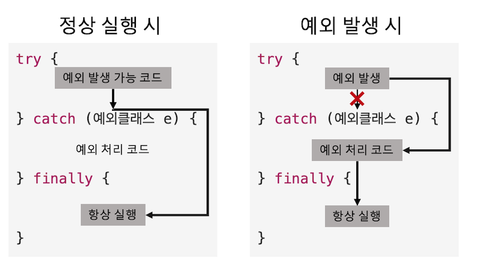

## 9주차 과제
> 자바의 예외 처리에 대해 학습

## 목차
- [Exception과 Error의 차이](#exception과-error의-차이)
- [자바 예외 처리 방법](#자바-예외-처리-방법)
- [자바가 제공하는 예외 계층 구조](#자바가-제공하는-예외-계층-구조)
- [RuntimeException과 RE가 아닌 것의 차이](#runtimeexception과-runtimeexception이-아닌-것의-차이)
- [커스텀 예외 만드는 방법](#커스텀-예외-만드는-방법)


## Exception과 Error의 차이
**Error**는 컴퓨터 하드웨어의 오동작 또는 고장으로 인해 응용프로그램 실행 오류가 발생하는 것. JVM 실행에 문제가 생겼음을 의미하며 **프로그램 실행이 종료**됨

**Exception** 은 사용자의 잘못된 조작 또는 개발자의 잘못된 코딩으로 인해 발생하는 프로그램 오류. Error와 마찬가지로 프로그램 실행이 종료되지만, **예외 처리를 통해 정상 실행 상태 유지** 가능

:arrow_double_up:[Top](#9주차-과제)

## 자바 예외 처리 방법
예외 발생 시 프로그램의 갑작스러운 종료를 막기 위해 예외 처리 코드 필요

### try-catch-finally 블록
생성자와 메소드 내부에 작성하며 흐름은 다음과 같음



#### try 블록
예외 발생 가능성이 있는 코드 작성. 예외 발생 시 즉시 중단하고 catch 블록으로 이동

#### catch 블록
try 블록에서 예외 발생 시 실행할 코드 작성. 예외가 발생하지 않으면 실행되지 않음

#### 다중 catch 블록
처리할 예외가 여러개인 경우, 발생 예외별로 예외 처리 코드를 다르게 하려면 다중 catch 블록 사용
```JAVA
try {
  // ArrayIndexOutOfBoundsException 발생 코드

  // NullPointerException 발생 코드
} catch (ArrayIndexOutOfBoundsException e) {
  // . . .
} catch (NullPointException e) {
  // . . .
}
```
try 블록에서 동시다발적으로 여러 예외가 발생하지 않기 때문에 catch블록은 단 한 개만 실행

catch 순서
- 위에 작성된 블록부터 실행
- 주의할 점은 **상위 예외 클래스가 하위 예외 클래스보다 아래쪽에 위치하도록 작성**
- 상위 예외 catch 블록이 상단에 있다면, 아래에 있는 하위 예외 catch 블록에 컴파일 에러 발생
  - 이미 위쪽에서 잡힌 예외이기 때문
  - ```Exception 'java.lang.XXXException' has already been caught```

#### 멀티 catch 블록
Java 7에서 추가. catch 괄호 안에 |를 사용해 예외 연결
```JAVA
try {
  // ArrayIndexOutOfBoundsException 발생 코드

  // NullPointerException 발생 코드
} catch (ArrayIndexOutOfBoundsException | NullPointException e) {
  // . . .
}
```

#### finally 블록 (옵션)
예외 발생 여부와 관계 없이 항상 실행할 코드 작성. 옵션이므로 생략 가능<br />단, try-catch블록에서 **예외나 return이 발생해도 무조건 항상 실행**하므로 꼭 필요한 경우에만 작성

### try-with-resources
Java 7에서 추가. 예외 발생 여부와 상관없이 사용했던 리소스 객체(각종 입출력 스트림, 서버 소켓, 소켓, 각종 채널 등 데이터를 읽고 쓰는 객체)의 ```close()``` 메소드를 호출해서 안전하게 리소스를 닫아줌

Java 6까지는 finally 블록을 사용해 닫아주었지만 이제 다음과 같이 사용 가능
```JAVA
try(FileInputStream fis = new FileInputStream("file.txt")) {
  // . . .
} catch (IOException e) {
  // . . .
}
```
try 블록이 정상 완료하거나 도중 예외 발생 시 자동으로 ```close()``` 메소드 호출

리소스 객체 여러 개 사용 시
```JAVA
try(
  FileInputStream fis = new FileInputStream("file1.txt");
  FileOutputStream fos = new FileOutputStream("file2.txt")
) {
  // . . .
} catch (IOException e) {
  // . . .
}
```

#### 사용 가능 조건
**리소스 객체가 ```java.lang.AutoCloseable``` 인터페이스를 구현**해야 try-with-resources 블록을 사용 가능

[AutoCloseable](https://docs.oracle.com/javase/8/docs/api/java/lang/AutoCloseable.html)의 ```close()``` 메소드를 호출하여 자동 닫기가 가능한 것
- 링크의 'All known Implementing Classes' 참고하여 구현 클래스 확인 가능
- 직접 구현도 가능


### throws
메소드 선언부 끝에 작성하여 메소드에서 처리하지 않은 예외를 호출한 곳으로 던지는 역할.
```JAVA
public void method() throws NullPointException, IOException {
  // . . .
}

public void method() throws Exception {
  // . . .
}
```
- 쉼표로 구분하여 여러개 작성 가능
- 상위 예외 클래스인 ```Exception```으로 모든 예외 던지기 가능

throws는 예외를 직접 처리하는 것이 아니라 본인을 호출한 메소드에게 떠넘기는 것이기 때문에 넘겨 받은 메소드는 반드시 try-catch 블록으로 예외 처리를 하거나 또다시 호출한 메소드로 예외를 넘겨야 함

### throw
예외를 직접 생성하는 역할.
```JAVA
public void method(int num1, int num2) throws Exception {
  if (num1 > num2) {
    throw new Exception();
  }
}
```
- 예외 생성자 인자로 예외 메시지 전달 가능
- 생성한 예외는 throws로 던지거나, try-catch 사용해서 처리

:arrow_double_up:[Top](#9주차-과제)

## 자바가 제공하는 예외 계층 구조
자바는 예외를 클래스로 관리


예외 관련 클래스들의 패키지는 ```java.lang```

예외 계층 구조 최상단에는 ```Object```를 상속받은 ```Throwable```이 있으며 그 하위에 ```Exception```과 ```Error``` 클래스로 분류

자바에서 발생하는 모든 예외는 ```java.lang.Exception``` 상속

:arrow_double_up:[Top](#9주차-과제)

## RuntimeException과 RuntimeException이 아닌 것의 차이
자바에는 두 가지 종류의 예외가 있으며 일반 예외인 Exception과 RuntimeException으로 구분
### Exception
**CheckedException** 이라고도 하며, 자바 소스를 **컴파일하는 과정에서 예외 처리 코드가 필요한지 검사**<br />만약 예외 처리 코드가 없다면 컴파일 오류를 발생시켜 개발자가 필수로 예외 처리 코드 추가하게 함<br />CheckedException 발생 시, 이클립스나 인텔리제이에서 자동 완성 기능 제공

### RuntimeException
**UncheckedException** 이라고도 하며, 컴파일 단계에서 예외 처리 코드를 검사하지 않는 예외<br />컴파일러가 체크해주지 않기 때문에 실행 중 예상하지 못한 부분에서 예외가 발생한다면 프로그램 종료. 개발자의 경험에 의해 예외 처리 코드 추가 필요

### 프로그램 실행 중 JVM의 예외 처리 과정
1. 실행 중 예외가 발생하면 JVM은 해당 예외의 Exception 객체를 생성
    - Exception 객체는 예외 이름, 설명, 예외가 발생한 프로그램의 현재 상태를 포함
2. JVM은 예외를 처리할 수 있는 ExceptionHandler를 찾기 위해 call stack 탐색
    - call stack : 프로그램이 실행되면서 연쇄적으로 호출한 메소드 순서 목록
    - 예외가 발생한 메소드에서 시작해 call stack에서 꺼내며(메소드 호출 역순으로) 탐색
2. 적절한 핸들러를 찾으면 발생한 예외를 핸들러에게 전달
3. 만약 적절한 핸들러를 찾지 못하면 JVM에 포함되어있는 default exception handler가 처리
    - default exception handler는 콘솔창에 예외 정보를 출력하고, 프로그램 실행 종료


### 자주 발생하는 RuntimeException
#### NullPointerException
객체 참조가 없는 상태인 null 값을 갖는 참조 변수로 객체 접근 연산자인 도트(.)를 사용했을 때 발생

#### ArrayIndexOutOfBoundsException
배열에서 인덱스 범위를 초과하여 사용할 경우 발생

#### NumberFormatException
숫자 관련 래퍼 클래스의 ```parseXXX()``` 메소드를 사용해 문자열을 숫자값으로 변환할 때, 적절히 변환할 수 없는 문자가 포함되어있다면 발생

#### ClassCastException
상속 관계/구현 관계가 아닌 클래스로 타입 변환 시도하면 발생

:arrow_double_up:[Top](#9주차-과제)

## 커스텀 예외 만드는 방법
자바가 제공하는 클래스만으로는 다양한 예외를 표현하기 어렵기 때문에 개발자가 직접 애플리케이션 서비스와 관련된 '애플리케이션 예외'를 정의하여 사용(사용자 정의 예외)

### 커스텀 예외 클래스 선언
일반 예외(CheckedException)로 선언하는 방법
```JAVA
public class XXXException extends Exception { }
```
- Exception 상속

실행 예외(UncheckedException)로 선언하는 방법
```JAVA
public class XXXException extends RuntimeException {
  public XXXException() { }
  public XXXException(String message) {
    super(message);
  }
}
```
- RuntimeException 상속

일반적인 선언 방법
- 클래스 이름은 Exception으로 끝내기
- 대부분 생성자 선언만 포함하며, 생성자는 기본 생성자와 예외 메시지 전달을 위한 String 타입 매개변수를 갖는 생성자 두 개 선언

### 예외 발생 시키기
커스텀 예외는 애플리케이션 예외이므로 서비스 실행 중 특정 상황에서만 발생. 개발자는 이 예외가 발생하는 상황을 알고 있으므로 직접 예외를 발생시킴
```JAVA
public void method() throws XXXException {
  // . . .
  throw new XXXException("예외 발생");
}
```
```JAVA
public static void main(String[] args){
  try {
    method();
  } catch(XXXException e) {
    String message = e.getMessage();
    e.printStackTrace();
  }
}
```
- 가장 빈번하게 사용되는 ```getMessage()```, ```printStackTrace()```를 사용하여 예외 메시지를 확인하고 예외 추적 가능

:arrow_double_up:[Top](#9주차-과제)

### Reference
- 신용권, 『이것이 자바다』, 한빛미디어(2015)
- [The Java Exception Class Hierarchy](https://airbrake.io/blog/java-exception-handling/the-java-exception-class-hierarchy)
- [Exceptions in Java](https://www.geeksforgeeks.org/exceptions-in-java/)
